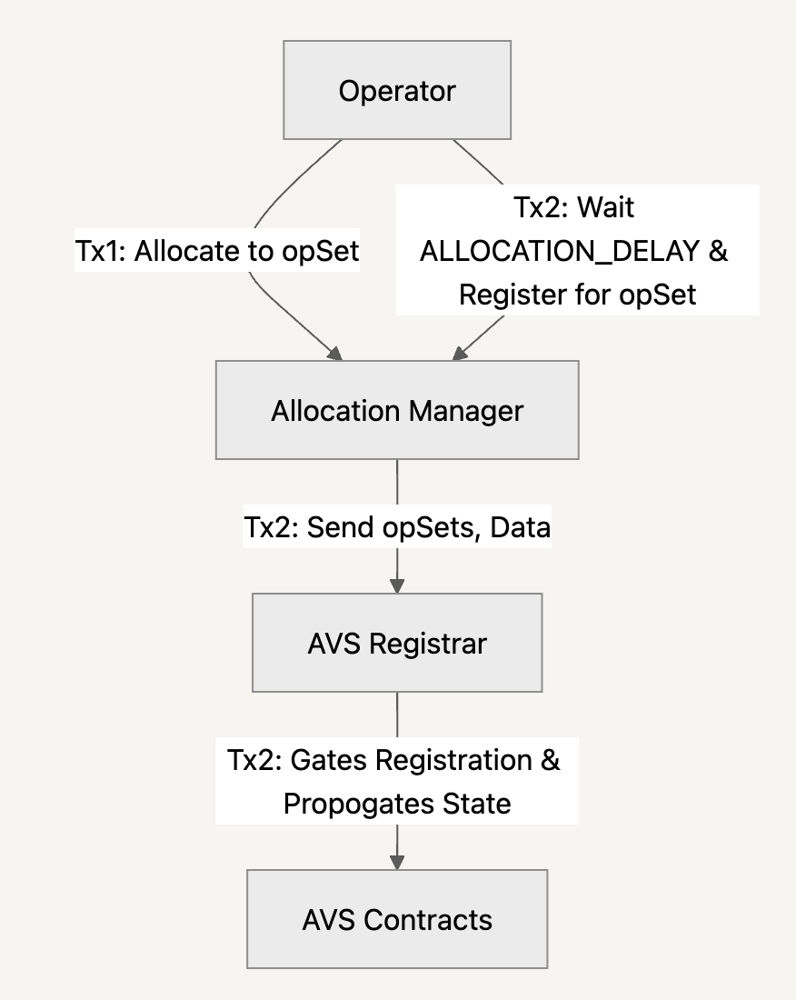
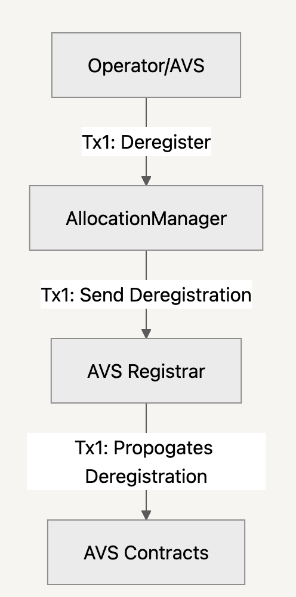
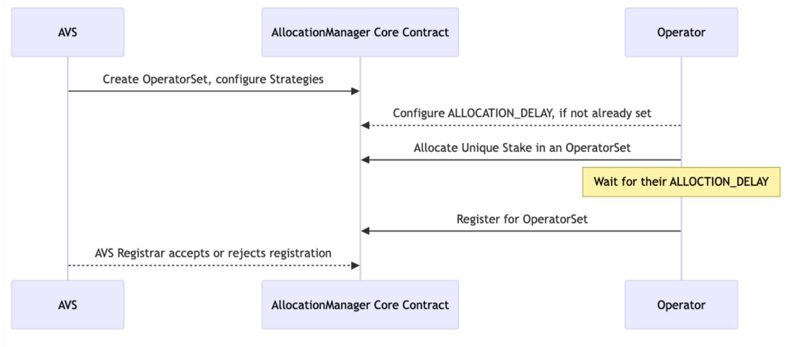
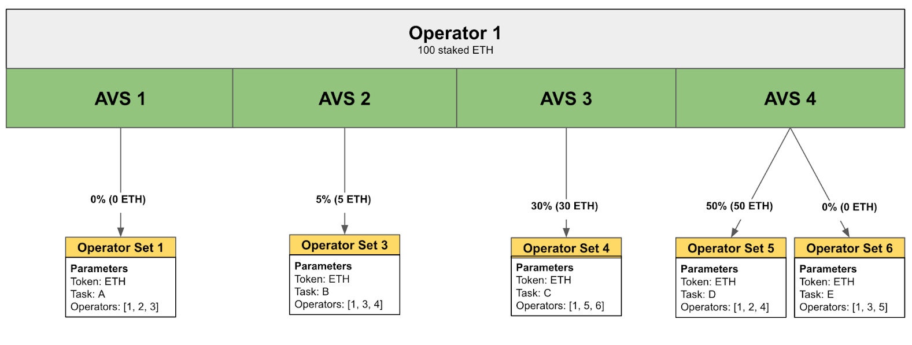
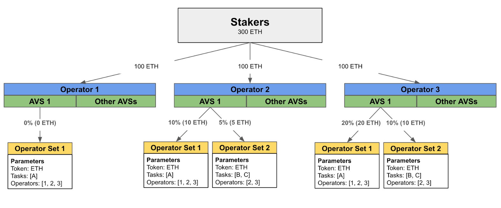
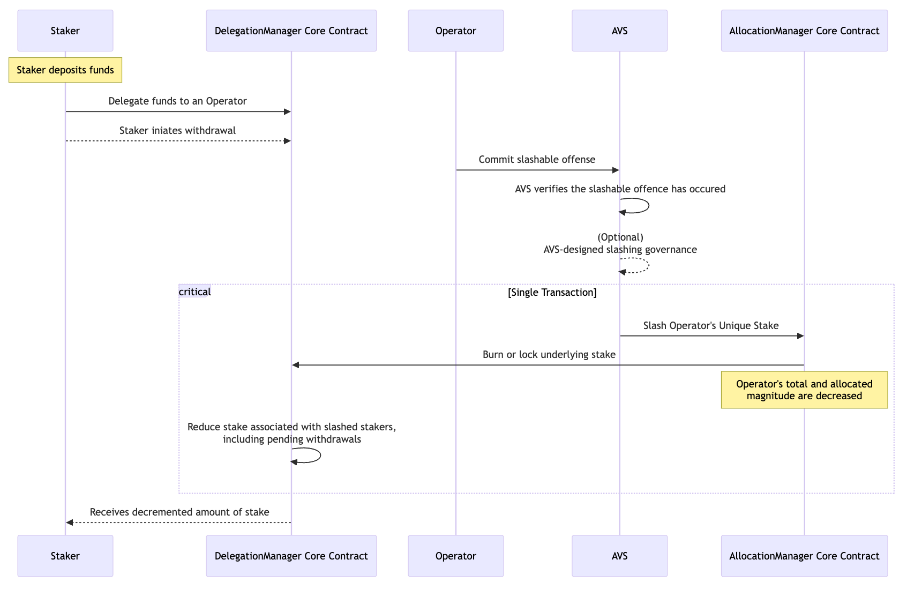

| Author(s) | [Matt Nelson](mailto:matt.nelson@eigenlabs.org), [Yash Patil](mailto:yash@eigenlabs.org), [Matt Curtis](mailto:matt.curtis@eigenlabs.org), [Gautham Anant](mailto:gautham@eigenlabs.org), [Brett Palatiello](mailto:brett@eigenlabs.org) |
| :---- | :---- |
| Created | December 12th, 2024 |
| Status | Draft |
| References | [Slashing Feature Branch](https://github.com/Layr-Labs/eigenlayer-contracts/pull/679) |
| Discussions | [Research Forum Post](https://forum.eigenlayer.xyz/t/elip-002-slashing-via-unique-stake-operator-sets/14275) |

# ELIP-002: Slashing via Unique Stake & Operator Sets

---

[Executive Summary](./ELIP-002.md#executive-summary)

[Motivation](./ELIP-002.md#motivation)

[Features & Specifications](./ELIP-002.md#features--specifications)

[Rationale](./ELIP-002.md#rationale)

[Security Considerations](./ELIP-002.md#security-considerations)

[Impact Summary](./ELIP-002.md#impact-summary)

[References & Relevant Discussions](./ELIP-002.md#references--relevant-discussions)

[Glossary](./ELIP-002.md#glossary)

---

# Executive Summary

EigenLayer is a platform for protocol participants to make credible commitments to one another. On EigenLayer, AVSs have tools to make economic commitments to their end users, such as proper or fair execution of their code run by Operators. With [Rewards v2](https://github.com/eigenfoundation/ELIPs/blob/main/ELIPs/ELIP-001.md#eigenlayer-improvement-proposal-001-rewards-v2), EigenLayer enables AVSs to issue rewards to Operators and Stakers when the AVS’ services are properly run (the carrot). With this Slashing upgrade, EigenLayer will give AVSs the ability to slash stake in instances where the commitments to properly run their services are provably broken (the stick). 

This proposal outlines an upgrade that strengthens the credible commitments AVSs can make to their users by penalizing (i.e. slashing) Operators for not properly running their services. These commitments are designed and deployed by AVSs, and can range from faults like incorrect computation, liveness failures, and more. Explicitly, this upgrade adds two new features to facilitate the slashing mechanism: [Unique Stake and Operator Sets](https://www.blog.eigenlayer.xyz/introducing-the-eigenlayer-security-model/#:~:text=Operator%20Sets%20are%20Versatile%20and%20Extensible&text=It%20can%20specify%20slashing%20conditions,these%20rewards%20will%20be%20distributed.).

Unique Stake guarantees that an Operator’s specific slashable stake can be allocated only to one AVS at a particular time. This single pairing strengthens the AVS's security without creating exogenous risk to other AVSs or the protocol at large. Operator Sets provide an in-protocol structure that enshrines the segmentation of Operators into local groups for the accounting, allocation, and slashing of staked security.

Together these features enable:

1. Opt-in, task-specific slashing for Operators, where they may take on slashing risk in return for AVS rewards,  
2. Launching of more AVSs on mainnet, by giving them tools to make more cryptoeconomic commitments to their users,  
3. Use of the Unique Stake model by ecosystem participants to better understand risk, reward, and operating models for AVS infrastructure.

With Unique Stake and Operator Sets, Operators have fine-grained control over slashable stake in accordance with their acceptable risk and competencies. These unlock slashing, slashing unlocks the creativity of AVSs, and unlocking AVS creativity allows them to reach users and reward Stakers and Operators. 

# Motivation

Eigen Labs proposes the launch of Slashing with Unique Stake and Operator Sets. Slashing is key to kickstarting the flywheel for the EigenLayer Economy. Slashing conditions allow AVSs to make cryptoeconomic commitments to their users that Operators will be punished if they complete tasks dishonestly or incorrectly. Similarly, AVSs need a means to reward Operators and Stakers for the additional slashing risk imposed on staked assets by live slashing conditions. 

The first iteration of the EigenLayer security model allowed each Operator to opt into a subset of AVSs, with their entire delegated stake slashable by any of those AVSs. This created several challenges: Operators had limited control over slashing risks, AVSs lacked assurance of accessing slashable stake when they needed it, a global protocol veto committee was required to mitigate systemic slashing risk, and AVS onboarding had to be permissioned to avoid exposing the veto committee to legal or social risks. To address these issues, the protocol necessitated an initial solution like Unique Stake in the [Unique Security model](https://www.blog.eigenlayer.xyz/introducing-the-eigenlayer-security-model/) for Operators to allocate stake that is exclusively slashable by a specific AVS. 

Unique Stake is needed for AVSs to flexibly define their own slashing conditions with minimal impact to other ecosystem participants. Previously, many types of commitments at scale lacked a mechanism to provide the trustless guarantees available to EVM execution or direct on-chain value transfer in Ethereum Proof of Stake. EigenLayer expands the conditions in which underlying stake can be slashed when used to secure services; with slashing, we can expand the functional cryptoeconomic guarantees that AVSs can make to users to power entirely new classes of trustless work on-chain and novel services with cryptoeconomic commitments.

Unique Stake requires a new core-protocol structure to handle its accounting and to provide explicit safety guarantees to Operators, Stakers, and AVSs in its implementation. [Quorums](https://www.blog.eigenlayer.xyz/eigenlayer-holesky-testnet-launch-dual-quorum-support-for-eigenda/) are an optional tool provided by EigenLayer to segment Operators, but do not provide necessary core-protocol guarantees to enforce slashings nor mitigate cascading slashing risk. We view Operator Sets as their evolution and as a means to enshrine this concept in the core protocol.

Ultimately, this release is crucial for connecting high quality Operators with AVSs. AVSs will have more tools to reward Operators' behavior for honestly and correctly validating services and protocols. 

# Features & Specifications

## Goals 

Slashing unlocks the creativity of AVSs to design the protocols they need to serve their customers. This release provides key functionality towards the EigenLayer vision of creating infrastructure for applications to make credible commitments to their users. The goal of this upgrade is to benefit all EigenLayer participants with: 

1. **Enhanced Credible Commitments:** This upgrade introduces **flexible slashing conditions**, ensuring that Operators running AVS code can be held accountable for dishonest or incorrect behavior. This provides AVSs with a mechanism to punish broken Operator commitments.  
2. **Unique Stake and Task Management via Operator Sets:** AVSs can define custom security compositions in Operator Sets, enabling differentiation between an AVS’s tasks and the associated tokens that secure them. With segmentation, AVSs may design assignment of tasks based on Operators' hardware profiles and risk capacities. AVSs have optionality to forecast stake and only use what they need, not more or less.  
3. **Exogenous Risk Management:** AVSs can be certain allocated Unique Stake is available to them and only them for an Operator Set. Slashing by one AVS will not impact the Unique Stake of any other.   
4. **Enabling Accountability and Rewards:** Operators can be rewarded based on tasks tied to **slashable security commitments** in Operator Sets, encouraging honest and high-quality service and giving flexibility in rewards distributions by AVSs.  
5. **Facilitates Innovation and Risk Assessment:** By introducing slashing and the Unique Stake model, AVSs can pioneer new classes of work on-chain, while Stakers and Operators gain better insights into risk and reward dynamics.  
6. **Dynamic AVS Governance and Adaptability:** AVSs retain flexibility to define their own slashing conditions and governance models, aligning incentives among Operators, Stakers, and end users. This is necessary for long-term sustainability.

## Features

To achieve these goals, this proposal introduces the following specific features on EigenLayer:

* Operator Sets,  
* Unique Stake Allocation and Deallocation,  
* Slashing of Unique Stake.

An Operator Set is a logical and segmented set of Operators created by the AVS. These groups of Operators may be split up for whatever reason an AVS can think of. AVSs may assign arbitrary “tasks” to Operator Sets that can represent anything Operators may be asked to do. Tasks could include computation, proof verification, signature aggregation, liveness pings, or something entirely creative. Operator Sets are the exclusive organizational level at which Operators allocate Unique Stake as slashable security for AVSs and where AVSs slash stake in the case of faults.

Unique Stake is an accounting tool defined on the level of Operator Sets that ensures AVSs and Operators maintain key safety properties when handling staked security and slashing on EigenLayer. Unique Stake is allocated to different Operator Sets on an opt-in basis by Operators. Only Unique Stake is slashable by AVSs, and it represents proportions of the Operator’s delegated stake from Stakers. 

This upgrade adds new protocol interfaces and primitives for Operator Sets, Unique Stake Allocations, and Slashing to provide: 

* A standardized registration and deregistration flow of Operators to Operator Sets, with respect to an AVS address and an Operator Set identifier,  
* A mechanism for Operators to allocate and deallocate Unique Stake to and from Operator Sets,  
* A slasher function for AVSs to slash an Operator’s Unique Stake allocated to a single Operator Set,  
* A new, iterative rewards mechanism for AVSs to reward Operators based on tasks tied to Operator Sets and slashable Unique Stake.

These are provided through the introduction of the `AllocationManager` contract and changes to the `DelegationManager` to make use of the Unique Security model. The AVS middleware contracts are also updated. First, we will describe Operator Sets and how they give fine-grained, opt-in control of slashable Unique Stake to Operators and how they provide some key guarantees to AVSs.

## Operator Sets

The Operator Set feature enshrines an `(address avs, uint32 operatorSetId)` pair as a first class primitive of the protocol to which Operators are registered and deregistered. Operator Sets are needed to apply the guarantees of Unique Stake to the protocol and to bring commitment-based slashing to AVSs. AVSs may use them to differentiate Operators based on unique business logic, hardware profiles, liveness guarantees, or composition of stake. Operator Sets help reduce complicated middleware code in the infrastructure of AVSs, simplify long-term AVS business logic and rewards distribution, and provide more protocol legibility for Stakers and Operators.

As an AVS, Operator Sets unlock the ability to:

1. Customize the makeup of my cryptoeconomic security by choosing what Strategies (e.g., token) I wish to utilize as Unique Stake,  
2. Define custom logic for registering Operators to Operator Sets,  
3. Distinguish between different *types of tasks* for my service,  
4. Slash individual Operators retroactively for breaking commitments made when completing those tasks,  
5. Value (via rewards) the distinct groupings of stake (and tasks) that are securing my service.

As an Operator, Operator Sets unlock the ability to:

1. Opt-in to receiving task-based work from AVSs assigned to their Operator Sets,   
2. Allocate and deallocate stake to secure AVSs that are distributing rewards against slashable and non-slashable tasks and security.

This simple data structure is meant to provide an AVS flexible means for segmenting tasks, security, and types of Operators. Operator Sets are defined in the `AllocationManager` core contract. Below is the Operator Set primitive: 

```solidity
struct OperatorSet {
    address avs;
    uint32 operatorSetId;
}
```

For the clarity of the reader, these interfaces are typically provided in snippets throughout the document.

### Creation, Registration, & Deregistration

First, AVSs create new Operator Sets through the `AllocationManager`. If the transaction does not revert, the Operator Set will be created successfully. An AVS may create many Operator Sets for different needs. The AVS can then add (or later remove) specific Strategies to that Operator Set that Operators will use to secure it. The AVS can also specify an additional `AVSRegistrar` contract that applies business logic to gate Operator registration to an Operator Set. This AVS-specific contract can implement a variety of custom logic. AVSs may want to gate registration on Operators' allocated Unique Stake, for example, or create a registration queue. 

To ensure community and incentive alignment, it is generally expected that AVSs will conduct off-chain outreach to communicate the purpose and task/security makeup of their Operator Sets with their Operators and Stakers prior to beginning registration. This likely would include any potential hardware, software, or stake requirements. It is up to the AVS to decide task distribution within an Operator Set, whether it's based on stake or other out of protocol means. For example, one Operator Set for an AVS may require secure enclave compute for task distribution and Operator registration, while another Operator Set can serve general attestation purposes on commodity hardware. 

In order for Operators to join Operator Sets, there is a new registration process handled via the `AllocationManager`. Both AVSs and Operators will have control over who, how, and when Operators can register. After the instantiation of an Operator Set and its optional registrar contract by an AVS, Operators can begin the registration process. The flow follows the pattern illustrated below and is completed in one or two transactions: 

*Registration* | *Deregistration* 
:-------------------------:|:-------------------------:
 |  
   
***Figure 1: The above registration/deregistration flows move away from the [EIP-1271](https://eips.ethereum.org/EIPS/eip-1271)-based process in the `AVSDirectory`.***

The AVS may require an optional transaction to first allocate Unique Stake as part of the requirements in the registrar contract. More on this allocation later, but the AVS may allow it to be skipped if there are no slashable stake requirements and/or slashing conditions for that Operator Set. The second transaction registers the Operator to that set. A successful registration by the Operator signals that they are live and ready to receive tasks subject to slashing conditions (or lack thereof) for that set. 

Deregistration can be used to signal an exit from an Operator Set, or for other cases like signaling a period of Operator inactivity or an inability to receive tasks. It is up to the AVS to implement specific deregistration logic. Deregistration occurs instantly with no delay. It does _not_ make funds allocated to the deregistered set instantly non-slashable. For AVS stake guarantees, the Operator remains slashable for the `DEALLOCATION_DELAY` and must also wait for that period to elapse before they can register to the same Operator Set again. The Operator may make stake non-slashable through other pathways, like [deallocation](./ELIP-002.md#allocating-and-deallocating-to-operator-sets) and [withdrawals](./ELIP-002.md#deposits-delegation--withdrawals). More on this below.

AVSs and Operators can both deregister from Operator Sets unilaterally. This is done via a call to the `AllocationManager`, which will attempt to call the AVS’s Registrar contract to signal a deregistration to the AVS. The deregistration will be queued for completion if there is no revert in the `AllocationManager`, regardless of the AVS Registrar logic. This is mainly to allow operators to terminate their relationship with the Operator Set in external integrations (e.g. the EigenLayer App UI). 

Below is the [AllocationManager interface](https://github.com/Layr-Labs/eigenlayer-contracts/blob/725d3df10a82e46003dd5d78d8c814790fff13c1/src/contracts/interfaces/IAllocationManager.sol):

```solidity
interface IAllocationManager {
    /**
     * @notice Allows an operator to register for one or more operator sets for an AVS. If the operator
     * has any stake allocated to these operator sets, it immediately becomes slashable.
     * @dev After registering within the ALM, this method calls `avs.registerOperator` to complete
     * registration. This call MUST succeed in order for registration to be successful.
     */
    function registerForOperatorSets(
	address operator, 
	RegisterParams calldata params
    ) external;

    /**
     * @notice Allows an operator or AVS to deregister the operator from one or more of the AVS's operator sets.
     * If the operator has any slashable stake allocated to the AVS, it remains slashable until the
     * DEALLOCATION_DELAY has passed.
     * @dev After deregistering within the ALM, this method calls `avs.deregisterOperator` to complete
     * deregistration. If this call reverts, it is ignored.
     */
    function deregisterFromOperatorSets(
        DeregisterParams calldata params
    ) external;

    /// @notice Delay before allocation delay modifications take effect.
    uint32 public immutable ALLOCATION_CONFIGURATION_DELAY;

    /// @notice Delay before deallocations are clearable and can be added back into freeMagnitude
    /// In this window, deallocations still remain slashable by the operatorSet they were allocated to.
    uint32 public immutable DEALLOCATION_DELAY;

    /**
     * @notice Called by an AVS to configure the address that is called when an operator registers
     * or is deregistered from the AVS's operator sets. If not set (or set to 0), defaults
     * to the AVS's address.
     * @param registrar the new registrar address
     */
    function setAVSRegistrar(
	address avs, 
	IAVSRegistrar registrar
    ) external;

    /**
     *  @notice Called by an AVS to emit an `AVSMetadataURIUpdated` event indicating the information has updated.
     *
     *  @param metadataURI The URI for metadata associated with an AVS.
     *
     *  @dev Note that the `metadataURI` is *never stored* and is only emitted in the `AVSMetadataURIUpdated` event.
     */
    function updateAVSMetadataURI(
	address avs,
	string calldata metadataURI
    ) external;

    /**
     * @notice Allows an AVS to create new operator sets, defining strategies that the operator set uses
     */
    function createOperatorSets(
	address avs, 
	CreateSetParams[] calldata params
    ) external

    /**
     * @notice Allows an AVS to add strategies to an operator set
     * @dev Strategies MUST NOT already exist in the operator set
     * @param avs the avs to set strategies for
     * @param operatorSetId the operator set to add strategies to
     * @param strategies the strategies to add
     */
    function addStrategiesToOperatorSet(
	address avs, 
	uint32 operatorSetId, 
	IStrategy[] calldata strategies
    ) external;

    /**
     * @notice Allows an AVS to remove strategies from an operator set
     * @dev Strategies MUST already exist in the operator set
     * @param avs the avs to remove strategies for
     * @param operatorSetId the operator set to remove strategies from
     * @param strategies the strategies to remove
     */
    function removeStrategiesFromOperatorSet(
        address avs,
        uint32 operatorSetId,
        IStrategy[] calldata strategies
    ) external;
}
```

When adding Strategies to Operator Sets, the protocol limits the number of Strategies to 32. There are no enforced limits around the number of Operator Sets an AVS can create or how many Operators may be in a single Operator Set. There may be practical gas cost limitations in Operator Sets. For example, as sizes get very large, it may become impossible to perform an operation on all Operators in an Operator Set within a single transaction.

Going forward, the `AllocationManager` will handle all Operator/AVS relationships. This new registration flow supplants the M2 process in the `AVSDirectory` but will be supported in parallel for some time. Operator Sets will be the sole means of codifying a relationship in the protocol between an AVS and an Operator. We suggest AVSs register Operators to Operator Sets over-time with the new process as they gain clarity in their designs. Operator Set registration will be required to take advantage of Unique Stake and slashing, but is initially additive to the existing M2 process. More on this in the [rationale](./ELIP-002.md#rationale).

Figure 2 outlines the lifecycle of an Operator’s registration to an Operator Set:  

***Figure 2: Sequence Representation of Operator Set Registration*** 

## Unique Stake Allocation & Deallocation

Unique Stake is a mechanism to guarantee slashable stake can only be allocated to one Operator Set at a time. Unique Stake benefits both Operators and AVSs with certain properties when reasoning about EigenLayer slashing: 

* **Greater control over slashing risk:** With Unique Stake, the risk of slashing is isolated to the individual AVS and Operator Set, and Operators can control how much of their stake any AVS can slash. AVSs are not exposed to risk from any other AVS or their slashings.  
* **Guaranteed slashable stake:** AVSs have the tools they need to understand the amount of Unique Stake that can be slashed at a given time across their Operator Sets.   
* **Permissionless onboarding of AVSs:** Since slashing is localized to individual AVSs, there is no need for a common veto committee which means launching an AVS on EigenLayer remains permissionless.

When Stakers deposit assets on EigenLayer, they are stored in accounting contracts known as Strategies. Strategies are different expressions of security on EigenLayer. Today, they represent different types of restaked assets (e.g., tokens) delegated to Operators that AVSs can leverage for securing their services and upholding cryptoeconomic guarantees. In order to make delegations slashable, Operators must allocate individual proportions of them as Unique Stake to Operator Sets. Allocations are exclusively slashable by the AVS that created that Operator Set.

In figure 3 below, Operator 1 has a delegation of 100 staked ETH for the ETH Strategy. Operator 1 then allocates proportions of that ETH as Unique Stake in Operator Sets across several AVSs. 

  
***Figure 3: Operator Allocations to Operator Sets***

The 85 allocated ETH is slashable exclusively by the AVS originating each Operator Set. In this case, AVS 2, 3, and 4 can slash their associated Operator Sets 2, 3, and 4, respectively. 

Let’s consider another example with three Operators. Figure 4 illustrates two Operator Sets instantiated by AVS 1. AVS 1 has created two Operator Sets for different tasks. For example, this AVS may use Operator Set 1 for assigning generation of ZK proofs to Operators, an expensive computation, and Operator Set 2 for verification of those proofs, a cheaper computation. 

  
***Figure 4: Example of an AVS’s Unique Stake***

Operator 1 is registered to Operator Set 1 but has not yet allocated any Unique Stake. Operator 2 has allocated 10% of its ETH delegation to Operator Set 1 (amounting to a nominal allocation of 10 ETH). This is exclusively slashable by AVS 1 in Operator Set 1. Operator 2 has also allocated 5% (5 ETH) to Operator Set 2, which is exclusively slashable by AVS 1 in Operator Set 2. 

Along with Operator 3’s 20% allocation (20 ETH), Operator Set 1 has a total Unique Stake of 30 ETH available to slash, with the certainty it cannot be slashed elsewhere. Operator Set 2 has allocations totalling 15 ETH of Unique Stake. AVS 1 may distribute more valuable tasks against which to slash and reward to Operator Set 1 in order to take advantage of the greater amount of Unique Stake.

### Allocating and Deallocating to Operator Sets

Unique Stake is allocated to Operator Sets in the protocol via a function provided in the `AllocationManger`. In the `AllocationManager`, these allocations are tracked using an accounting tool known as magnitudes. 

For each Strategy, an Operator starts with a protocol-defined Total Magnitude of 1x10^18 (`INITIAL_TOTAL_MAGNITUDE`). This Total Magnitude can never increase; to account for slashing events originated by an AVS, the protocol *monotonically decreases* the Strategy’s total magnitude for the slashed Operator. Operators can allocate magnitudes to Operator Sets using the `modifyAllocations` function. The proportion of an Operator’s delegation assigned as Unique Stake to an Operator Set is equal to the magnitude allocated to that Operator Set divided by the Operator’s Total Magnitude. For a given strategy, the sum of all magnitude allocations can never be greater than the Total Magnitude (the sum of the proportions cannot exceed 100%), ensuring the property of Unique Stake that no two Operator Sets can slash the same stake. 

Below is an example of an Operator Magnitude allocation for the EIGEN Strategy. This will be expanded upon in the next section. 

|  | Magnitude | Proportion | EIGEN |
| :---- | :---- | :---- | :---- |
| `AVS_1_EIGEN` | 3,000 | 30% | 30 |
| `AVS_2_EIGEN` | 2,500 | 25% | 25 |
| `EigenDA_EIGEN` | 2,000 | 20% | 20 |
| `Non-slashable` | 2,500 | 25% | 25 |
| `Total` | 10,000 | 100% | 100 |

In this example, the Operator submitted one transaction to allocate to three Operator Sets simultaneously for the Eigen strategy using the `modifyAllocations` function. It allocated various magnitudes across AVSs in the Operator’s EIGEN Strategy and uses a total magnitude of 10,000 as opposed to 1x1018 for legibility.

Allocations and deallocations are subject to some safety delays in the protocol. The delays vary from protocol-configured constants to custom constraints that Operators can add for additional safety. They are instantiated in the `AllocationManager` alongside the other constants:  

| Parameter | Description | Value | Setter & Configuration |
| :---- | :---- | :---- | :---- |
| `ALLOCATION_CONFIG_DELAY` | The amount of blocks between an Operator queuing an `ALLOCATION_DELAY` change and the change taking effect. | 126000 blocks (~17.5 days) | Core Protocol: Set via governance |
| `ALLOCATION_DELAY` | The amount of blocks it takes for an Operator’s allocation to be live in an Operator Set for a given Strategy. It must be set by the Operator prior to any allocations and applies globally to all Operator Sets and Strategies.  The protocol provides no constraints on this value. It can be any unsigned integer value and can be changed by the Operator.  | Unsigned integer value representing a number of blocks  | Operator: Set via `AllocationManager` Must be set in order to allocate |
| `DEALLOCATION_DELAY` | The amount of blocks between an Operator queuing a deallocation of stake from an Operator Set for a strategy and the deallocation taking effect. This delay also applies to an Operator *deregistering* from an Operator Set, either by their own action or that of the AVS. | 100800 blocks (~14 days) | Core Protocol: Set via governance |
| `INITIAL_TOTAL_MAGNITUDE` | The initial value of the monotonically decreasing total magnitude for every Operator for every strategy. This is set high enough to start out with a large level of precision in magnitude allocations and slashings. | 1e18 | Core Protocol: Constant, unlikely to change |
| `WITHDRAWAL_DELAY` | The amount of blocks between a Staker queueing a withdrawal and the withdrawal becoming non-slashable and completable. | 100800 blocks (~14 days) | Core Protocol: Set via governance |

Before allocating for their first Operator Set, an Operator is required to set an `ALLOCATION_DELAY` in the `AllocationManager`. If an Operator is registering with EigenLayer for the first time, they will be required to provide an `ALLOCATION_DELAY` during registration. It takes the amount of time specified in the `ALLOCATION_CONFIG_DELAY` for the Operator's `ALLOCATION_DELAY` to be set initially or updated. This delay is to ensure Stakers have time to adjust to changes in their delegated Operator’s stake allocations. Stakers can withdraw their funds if an allocation is viewed as undesirable, subject to the `WITHDRAWAL_DELAY`. [The rationale for this is captured below.](./ELIP-002.md#why-is-withdrawal_delay-set-to-14-days-worth-of-blocks)

The `AllocationManager` interface handles all allocation and deallocation signals:

```solidity
interface IAllocationManager {

   /**
    * @notice struct used to modify the allocation of slashable magnitude to an operator set
    * @param operatorSet the operator set to modify the allocation for
    * @param strategies the strategies to modify allocations for
    * @param newMagnitudes the new magnitude to allocate for each strategy to this operator set
    */
   struct AllocateParams {
       OperatorSet operatorSet;
       IStrategy[] strategies;
       uint64[] newMagnitudes;
   }

   /**
     * @notice Called by the delegation manager OR an operator to set an operator's allocation delay.
     * This is set when the operator first registers, and is the number of blocks between an operator
     * allocating magnitude to an operator set, and the magnitude becoming slashable.
     * @param operator The operator to set the delay on behalf of.
     * @param delay the allocation delay in blocks
     */
    function setAllocationDelay(
	address operator, 
	uint32 delay
    ) external;

    /**
     * @notice Modifies the proportions of slashable stake allocated to an operator set  from a list of strategies
     * Note that deallocations remain slashable for DEALLOCATION_DELAY blocks therefore when they are cleared they may
     * free up less allocatable magnitude than initially deallocated.
     * @param operator the operator to modify allocations for
     * @param params array of magnitude adjustments for one or more operator sets
     * @dev Updates encumberedMagnitude for the updated strategies
     * @dev msg.sender is used as operator
     */
    function modifyAllocations(
	address operator, 
	AllocateParams[] calldata params
    ) external;

    /**
     * @notice struct used to modify the allocation of slashable magnitude to an operator set
     * @param operatorSet the operator set to modify the allocation for
     * @param strategies the strategies to modify allocations for
     * @param newMagnitudes the new magnitude to allocate for each strategy to this operator set
     */
    struct AllocateParams {
        OperatorSet operatorSet;
        IStrategy[] strategies;
        uint64[] newMagnitudes;
    }

    /**
     * @notice This function takes a list of strategies and for each strategy, removes from the deallocationQueue
     * all clearable deallocations up to max `numToClear` number of deallocations, updating the encumberedMagnitude
     * of the operator as needed.
     *
     * @param operator address to clear deallocations for
     * @param strategies a list of strategies to clear deallocations for
     * @param numToClear a list of number of pending deallocations to clear for each strategy
     *
     * @dev can be called permissionlessly by anyone
     */
    function clearDeallocationQueue(
        address operator,
        IStrategy[] calldata strategies,
        uint16[] calldata numToClear
    ) external;
}
```

Magnitude allocations can only be made to valid Operator Sets and only from non-slashable magnitude. Allocations are queued in the `AllocationManager` and become active automatically after the `ALLOCATION_DELAY`. Magnitude is not allocated until the Operator’s `ALLOCATION_DELAY` has passed, i.e. the allocation is not pending. Additional magnitude allocations cannot be made from existing queued allocations, magnitude already allocated to an Operator Set, or pending deallocations.

***An AVS may slash an Operator up to the total allocated amount of Unique Stake per Strategy under the following conditions:***

* ***The Operator is registered to the Operator Set the AVS wishes to slash.***  
* ***The Operator Set is configured to include the allocated strategy.***

***Deallocations are the primary means of making Unique Stake non-slashable.*** ***Operators should handle allocations to registered Operator Sets as if they can be slashed at any time.*** For example, AVSs may add or remove Strategies to Operator Sets at will, which may instantly make any allocated strategy slashable. Deregistration from an Operator Set is another such case. An Operator is slashable by that Operator Set for the duration of the `DEALLOCATION_DELAY` after a deregistration, but the allocations to that Operator Set _will still exist._ If the Operator re-registers after the delays have elapsed, those Operator Set allocations immediately become slashable again.

Deallocations act similarly to allocations and are queued in the `AllocationManager` and take effect automatically after the `DEALLOCATION_DELAY`. This is a globally set constant across all Operators and Operator Sets. This delay allows AVSs to update their view of Unique Stake to reflect the Operator’s reduced allocation and guarantees appropriate delays for tasks to remain slashable. Queued deallocations *cannot* be canceled. After the delay, this stake is considered non-slashable. 

Some notes and caveats impacting UX:

* If an allocation to an Operator Set is made non-slashable by no longer meeting the criteria above, a deallocation does not go through the 14 day `DEALLOCATION_DELAY` and instead takes effect immediately.   
* A given (Operator, Strategy) pair can only have one pending allocation *OR* deallocation transaction per Operator Set at a given time.   
* A single transaction can modify multiple allocations.  
* An Operator Set deregistration ***does not*** also queue a deallocation. They have to be queued separately, as a deregistration may be used to signal other states, like a period of Operator inactivity. Previously allocated magnitude that has not been deallocated becomes instantly slashable upon re-registration.

### Magnitude Allocation Flow 

An illustrative example of these magnitudes is useful in showing the allocation flow. Suppose, after initial delays, the Operator’s queued allocations are applied for delegated tokens in the EIGEN strategy according to the following magnitudes:

|  | Magnitude | Proportion | EIGEN |
| :---- | :---- | :---- | :---- |
| `AVS_1_EIGEN` | 3,000 | 30% | 30 |
| `AVS_2_EIGEN` | 2,500 | 25% | 25 |
| `EigenDA_EIGEN` | 2,000 | 20% | 20 |
| `Non-slashable` | 2,500 | 25% | 25 |
| `Total`  | 10,000 | 100% | 100 |

The above represents non-slashable and slashable stake, by Operator Set (in this case one per AVS, but this may be multiple sets). Now presume a deallocation is queued by the Operator signaling a reduction in the allocation to Operator Set AVS_1_EIGEN. The number of delegated tokens does not change, but their proportions do.

|  | Magnitude | Proportion | EIGEN |
| :---- | :---- | :---- | :---- |
| `AVS_1_EIGEN` (*pending deallocation*) | 3,000 -> *2,000* | 30% -> *20%* | 30 -> *20* |
| `AVS_2_EIGEN` | 2,500 | 25% | 25 |
| `EigenDA_EIGEN` | 2,000 | 20% | 20 |
| `Non-slashable` | 2,500 | 25% | 25 |
| `Total`  | 10,000 | 100% | 100 |

The 10 EIGEN in reduced magnitude is still considered slashable until the deallocation is complete. The below is the result following the deallocation and its associated delays. Note the non-slashable stake increase.

|  | Magnitude | Proportion | EIGEN |
| :---- | :---- | :---- | :---- |
| `AVS_1_EIGEN` | 2,000 | 20% | 20 |
| `AVS_2_EIGEN` | 2,500 | 25% | 25 |
| `EigenDA_EIGEN` | 2,000 | 20% | 20 |
| `Non-slashable` | 3,500 | 35% | 35 |
| `Total`  | 10,000 | 100% | 100 |

Now, a deposit occurs for an additional 100 EIGEN by a Staker who has delegated to the Operator. Instantly, that deposit is applied, following the proportions laid out in the allocation magnitudes. 

|  | Magnitude | Proportion | EIGEN |
| :---- | :---- | :---- | :---- |
| `AVS_1_EIGEN` | 2,000 | 20% | 40 |
| `AVS_2_EIGEN` | 2,500 | 25% | 50 |
| `EigenDA_EIGEN` | 2,000 | 20% | 40 |
| `Non-slashable` | 3,500 | 35% | 70 |
| `Total`  | 10,000 | 100% | 200 |

Each Operator Set’s slashable stake and the overall non-slashable stake increase commensurately. This example is expanded in [this forum post](https://forum.eigenlayer.xyz/t/the-mechanics-of-allocating-and-slashing-unique-stake/13870#p-143651-allocation-3) with more details. We will reference this example again later in the context of slashing. 

### Deposits, Delegations, & Withdrawals

Magnitude allocations make a proportion of an Operator’s delegated stake slashable by an AVS. As a result, new delegations and deposits are immediately slashable by the same proportion. There is no "activation delay". There is no change in the deposit and delegation interface. 

Withdrawals and undelegation, like deallocations and deregistrations, are slashable for the `WITHDRAWAL_DELAY` after they are queued and automatically become unslashable after the delay has passed. The escrow process remains unchanged: withdrawals must be queued and completed in separate transactions. When the withdrawal is completed, slashings are applied to the stake received. 

## Slashing of Unique Stake

With Unique Stake allocated to Operator Sets, AVSs can begin assigning slashable tasks with economic commitments from their Operators. It is key to AVS designs to consider what is a slashable offense and to effectively communicate these conditions with Operators and Stakers. 

**The protocol provides a slashing function that is maximally flexible; an AVSs may slash any Operator within any of their Operator Sets for any reason.**  Slashing does not have to be objectively attributable (i.e., provable on-chain), but AVSs are encouraged to create robust legibility and process around individual slashings. It is expected that governance, fraud proofs, decentralization, and more shall be considered in AVS slashing designs. Other delays and veto periods may be included in AVS designs to avoid or cancel slashing in cases of AVS implementation bugs, improper slashing, or fraud, but **no vetoes** are provided by the EigenLayer protocol.

The `AllocationManager` provides the interface for the slashing function: 

```solidity
    /**
     * @notice Called by an AVS to slash an operator in a given operator set
     */

    function slashOperator(
        address avs,
        SlashingParams calldata params
    ) external;

    /**
     * @notice Struct containing parameters to slashing
     * @param operator the address to slash
     * @param operatorSetId the ID of the operatorSet the operator is being slashed on behalf of
     * @param strategies the set of strategies to slash
     * @param wadsToSlash the parts in 1e18 to slash, this will be proportional to the operator's
     * slashable stake allocation for the operatorSet
     * @param description the description of the slashing provided by the AVS for legibility
     */
    struct SlashingParams {
        address operator;
        uint32 operatorSetId;
        IStrategy[] strategies;
        uint256[] wadsToSlash;
        string description;
    }
```

To slash, AVSs specify the individual Operator that will be slashed, the Operator Set, the list of Strategies that will be slashed, the list of proportions to slash (as `wads` or “parts per `1e18`”), and a description for legibility. For example, an 8% slash would be represented as `8e16`, or `80000000000000000` as expected in the `wadsToSlash` parameter. A 25% slash, or `2.5e17`, the contract will expect `250000000000000000` as `wadsToSlash`. The indexes in the two arrays should match across `strategies` and `wadsToSlash`. 

All Strategies supplied must be configured as part of the Operator Set. For all Strategies specified, the Operator’s allocations to that Operator Set will be slashed by the corresponding proportion while maintaining their nominal allocations to all other Operator Sets. Under the hood this is accomplished by subtracting allocated magnitude from both the specified Operator Set, and the Operator’s Total Magnitude. This is illustrated in the example below.

Slashing proportionally reduces funds of all Stakers of the given Strategies that are delegated to the Operator, including funds in queued deallocations and withdrawals (that haven’t passed `WITHDRAWAL_DELAY`). Operator delegation is decreased directly in the `DelegationManager` in each Strategy. Changes are propagated to Staker withdrawals and view functions by referring to their delegated Operator’s Total Magnitude.

When a slashing occurs, an event is emitted onchain, one for each slashing. Details are emitted identifying the Operator slashed, in what Operator Set, and across which Strategies, with fields for the proportion slashed and meta-data:
```
/// @notice Emitted when an operator is slashed by an operator set for a strategy
/// `wadSlashed` is the proportion of the operator's total delegated stake that was slashed
event OperatorSlashed(
    address operator, OperatorSet operatorSet, IStrategy[] strategies, uint256[] wadSlashed, string description
);
```

Returning to our example from above, let’s assume that `AVS_1_Eigen` Operator Set slashes the Operator in question by 50%. Recall the final allocated magnitudes were the following:

|  | Magnitude | Proportion | EIGEN |
| :---- | :---- | :---- | :---- |
| `AVS_1_EIGEN` | 2,000 | 20% | 40 |
| `AVS_2_EIGEN` | 2,500 | 25% | 50 |
| `EigenDA_EIGEN` | 2,000 | 20% | 40 |
| `Non-slashable` | 3,500 | 35% | 70 |
| `Total`  | 10,000 | 100% | 200 |

Now, `AVS_1` slashes the Operator for a 50% reduction (`5e17` in `wads`) in the Operator Set `AVS_1_EIGEN`:

|  | Magnitude | Proportion | EIGEN |
| :---- | :---- | :---- | :---- |
| `AVS_1_EIGEN` | 1,000 | 11% | 20 |
| `AVS_2_EIGEN` | 2,500 | 28% | 50 |
| `EigenDA_EIGEN` | 2,000 | 22% | 40 |
| `Non-slashable` | 3,500 | 39% | 70 |
| `Total` | 9000 | 100% | 180 |

Note, slashing by one Operator Set does not affect the magnitudes of EIGEN allocated to other Operator Sets. The interactions between Staker, Operator, AVS, and core contracts are represented visually in the sequence diagram below:

  
***Figure 5: Sequence Representation of a Slashing***

### Burning of Slashed Funds

In this release, when funds are slashed by an AVS, the EigenLayer core contracts will make slashed funds permanently inaccessible (“burned”). ERC-20s have this done by sending them to the dead `0x00...00e16e4` address. This is done to ensure proper accounting with various LRT protocols. Natively Restaked ETH will be locked in EigenPod contracts, permanently inaccessible. The Ethereum Pectra upgrade is anticipated to unblock development of an EigenLayer upgrade which would burn Natively Restaked ETH by sending it to a dead address, instead of permanently locking it within EigenPod contracts as planned in this release.

## Rewarding Unique Stake and Operator Sets

AVSs, taking advantage of Unique Stake, may wish to reward Operator Sets with more granularity in connection to any additional tasks or slashing conditions. This release provides additional functionality in the `RewardsCoordinator` interface for AVSs to specify an Operator Set in rewards submissions to improve the flexibility of incentives and rewards they can provide. The interface will become the sole rewards distribution mechanism with the deprecation of M2 Registration and the `AVSDirectory` at a later date. It is additive with regards to existing [Rewards functionality](https://github.com/eigenfoundation/ELIPs/blob/main/ELIPs/ELIP-001.md#eigenlayer-improvement-proposal-001-rewards-v2).

AVSs specify a set of Strategies for each of their Operator Sets. Reward submissions are verified to only be made to the Strategies in the Operator Set at the time of submission. In addition, reward types are added for making rewards on behalf of an Operator Set as opposed to an AVS. Operators can granularly set their fee on an Operator Set level. If they haven’t, any rewards use the AVS-level fee, or the global default of 10% if nothing has been configured. 

Below are the interface additions:

```solidity
interface IRewardsCoordinator {
  /// @notice operatorSet parallel of AVSRewardsSubmissionCreated
  event OperatorSetRewardsSubmissionCreated(
      OperatorSet indexed operatorSet,
      uint256 indexed submissionNonce,
      bytes32 indexed rewardsSubmissionHash,
      RewardsSubmission rewardsSubmission
  );

  /// @notice operatorSet parallel of AVSPerformanceRewardsSubmissionCreated
  event AVSPerformanceRewardsSubmissionCreated(
      OperatorSet indexed operatorSet,
      uint256 submissionNonce,
      bytes32 indexed performanceRewardsSubmissionHash,
      PerformanceRewardsSubmission performanceRewardsSubmission
  );
  
  /// @notice sets the operator's split for a given operatorSet
  function setOperatorSetOperatorSplit(OperatorSet operatorSet, uint16 splitBips) external;
  /// @notice operatorSet parallel of createAVSRewardsSubmission
  /// @dev sender must be the avs of the given operatorSet
  function createOperatorSetRewardsSubmission(
      RewardsSubmission[] calldata rewardsSubmissions
  ) external;
  
  /// @notice operatorSet parallel of createAVSPerformanceRewardsSubmission
  /// @dev sender must be the avs of the given operatorSet
  function createOperatorSetPerformanceRewardsSubmission(
      OperatorSet calldata operatorSet,
      PerformanceRewardsSubmission[] calldata performanceRewardsSubmissions
  ) external;
}
```

# Rationale

## Creation, Registration, & Deregistration

### Why the new registration flow? What happens to the old process?

Operator Sets will codify a new means for AVSs to register with the core protocol, in the `AllocationManager`. This contract will become the sole means for AVSs to register with EigenLayer and register Operators to themselves (via Operator Sets). The deprecation of the `AVSDirectory` is slated for a later date and the entire set of changes will be covered in another ELIP.

The M2 registration flow lacks the enshrined ability for Operators to deregister from AVS, creating potentially abusive edge cases where Operators are locked in agreements permanently. Adding this functionality to the core contracts ensures that Operators can opt out of AVSs where they no longer wish to provide security. 

The previous M2 registration flow will be available after the slashing release and deprecated at a later date after the Mainnet launch. The new registration flow was required to ensure proper accounting of Unique Stake when integrating with Operator Sets & slashing. An AVS MUST USE the new registration flow in order to take advantage of these features. We recommend having Operators register to Operator Sets in parallel while running their M2 operations, then cutover when ready. There is NO atomic migration transaction available. 

## Unique Stake Allocation & Deallocations

### Why have an allocation delay? Why is it configurable?

An allocation delay is an instrument used by Operators who want to give their Stakers a chance to withdraw before an allocation takes effect. Stakers may wish to monitor their Operator’s allocations and corresponding risk profile, and the allocation delay dictates how much time the Staker has to monitor and withdraw before an allocation takes effect and their funds are subjected to slashing risk in the new allocation. The allocation delay is expected to be surfaced in user interfaces, like [app.eigenlayer.xyz](https://app.eigenlayer.xyz/), for legibility of the protocol to Stakers and Operators in expressing their risk profiles, as well as details on pending allocations by Operators.

Instead of choosing a global delay, it is made configurable by Operators to make choices about either the agility or safety of their delegated stake. For example, some Stakers run their own Operators so presumably would want to set their allocation delay to zero (e.g., many LRTs) and/or some Operators may prefer to enforce additional allocation delays or controls out-of-protocol through their own contracts.

### Why is `WITHDRAWAL_DELAY` set to 14 days worth of blocks?

For a more comprehensive understanding of the withdrawal delay, see this [post](https://forum.eigenlayer.xyz/t/stake-guarantee-window/14245). A succinct version is provided below.

The withdrawal delay is lower bounded by two variables:

1. The sync delay: the amount of time it takes an AVS to update its state to reflect the fact that a withdrawal has been queued,  
2. The slashability window: the amount of time between the creation of an AVS task and slashing for misbehavior on that task.

To explain the choice of 14 days for this window, consider a theoretical model:

Some AVSs have indicated that 7 days is an economical period in which AVSs can sync to the stakes of EigenLayer. However, AVSs can do it more or less frequently if they prefer. 

It might be expected in the case of genuine fraud that, after a fraud proof is submitted onchain, the canceller would not need to intervene onchain. There could be a 3.5 day window after a fraud proof is submitted to the chain, after which, if there is no cancellation transaction, any entity could forward a slashing request to the core protocol.

Finally, it might be assumed that a challenger will not be censored for more than 3.5 days within a 7 day window, enabling them to send their fraud proof and forwarding transactions to the core protocol within 3.5 days.

In the case of genuine fraud,

1. A task may be created with stakes that are 7 days old  
2. Misbehaviour by a certain Operator is fraud proven within d\_fraudProof of its creation  
3. 3.5 days must pass without a cancellation of the fraud proof  
   1. Incorrect (or buggy) fraud proofs are canceled at this stage  
4. There are 3.5 days \- d\_fraudProof time to forward the fraud proof to the core protocol

EigenLayer can be updated to enable longer or shorter delays in a future release but this proposal has a global parameter for simplicity. 

### Why is `DEALLOCATION_DELAY` set to 14 days worth of blocks?

A withdrawal and a deallocation are both treated as a reduction of slashable stake by an AVS, so the `DEALLOCATION_DELAY` is treated with the same care as the `WITHDRAWAL_DELAY`.

### Why is `ALLOCATION_CONFIG_DELAY` set to 17.5 days worth of blocks?

The allocation config delay is set to 17.5 days in order to give Stakers 3.5 days to withdraw (3.5 \+ 14 \= 17.5) before new allocation delays take effect. 3.5 days is used as a censorship resistance interval.

### Why is instant deallocation of non-slashable magnitudes allowed?

Allocation and registration to an Operator Set are not atomic. This is problematic since registration to an Operator Set may be prevented due to external factors by the time an allocation has taken effect (e.g., the stake of other Operators in the Operator Set increases such that an Operator’s allocation is no longer large enough to qualify them for registration into the Operator Set).

To combat the non-atomicity of the allocation and registration flow and to enable agility of stake in the protocol, Operators can instantly deallocate non-slashable allocations. Stake in a Strategy is considered non-slashable if the Operator is not registered for the Operator Set or if the Strategy is not part of the Operator Set. 

### Why did we choose magnitude values of 1x1018?

At this time, the EVM does not support floating point arithmetic. Thus, the protocol uses fixed point arithmetic with 18 decimals. 1×1018 , also known as WAD, is a common measure of 1 unit across the DeFi ecosystem and is sufficient to represent proportions of stake.

## Deposits, Delegation & Withdrawals

### Why is there no activation delay on newly deposited/delegated stake?

This proposal opts for deposits/delegations becoming instantly slashable to lead to the highest security guarantees for AVSs. If Stakers and Operators would like further safeguards, they may be implemented upstream of the core protocol.

## Slashing of Unique Stake

### Why the Unique Security model? What about Unique Stake?

The original [security model](https://docs.eigenlayer.xyz/assets/files/EigenLayer_WhitePaper-88c47923ca0319870c611decd6e562ad.pdf) had the following structure: each Operator can opt into a subset of AVSs, and the entire stake delegated to that Operator could be slashed by any of those AVSs, which meant: 

1. **Less control over slashing risk**: An AVS sharing slashable stake could be inadvertently exposed to the risks of slashing by other AVSs. Additionally, the entirety of an Operator’s delegated stake is at risk of being slashed by any AVS it opted into.   
2. **No slashable stake assurances for AVSs**: AVSs had no assurance that they would have access to slashable stake when needed.  
3. **Needs a common slashing veto committee:** The system needed a common veto committee to buffer slashing events from becoming systemic.   
4. **Permissioned onboarding of AVSs**: Because of the need for a common veto committee, launching an AVS on EigenLayer needed to be permissioned otherwise the veto committee would be taking on uncalibrated risks.

The new Unique Security model has been specifically designed to address these shortcomings by offering greater flexibility and control through Unique Stake:

1. **Greater control over slashing risk**: With Unique Stake, the risk of slashing is isolated to the individual AVS, and Operators can control how much of their stake any AVS can slash.  
2. **Guaranteed slashable stake**: Each AVS knows how much slashable stake they have by adding up the Unique Stake allocated to them across all its Operators.  
3. **No need for a common veto committee**: Since slashing is localized to individual AVSs, there is no necessity for a common veto committee. Each AVS can specify its own mechanisms for slashing and governance.   
4. **Permissionless onboarding of AVSs**: Launching an AVS on EigenLayer  is permissionless and only requires Operators to opt in.

The Unique Security model has additional properties like combining Operator delegation and Unique Stake as demonstrated [here](https://www.blog.eigenlayer.xyz/introducing-the-eigenlayer-security-model/). Also, if desired, this model allows AVSs to use the original security model by sharing Operator Sets with other AVSs but with a more reasonable risk model.

### Why isn’t there a protocol-level veto committee?

The protocol opts for minimal social overloading. Having all vetoing functionality implemented upstream in an AVS opens the design space, reduces governance overhead on EigenLayer, and increases overall agility, flexibility, and safety of the system. We encourage safety and thoughtfulness in AVS development, rather than relying on a core protocol veto.

In addition, the Unique Security model eliminates Operator Sets’ exposure to one another’s slashing. This reduces the relevance of the original motivations for a protocol level veto committee.

### What about token forking and intersubjective slashing?

[Intersubjective slashing via the forking EIGEN token](https://www.blog.eigenlayer.xyz/eigen/) is considered out of scope for this proposal and initial implementation. The Unique Stake and slashing mechanisms in this proposal are forward thinking with regards to EIGEN token forking and intersubjective slashing. 

# Security Considerations

## Magnitude Allocations

There is no ability to cancel allocations. Allocations must be made for the correct value, otherwise the risk profile of the Operator and Stakers may be unintentionally affected.

## Rounding and Imprecision

Due to required changes in accounting and scaling down stake (referred to in the Strategy code as “shares”) to factor in any slashing that has occurred, there are potentially small precision errors due to division rounding. This can affect the amount withdrawn for a Staker. Even if they did not get slashed between the time deposited and withdrawn, small amounts of `Wei` can be lost as a result. This has been considered and designed around, with the main motivation being avoidance of any underflow/overflow situation where user actions unexpectedly revert.

Additionally, we are using OpenZeppelin’s Math utility library and the mulDiv function (credit to Remco Bloemen) for safety and precision.

## Buggy Slashing Logic

From time to time, buggy slashing logic may be deployed by AVSs, regardless of the intention of the designs. As outlined in this proposal, it is recommended that AVSs utilize timelock, veto, or fraud proof periods prior to calling the slashing function to determine the veracity of a proposed slash or to incorporate elements of social consensus. Slow experimentation with slashing conditions on testnet is encouraged. 

# Impact Summary

## AVSs 

Existing AVSs are strongly recommended to migrate away from the `AVSDirectory` towards using the Operator Sets feature. This will be required to slash. In order to make this migration, we recommend that AVSs:

1. Upgrade their contracts to handle the callback from the `AllocationManager`  
2. Communicate to Operators regarding registering for Operator Sets via the new registration pathway  
   1. For slashable Operator Sets, Operators should also allocate slashable stake  
   2. AVSs should consider requirements for the `AVSRegistrar` contract  
3. Migrate to using new Operator Set-registered operators to distribute tasks based on delegated and slashable stake

This allows AVSs to reach a state where each of their quorums is reflected exactly in their Operator Sets in the core protocol. After this migration has occurred, integrations with slashing can go live.

## Operators

All Operator actions are opt-in for the slashing release. In order to take part in Operator Sets, and receive the associated rewards, Operators must allocate slashable stake and then register to Operator Sets. This will require communications with their stakeholders and an understanding of the slashing system’s associated risk. Operators will also require an understanding of the AVSs slashing conditions and the code they are expected to run.

## Stakers

Stakers will see changes to their risk and reward profile following this upgrade. Initially following the upgrade, if a Staker is already delegated to an Operator, its stake can become slashable as soon as the Operator opts-in to Operator Sets and allocates stake. This will create risk (and potential return).  Stakers therefore should review and confirm their risk tolerances for their continued delegations to operators.  If a Staker is planning on delegating in the future, they can view any Operator’s existing allocations to see the AVSs and risks they would be opting into via delegation. AVS and Operator slashing histories will be transparent and may be surfaced via user interfaces, like [app.eigenlayer.xyz](https://app.eigenlayer.xyz/), so Stakers may review the onchain history of slashing activity. Notification services can be built atop EigenLayer or may be provided at a later time.

## Breaking Changes

### Custom Errors

All errors, except those originating from externally inherited contracts (eg. OpenZeppelin), have been updated from strings to [custom errors](https://soliditylang.org/blog/2021/04/21/custom-errors/). 

For custom errors, we upgraded our solidity version from `^0.8.12` to `^0.8.27`. Interfaces remain `>=0.5.0`. 

### Operator Registration

The `registerToOperator` function in the `DelegationManager` has been updated to take in the `allocationDelay` and the `initDelegationApprover`. The `OperatorDetails` struct is no longer passed in.

```solidity
/**
 * @notice Registers the caller as an operator in EigenLayer.
 * @param initDelegationApprover is an address that, if set, must provide a signature when stakers delegate
 * to an operator.
 * @param allocationDelay The delay before allocations take effect.
 * @param metadataURI is a URI for the operator's metadata, i.e. a link providing more details on the operator.
 *
 * @dev Once an operator is registered, they cannot 'deregister' as an operator, and they will forever be considered "delegated to themself".
 * @dev This function will revert if the caller is already delegated to an operator.
 * @dev Note that the `metadataURI` is *never stored * and is only emitted in the `OperatorMetadataURIUpdated` event
 */
function registerAsOperator(
    address initDelegationApprover,
    uint32 allocationDelay,
    string calldata metadataURI
) external;
```

### Stake Introspection

The `stakerStrategyShares` mapping in the `StrategyManager` has been renamed. Deposited stake in the `StrategyManager` is given by: 

```solidity

/// @notice Returns the current shares of `user` in `strategy`
/// @dev strategy must be beaconChainETH when talking to the EigenPodManager
/// @dev returns 0 if the user has negative shares.
function stakerDepositShares(
    address user, 
    IStrategy strategy
) external view returns (uint256 depositShares); 
```

Withdrawable stake is given by:

```solidity
/**
 * @notice Given a staker and a set of strategies, return the shares they can queue for withdrawal and the
 * corresponding depositShares.
 * This value depends on which operator the staker is delegated to.
 * The shares amount returned is the actual amount of Strategy shares the staker would receive (subject
 * to each strategy's underlying shares to token ratio).
 */
function getWithdrawableShares(
    address staker,
    IStrategy[] memory strategies
) external view returns (uint256[] memory withdrawableShares, uint256[] memory depositShares);
```

*Note: this is read from the `DelegationManager` whereas `stakerDepositShares()` is read from `StrategyManager`. The returned `uint256[] memory depositShares` in this `getWithdrawableShares` function also returns the same `depositShares` from above.* 

`getDelegatableShares` has been removed from the `DelegationManager` in favor of two functions:
- `getDepositedShares` returns the raw amount a Staker has deposited,
- `getWithdrawableShares` returns the the Staker-withdrawable amount with slashings applied. The sum of `getWithdrawableShares` for all of an Operator's stakers should be less than or equal to an Operator's delegated stake.

```solidity
/**
    * @notice Given a staker and a set of strategies, return the shares they can queue for withdrawal and the
    * corresponding depositShares.
    * This value depends on which operator the staker is delegated to.
    * The shares amount returned is the actual amount of Strategy shares the staker would receive (subject
    * to each strategy's underlying shares to token ratio).
    */
function getWithdrawableShares(
    address staker,
    IStrategy[] memory strategies
) external view returns (uint256[] memory withdrawableShares, uint256[] memory depositShares);

/**
    * @notice Returns the number of shares in storage for a staker and all their strategies
    */
function getDepositedShares(
    address staker
) external view returns (IStrategy[] memory, uint256[] memory);
```

### Operator Details

The `getOperatorDetails` getter been removed as the only relevant “detail” is the delegation approver. The `delegationApprover(address operator)` function can be used to retrieve this value. 

The `modifyOperatorDetails` function has been updated to reflect that the only Operator information to modify is the delegation approver:

```solidity
/**
 * @notice Updates an operator's stored `delegationApprover`.
 * @param operator is the operator to update the delegationApprover for
 * @param newDelegationApprover is the new delegationApprover for the operator
 *
 * @dev The caller must have previously registered as an operator in EigenLayer.
 */
function modifyOperatorDetails(
    address operator, 
    address newDelegationApprover
) external;
```

### Withdrawal Delay

**The functions `strategyWithdrawalDelayBlocks(IStrategy strategy)` and `getWithdrawalDelay(IStrategy calldata strategies)` are removed.** You can introspect the delay with the following function on the `DelegationManager`:

```solidity
/**
 * @notice Returns the minimum withdrawal delay in blocks to pass for withdrawals queued to be completable.
 * Also applies to legacy withdrawals so any withdrawals not completed prior to the slashing upgrade will be subject
 * to this longer delay.
 * @dev Backwards-compatible interface to return the `MIN_WITHDRAWAL_DELAY_BLOCKS` value
 */
function minWithdrawalDelayBlocks() external view returns (uint32);
```

### Queueing Withdrawals

The event when a withdrawal is queued is now named `SlashingWithdrawalQueued`. The updated Withdrawal event and struct are below:

```solidity
/**
 * @notice Emitted when a new withdrawal is queued.
 * @param withdrawalRoot Is the hash of the `withdrawal`.
 * @param withdrawal Is the withdrawal itself.
 * @param sharesToWithdraw Is an array of the expected shares that were queued for withdrawal corresponding to the strategies in the `withdrawal`.
 */
event SlashingWithdrawalQueued(
    bytes32 withdrawalRoot, 
    Withdrawal withdrawal, 
    uint256[] sharesToWithdraw
);

/**
 * Struct type used to specify an existing queued withdrawal. Rather than storing the entire struct, only a hash is stored.
 * In functions that operate on existing queued withdrawals -- e.g. completeQueuedWithdrawal`, the data is resubmitted and the hash of the submitted
 * data is computed by `calculateWithdrawalRoot` and checked against the stored hash in order to confirm the integrity of the submitted data.
 */
struct Withdrawal {
    // The address that originated the Withdrawal
    address staker;
    // The address that the staker was delegated to at the time that the Withdrawal was created
    address delegatedTo;
    // The address that can complete the Withdrawal + will receive funds when completing the withdrawal
    address withdrawer;
    // Nonce used to guarantee that otherwise identical withdrawals have unique hashes
    uint256 nonce;
    // Blocknumber when the Withdrawal was created.
    uint32 startBlock;
    // Array of strategies that the Withdrawal contains
    IStrategy[] strategies;
    // Array containing the amount of staker's scaledShares for withdrawal in each Strategy in the `strategies` array
    // Note that these scaledShares need to be multiplied by the operator's maxMagnitude and beaconChainScalingFactor at completion to include
    // slashing occurring during the queue withdrawal delay. This is because scaledShares = sharesToWithdraw / (maxMagnitude * beaconChainScalingFactor)
    // at queue time. beaconChainScalingFactor is simply equal to 1 if the strategy is not the beaconChainStrategy.
    // To account for slashing, we later multiply scaledShares * maxMagnitude * beaconChainScalingFactor at the earliest possible completion time
    // to get the withdrawn shares after applying slashing during the delay period.
    uint256[] scaledShares;
}
```

### Completing Withdrawals

Queuing a withdrawal emits an event with a `withdrawal` struct that *currently* must be indexed and passed into the `completeQueuedWithdrawal` function after the `WITHDRAWAL_DELAY` period. [app.eigenlayer.xyz](app.eigenlayer.xyz) can be used to supply this calldata but is not strictly mandatory. With the slashing update:

1. The event emitted when queuing a withdrawal changes (as captured above).
2. The `completeQueuedWithdrawal` parameters change (to remove an unused parameter).

The new complete withdrawal interface is below. Specifically, the unused `uint256` parameter (`middlewareTimesIndex`) is removed from both complete methods. By using the `getQueuedWithdrawals` function to introspect queued withdrawals, one can complete withdrawals just from RPC calls, **eliminating the need to run an indexer to complete withdrawals outside of the front-end application.**

```solidity
// One withdrawal, which is obtained by indexing the withdrawal struct or calling `getQueuedWithdrawals`. 
function completeQueuedWithdrawal(
    Withdrawal calldata withdrawal,
    IERC20[] calldata tokens,
    bool receiveAsTokens
)

// Many withdrawals, which are obtained by indexing the withdrawals when queued or calling `getQueuedWithdrawals`. 
function completeQueuedWithdrawals(
    Withdrawal[] calldata withdrawals,
    IERC20[][] calldata tokens,
    bool[] calldata receiveAsTokens
)

// Introspect currently queued withdrawals. Only returns withdrawals queued, but not completed, post slashing upgrade. 
function getQueuedWithdrawals(
    address staker
) external view returns (Withdrawal[] memory withdrawals, uint256[][] memory shares)
```

# References & Relevant Discussions

[The Mechanics of Allocating and Slashing Unique Stake - Protocol Research - EigenLayer Forum](https://forum.eigenlayer.xyz/t/the-mechanics-of-allocating-and-slashing-unique-stake/13870)  
[The Stake Guarantee Window](https://forum.eigenlayer.xyz/t/stake-guarantee-window/14245/2)  
[Introducing the EigenLayer Security Model: A Novel Approach to Operating and Securing Decentralized Services](https://www.blog.eigenlayer.xyz/introducing-the-eigenlayer-security-model/)

# Glossary

| Glossary | Definition |
| :---- | :---- |
| Allocation / Deallocation | An in-protocol commitment of security to an AVS’s Operator Set by an Operator. The act of allocating demarcates portions of an Operator’s delegation as Unique Stake, making it slashable by an AVS. Deallocation is the same process in reverse, subject to additional time delays that ensure AVSs can appropriately slash for tasks that have occurred in the past.  |
| AVS | Service built externally to EigenLayer that requires active validation by a set of Operators. An AVS deploys service manager contracts on Ethereum to allow EigenLayer Operator registration, slashing, and rewards distribution. Once registered, an Operator agrees to run the AVS’s off-chain code.    |
| `AllocationManager` | A contract that manages the Operator \<\> AVS Relationship. It updates allocations of staked assets to Operator Sets by Operators and executes slashings of Operator’s stake. |
| `AVS Registrar` | A contract that AVSs use to gate registration into Operator Sets.  |
| Deposits | Staker-added assets in EigenLayer, used as security in order to receive rewards.  |
| Burn | The removal of a token from circulation. |
| Core Contract | Contracts deployed and controlled by EigenLayer and its governance processes. |
| Delegation | The process by which a Staker assigns their staked tokens to a chosen Operator, granting them the authority to use the value of those tokens for validating AVSs. The Operator cannot directly access the delegated tokens, but can cause them to be slashed by an AVS. Delegations themselves are the sum of a given Operator’s delegated stake from Stakers. |
| `DelegationManager` | A contract used to track staked assets in strategies delegated to Operators. These tie in to allocation logic and rewards. |
| Magnitude | The accounting tool used to track Operator allocations to Operator Sets. Represented as `wads` in the `AllocationManager`. Magnitudes represent proportions of an Operator’s delegations for a specific Strategy. The sum of all of an Operator’s Magnitudes cannot exceed the `INITIAL_TOTAL_MAGNITUDE`. |
| M2  | [Release 0.4.3](https://github.com/Layr-Labs/eigenlayer-contracts/releases/tag/v0.4.3-mainnet-rewards-foundation-incentives) of the EigenLayer Protocol. |
| Operator | An entity that registers an Operator address on Eigenlayer to receive delegations and run AVS infrastructure. They make allocations to Operator Sets that act as slashable security. |
| Operator Set | A segmentation of Operators that secure specific sets of tasks for an AVS with staked assets reserved for securing that set.  |
| Registration / Deregistration | Inclusion/removal of an Operator from an Operator Set. |
| Rewards  | Tokens sent by AVSs to Stakers and/or Operators to compensate participation. |
| Security | The assurance that Operators will follow AVS-defined protocols provided by cryptoeconomic assets correlated to applied penalties and slashing conditions. AVSs use security to ensure they can make commitments to their end users.  |
| Slashing | A penalty for improperly or inaccurately completing tasks assigned in Operator Sets by an AVS. A slashing results in a burning/loss of funds. |
| Staker | An individual address that directly supplies assets to Eigenlayer. Such an address could be an EOA wallet or a smart contract controlled by an individual or institution. |
| Task | Work assigned to Operator Sets by an AVS. Tasks could take the form of computation, proof verification, signature aggregation, liveness pings, or something entirely creative |
| Unique Stake | Assets made slashable exclusively by one Operator Set. Unique Stake is an accounting tool defined on the level of Operator Sets that ensures AVSs and Operators maintain key safety properties when handling staked security and slashing on EigenLayer. Unique Stake is allocated to different Operator Sets on an opt-in basis by Operators. Unique Stake represents the proportion of an Operator’s delegated stake from Stakers that an AVS can slash.  |
| `wad` | One `wad` is equal to `1e18`. It is a fixed point number with 18 decimals. For example, a 25% slash would be represented as `2.5e17` and submitted to the slasher function as `250000000000000000`, representing “parts per `wad`.”  |
| Withdrawal | The process through which assets are moved out of the EigenLayer protocol, after safety delays and with applied slashings to the nominal amounts.  |

