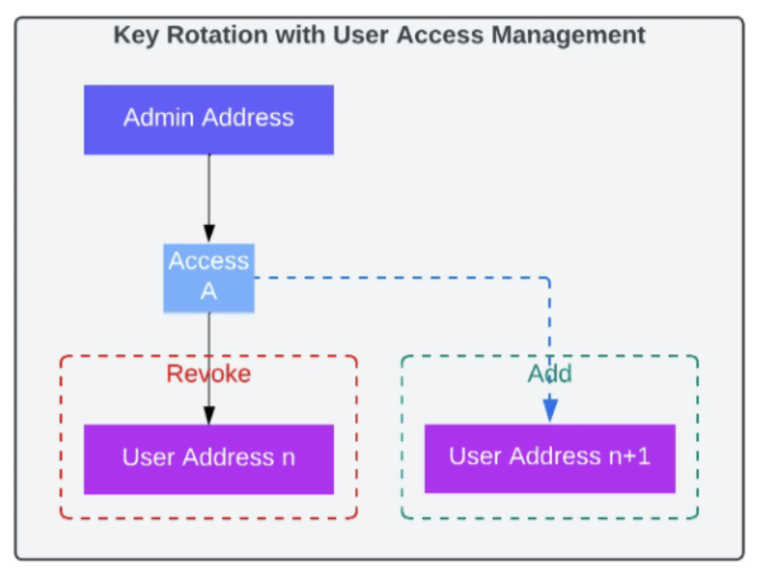
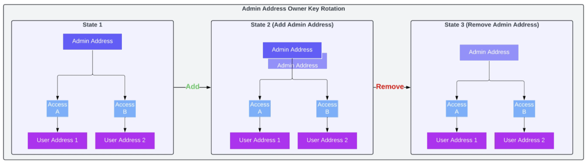

| Author(s) | Created | Status | References | Discussions |
| :---- | :---- | :---- | :---- | :---- |
| [Matt Nelson](mailto:matt.nelson@eigenlabs.org) [Zeyad Rajabi](mailto:zeyad@eigenlabs.org) [Yash Patil](mailto:yash@eigenlabs.org) | 2024-11-20 | Draft | |  |

# ELIP-003: User Access Management (UAM)

---

# Executive Summary

User Access Management (UAM) is a protocol-level feature in EigenLayer enhancing key management for Operators and AVS developers, such as allowing secure key rotation, revocation, and recovery. UAM will simplify AVS architecture in key ways, primarily through splitting of responsibilities of the `ServiceManager`. The protocol now demarcates specific functionality the root admin keys may appoint to new addresses, either EOAs or contracts. Similarly, admin keys themselves may be appointed or rotated. 

# Motivation

Operators play a crucial role in securing the EigenLayer ecosystem by allowing stakers to delegate their assets to provide services to Actively Validated Services (AVS). To operate effectively, Operators and AVS developers rely on secure and efficient management of cryptographic keys:

1. **Operator Key**: A smart contract or ECDSA key used for core functions, such as registration, reward claiming, slashable stake allocation, and fee management, requiring infrequent use.

2. **AVS Operations Keys**: Frequently used smart contract wallet or ECDSA keys used to manage operations-related functionality within the core protocol.

3. **Operator AVS Signing Keys**: Smart contract wallets, ECDSA, BLS, or other types of keys linked to an Operator for attestation and used for task verification logic in the AVS.

Current limitations in EigenLayer’s key management create several challenges for Operators and AVS developers:

1. **Security Risks**: Limited key management, such as lack of key rotation, increases the risk of key theft, loss, and unauthorized access, impacting network integrity and risking slashing penalties.  
2. **Operational Complexity**: Managing multiple AVS keys, including their generation, storage, and rotation, increases the administrative burden and risk of errors, threatening both security and efficiency.  
3. **Profitability Impact**: Poor key management can lead to lost rewards and slashing events, which, when coupled with operational complexity, discourages Operators from managing multiple AVSs.  
4. **Growing Demands for Best Practice**: Adherence to cybersecurity best practices requires Operators (and AVS developers) to meet standards for secure key management and auditing. **Without a robust key management system and a way to control permissions across a customer’s addresses, scalability, security, and efficiency are hindered across the EigenLayer ecosystem.** The User Access Management feature aims to address these challenges by enabling secure access management with permissions control.

# Specification & Rationale

User access management is implemented at the protocol level with a security-first and user empowerment approach, ensuring robust, decentralized security controls integrated directly into the core infrastructure. User access management allows admin address owners, either Operators or AVS developers, to create and manage as many appointed user (non-admin) addresses and admin addresses as they need. 

Admin address owners can add any number of user addresses and customize the protocol functions that each user address is  permitted to call. When access is no longer needed, admin address owners can revoke one or more permissions at the user address level. The following diagram highlights these key points:

**

Key rotation with this model is simple. An admin address owner can create a new user address with the same set of permissions and then revoke access to the old user address. The following diagram highlights key rotation design:

**

To rotate keys at the admin address owner level, admin address owners can create a new admin address. The admin address owner can then remove the old admin address. This approach ensures the new admin address has the same set of user addresses and permissions. The following diagram highlights key rotation at the admin address owner level:

**

## Access Permissions

Below are listed the protocol functions that admin address owners may appoint to a specific address:

* For Operators:  
  * Register for AVS  
  * Deregister from AVS  
  * Allocate Slashable Stake  
  * Claim rewards  
  * Set fee rates  
  * Update metadata  
  * Modify Operator Details  
  * Undelegate staker  
* For AVSs:  
  * Submit rewards  
  * Slashing  
  * Set AVS Registrar  
  * Manage Operator set strategies  
  * Add/Remove Quorum/OperatorSet  
  * Update AVS Metadata URI  
  * Eject Operator  
  * Rewards Claiming/SetClaimerFor (Rewards V2, refunds)

Admin keys will always be able to appoint children keys OR complete any of these actions themselves.

Note, access permissions can be extended beyond the list of functions listed above with new functions introduced at the protocol level (in the future) and with any custom smart contract function outside of EigenLayer protocol. 

## Contract Interface

UAM adds a core contract, the `PermissionController` as a dependency for the `DelegationManager`, `AllocationManager`, and `RewardsCoordinator`. We enable this functionality for AVSs and Operators but not for stakers. Note that if an Operator is also a staker, it cannot add an appointee for any staker operations, such as queueing a withdrawal and depositing.  There is no support for the `AVSDirectory` as we plan on deprecating its functionality at a later time in another ELIP.

Operators & AVSs can have multiple admins for their account. This enables admin key rotation. The account address of an Operator is initialized via the `registerAsOperator` function in the `DelegationManager`. The account address of an AVS is initialized via the `createOperatorSets` function in the `AllocationManager`.

Admins are configured via a 2-step handshake. An admin must be set as *pending*. After, the pending admin must accept adminhood over the account. There must always be at least one admin for the account. If  no admins have ever been set, then the initial Operator address acts as the admin. 

Operators cannot add an appointed user for initial Operator registration. In other words, the address they register with is their account and they can then transfer admin of that account in a subsequent transaction. Similarly, the account of an AVS is the address they use to initialize state in the `AllocationManager`. As admin keys are rotated, the original public address remains the associated Operator ID or AVS ID. 

The following Permission Controller interface is provided:

```solidity
// SPDX-License-Identifier: BUSL-1.1
pragma solidity ^0.8.27;

struct AccountPermissions {
    /// @notice The pending admins of the account
    EnumerableSet.AddressSet pendingAdmins;
    /// @notice The admins of the account
    EnumerableSet.AddressSet admins;
    /// @notice Mapping from an appointee to the list of encoded target & selectors
    mapping(address appointee => EnumerableSet.Bytes32Set) appointeePermissions;
    /// @notice Mapping from encoded target & selector to the list of appointees
    mapping(bytes32 targetSelector => EnumerableSet.AddressSet) permissionAppointees;
}

interface IPermissionControllerErrors {
    /// @notice Thrown when the caller is not the admin
    error NotAdmin();
    /// @notice Thrown when the admin to remove is not an admin
    error AdminNotSet();
    /// @notice Thrown when an appointee is already set for the account's function
    error AppointeeAlreadySet();
    /// @notice Thrown when an appointee is not set for the account's function
    error AppointeeNotSet();
    /// @notice Thrown when the account attempts to remove the only admin
    error CannotHaveZeroAdmins();
    /// @notice Thrown when an admin is already set
    error AdminAlreadySet();
    /// @notice Thrown when an admin is not pending
    error AdminNotPending();
    /// @notice Thrown when an admin is already pending
    error AdminAlreadyPending();
}

interface IPermissionControllerEvents {
    /// @notice Emitted when an appointee is set
    event AppointeeSet(address indexed account, address indexed appointee, address target, bytes4 selector);

    /// @notice Emitted when an appointee is revoked
    event AppointeeRemoved(address indexed account, address indexed appointee, address target, bytes4 selector);

    /// @notice Emitted when an admin is set as pending for an account
    event PendingAdminAdded(address indexed account, address admin);

    /// @notice Emitted when an admin is removed as pending for an account
    event PendingAdminRemoved(address indexed account, address admin);

    /// @notice Emitted when an admin is set for a given account
    event AdminSet(address indexed account, address admin);

    /// @notice Emitted when an admin is removed for a given account
    event AdminRemoved(address indexed account, address admin);
}

interface IPermissionController is IPermissionControllerErrors, IPermissionControllerEvents {
    /**
     * @notice Sets a pending admin of an account
     * @param account to set pending admin for
     * @param admin to set
     * @dev Multiple admins can be set for an account
     */
    function addPendingAdmin(address account, address admin) external;

    /**
     * @notice Removes a pending admin of an account
     * @param account to remove pending admin for
     * @param admin to remove
     * @dev Only the admin of the account can remove a pending admin
     */
    function removePendingAdmin(address account, address admin) external;

    /**
     * @notice Accepts the admin role of an account
     * @param account to accept admin for
     * @dev Only a pending admin for the account can become an admin
     */
    function acceptAdmin(
        address account
    ) external;

    /**
     * @notice Remove an admin of an account
     * @param account to remove admin for
     * @param admin to remove
     * @dev Only the admin of the account can reremmove an admin
     * @dev Reverts when an admin is removed such that no admins are remaining
     */
    function removeAdmin(address account, address admin) external;

    /**
     * @notice Set an appointee for a given account
     * @param account to set appointee for
     * @param appointee to set
     * @param target to set appointee for
     * @param selector to set appointee for
     * @dev Only the admin of the account can set an appointee
     */
    function setAppointee(address account, address appointee, address target, bytes4 selector) external;

    /**
     * Removes an appointee for a given account
     * @param account to remove appointee for
     * @param appointee to remove
     * @param target to remove appointee for
     * @param selector to remove appointee for
     * @dev Only the admin of the account can remove an appointee
     */
    function removeAppointee(address account, address appointee, address target, bytes4 selector) external;

    /**
     * @notice Checks if the given caller is an admin of the account
     * @dev If the account has no admin, the caller is checked to be the account itself
     */
    function isAdmin(address account, address caller) external view returns (bool);

    /**
     * @notice Checks if the `pendingAdmin` is a pending admin of the `account`
     */
    function isPendingAdmin(address account, address pendingAdmin) external view returns (bool);

    /**
     * @notice Get the admins of an account
     * @param account The account to get the admin of
     * @dev If the account has no admin, the account itself is returned
     */
    function getAdmins(
        address account
    ) external view returns (address[] memory);

    /**
     * @notice Get the pending admins of an account
     * @param account The account to get the pending admin of
     */
    function getPendingAdmins(
        address account
    ) external view returns (address[] memory);

    /**
     * @notice Checks if the given caller has permissions to call the fucntion
     * @param account to check
     * @param caller to check permission for
     * @param target to check permission for
     * @param selector to check permission for
     * @dev Returns `true` if the admin OR the appointee is the caller
     */
    function canCall(address account, address caller, address target, bytes4 selector) external returns (bool);

    /**
     * @notice Gets the list of permissions of an appointee for a given account
     * @param account to get appointee permissions for
     * @param appointee to get permissions
     */
    function getAppointeePermissions(
        address account,
        address appointee
    ) external returns (address[] memory, bytes4[] memory);

    /**
     * @notice Returns the list of appointees for a given account and function
     * @param account to get appointees for
     * @param target to get appointees for
     * @param selector to get appointees for
     * @dev Does NOT include admin as an appointee, even though it can call
     */
    function getAppointees(address account, address target, bytes4 selector) external returns (address[] memory);
}

```

This interface lives within the core contracts. The underlying `PermissionController` contract is upgradable. We anticipate new needs might arise in the core that will necessitate new actions to be added to the UAM interfaces. These may be yet-undesigned functionality in the core protocol that will be useful to appoint or permission. 

# Security Considerations

Security of the admin key is paramount in UAM. Operators and AVSs should take precautions when setting the admin address and ensuring safety of the admin key. Once an admin has accepted adminhood, the original root key of the Operator ID or AVS ID cannot be used for write operations to the protocol, unless also configured to be the admin. Regardless of how keys are structured and managed, caution is always recommended with admin keys. Never expose or connect admin keys to the web. As keys are needed, be mindful that UAM appointments can be made with lessened permissions or make use of keys that can later be rotated or destroyed. 

# Impact Summary

## Operators 

There is no enforced migration designed within this proposal. The protocol will continue to work as intended without action, but Operators will have new robust access management and permission control functionality available to them.

By allowing for flexible setting of addresses for each action, we anticipate a variety of solutions from simple (ECDSA key rotation) to complex (upstream smart contract permissioning schemes) to be implemented by Operators. This flexibility is by design to encourage and support robust cybersecurity practices, whatever they may be.

The following is a breaking change. We are updating interfaces to add the OperatorID as an input to several functions. This includes \`updateOperatorMetadataURI\` and \`modifyOperatorDetails\`.

```solidity  
 /**  
  * @notice Called by an operator to emit an \`OperatorMetadataURIUpdated\` event indicating the information has updated.  
  * @param operator The operator to update metadata for  
  * @param metadataURI The URI for metadata associated with an Operator  
  * @dev Note that the \`metadataURI\` is \*never stored \* and is only emitted in the \`OperatorMetadataURIUpdated\` event  
  */  
 function updateOperatorMetadataURI(  
     address operator,  
     string calldata metadataURI  
 ) external;  
```

## AVSs

As we move towards the release of Slashing, AVSs will need robust tools to ensure that keys are well protected, as they can soon be used to slash user funds and interact directly with allocated stake. The same flexible solution is provided to AVSs, and also opens the door to more complex, governance-based schemes, or simple, yet secure solutions like segregated multi-sigs per action. We anticipate that solutions will arise in the ecosystem specifically to fill some of these niches. The protocol remains unopinonated on these solutions, enabling AVS developers to choose their own approach. 

Additionally, UAM unlocks more modularity in AVS designs, by allowing for many write functions of the protocol to be appointed to new addresses (smart contracts). This opens up new designs and removes the need for the `Service Manager` to be the pass-through contract into EigenLayer.

# Action Plan

This proposal will be rolled into the Slashing release. It will not have its own upgrade associated with it and does not require any additional overhead on teams.

# References & Relevant Discussions

NA  
