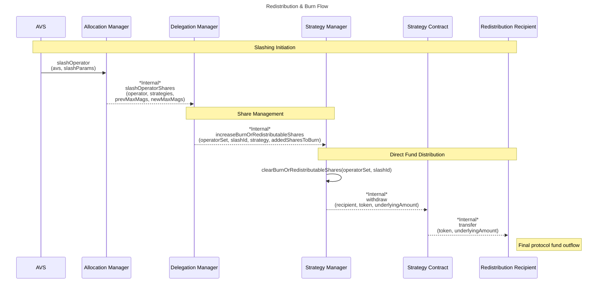

| Author(s) | Created | Status | References | Discussions |
|-------------|-----------|---------|------|----------|
| [Matt Nelson](mailto:matt.nelson@eigenlabs.org), [0xClandestine](https://github.com/0xClandestine) | 2025-04-30 | `testing` | [List of relevant work/PRs, if any] | [Discussion Forum Post](https://forum.eigenlayer.xyz/t/elip-006-redistributable-slashing/14553) |

# ELIP-006: Redistributable Slashing

---

# Executive Summary

[Slashing (ELIP-002)](./ELIP-002.md) is a key piece of EigenLayer's vision; it enables enforcement of crypto-economic commitments made by Service builders to their consumers and users. When leveraging slashing on EigenLayer today, security funds are always burned or locked when penalizing Operators. This creates a challenge for builders of use-cases that involve lending, insurance, risk hedging, or, broadly, commitments with a need to compensate harmed parties or amortize risk.

Redistributable Slashing is a feature that gives Service Builders a means to not just burn, but repurpose slashed funds. Redistribution represents an expansion of the types of use-cases builders can launch on EigenLayer, by expanding the expressivity of slashing on the platform. A new type of Operator Set with strict configuration controls allows for specifying a redistribution recipient by the AVS that receives slashed funds. This new feature requires, and is shipped with, adjustments to the EigenLayer security model and stake guarantees for AVSs to support this new slashing paradigm.

# Motivation

Slashings within EigenLayer cause an immediate and irreversible burn of funds. The existing slashing mechanism is restrictive in terms of capital expressivity; funds are either permanently destroyed or necessitate off-protocol methods to repurpose. This limitation significantly narrows the scope of potential applications—particularly in key areas like insurance and lending. Meanwhile, out-of-protocol or competing solutions embrace redistributable slashing. The absence of redistribution impacts Service Builders exploring use-cases like DeFi or insurance.

Introducing redistributable slashing significantly expands the expressivity and practicality of slashing on EigenLayer. More sophisticated slashing unblocks valuable protocol applications such as insurance, lending, bridging, and DeFi services on EigenLayer. Enabling Service Builders to design protocols around redistributable slashing improves capital efficiency for AVSs, Operators, and Stakers. These slashing changes represent high-impact opportunities with only modest engineering effort.

Collectively, Redistributable slashing promises expanded use-case diversity, greater AVS participation, increased value accrual for both security assets and AVS tokens, and ultimately, stronger revenue growth in the EigenLayer ecosystem.

# Features & Specification

## Overview

As of today, when slashed, ERC-20 funds are burned at the `0x0...00e16e4` address; EigenPod Native ETH funds are permanently locked when slashed. This is done asynchronously following the `slashOperator` function. There is more detail in [ELIP-002](./ELIP-002.md#slashing-of-unique-stake) on slashing mechanics. The same `slashOperator` mechanics apply, in large part. Redistributable Slashing requires minimal changes to the core protocol...

- to create a new type of Redistributable Operator Set,
- to handle a `redistributionRecipient`, that replaces the burn address when `clearBurnOrRedistributableShares` is called to transfer funds out of the protocol,
- to better decorate each slash with an identifier (`slashId`) that helps in downstream programmatic redistribution and accounting,
- and to modify some permission and withdrawal handling to strengthen guarantees of `slashOperator` (in both the burn and redistribute case).

These changes are externally facing in the `AllocationManager` interface. This is accompanied by changes to the storage of the `AllocationManager` as well. Internally, we have modified the `ShareManager` and `StrategyManager` interfaces, as well as some storage and internal logic.

## Specifications

### Redistributing Operator Sets

To take advantage of redistributable slashing, an AVS must instantiate a new `RedistributingOperatorSet`. These sets specify a `redistributionRecipient` address that CANNOT be changed later on. This is the address that will receive assets after a slash is triggered. This may be set to any address on Ethereum (EOA or Contract). AVSs may set whatever contracts they like upstream, but should make strong guarantees about the way they function in order to attract and retain Stakers and Operators.

New getter and setter functions are provided in the `AllocationManger` interface:

```solidity
interface IAllocationManager {
    /// @dev Existing struct in `IAllocationManager`.
    struct CreateSetParams {
        uint32 operatorSetId;
        IStrategy[] strategies;
    }
    
    /// EVENT

    /// @notice Emitted when a redistributing operator set is created by an AVS.
    event RedistributionAddressSet(OperatorSet operatorSet, address redistributionRecipient);
    
    /// WRITE

    /**
     * @notice Called by an AVS to slash an operator in a given operator set. The operator must be registered
     * and have slashable stake allocated to the operator set.
     *
     * @param avs The AVS address initiating the slash.
     * @param params The slashing parameters, containing:
     *  - operator: The operator to slash.
     *  - operatorSetId: The ID of the operator set the operator is being slashed from.
     *  - strategies: Array of strategies to slash allocations from (must be in ascending order).
     *  - wadsToSlash: Array of proportions to slash from each strategy (must be between 0 and 1e18).
     *  - description: Description of why the operator was slashed.
     *
     * @dev For each strategy:
     *      1. Reduces the operator's current allocation magnitude by wadToSlash proportion.
     *      2. Reduces the strategy's max and encumbered magnitudes proportionally.
     *      3. If there is a pending deallocation, reduces it proportionally.
     *      4. Updates the operator's shares in the DelegationManager.
     *
     * @dev Small slashing amounts may not result in actual token burns due to
     *      rounding, which will result in small amounts of tokens locked in the contract
     *      rather than fully burning through the burn mechanism.
     * @return slashId The operator set's unique identifier for the slash.
     * @return shares The number of shares to be burned or redistributed for each strategy that was slashed.
     */
    function slashOperator(
        address avs,
        SlashingParams calldata params
    ) external returns (uint256 slashId, uint256[] memory shares);

    /**
     * @notice Allows an AVS to create new Redistribution operator sets.
     * @param avs The AVS creating the new operator sets.
     * @param params An array of operator set creation parameters.
     * @param redistributionRecipients An array of addresses that will receive redistributed funds when operators are slashed.
     * @dev Same logic as `createOperatorSets`, except `redistributionRecipients` corresponding to each operator set are stored.
     *      Additionally, emits `RedistributionOperatorSetCreated` event instead of `OperatorSetCreated` for each created operator set.
     */
    function createRedistributingOperatorSets(
        address avs,
        CreateSetParams[] calldata params,
        address[] calldata redistributionRecipients
    ) external;

    /// READ

    /**
     * @notice Returns the address where slashed funds will be sent for a given operator set.
     * @param operatorSet The Operator Set to query.
     * @return For redistributing Operator Sets, returns the configured redistribution address set during Operator Set creation.
     *         For non-redistributing operator sets, returns the `DEFAULT_BURN_ADDRESS`.
     */
    function getRedistributionRecipient(
        OperatorSet memory operatorSet
    ) external view returns (address);

    /**
     * @notice Returns whether a given operator set supports redistribution
     * or not when funds are slashed and burned from EigenLayer.
     * @param operatorSet The Operator Set to query.
     * @return For redistributing Operator Sets, returns true.
     *         For non-redistributing Operator Sets, returns false.
     */
    function isRedistributingOperatorSet(
        OperatorSet memory operatorSet
    ) external view returns (bool);

    /**
     * @notice Returns the number of slashes for a given operator set.
     * @param operatorSet The operator set to query.
     * @return The number of slashes for the operator set.
     * @dev Slash counter will only increment after redistribution is live (not inclusive of previous slashes).
     */
    function getSlashCount(
        OperatorSet memory operatorSet
    ) external view returns (uint256);

    /**
     * @notice Returns whether an operator is slashable by a redistributing operator set.
     * @param operator The operator to query.
     */
    function isOperatorRedistributable(
        address operator
    ) external view returns (bool);
}
```

`RedistributingOperatorSets` act the same way in the core as normal Operator Sets. The [logic and control flow for Operator Set creation and registration](./ELIP-002.md#creation-registration--deregistration) as it relates to the protocol and `AVSRegistrar` contract remain the same. We store an additional field in storage that maps that Operator Set ID to a given `redistributionRecipient`. [Stake allocation mechanics](ELIP-002#allocating-and-deallocating-to-operator-sets) act the same as other Operator Sets.

### Slash Identifiers

Slashes are largely handled the same as in [the existing protocol](./ELIP-002.md#burning-of-slashed-funds). The `slashOperator` function has been updated to return a `slashId` (acting as a nonce), the `strategies` slashed, and the amount slashed in `shares`. This addition of the `slashId` in return data is to aid in programmatic handling of funds in redistribution logic by upstream (and out-of-protocol) contracts. Accounting of stake has not changed. The new storage model is below:

```solidity
abstract contract AllocationManagerStorage {
    /// @notice Returns the number of slashes for a given operator set.
    /// @dev This is also used as a unique slash identifier.
    /// @dev This tracks the number of slashes after the redistribution release.
    mapping(bytes32 operatorSetKey => uint256 slashId) internal _slashCount;

    /// @notice Returns the address where slashed funds will be sent for a given operator set.
    /// @dev For redistributing Operator Sets, returns the configured redistribution address set during Operator Set creation.
    ///      For non-redistributing or non-existing operator sets, returns `address(0)`.
    mapping(bytes32 operatorSetKey => address redistributionAddr) internal _redistributionRecipients;
}
```

All core contracts handling a slash, the `DelegationManager`, `ShareManager`, `StrategyManager`, and `EigenPodManager` have certain inputs updated to accept the `slashId`. This is for proper downstream accounting during burn or redistribution of funds. Below the `ShareManager` is modified for `slashId`

```solidity
interface IShareManager {
    /// @notice Used by the DelegationManager to remove a Staker's shares from a particular strategy when entering the withdrawal queue
    /// @dev strategy must be beaconChainETH when talking to the EigenPodManager
    /// @return updatedShares the staker's deposit shares after decrement
    function removeDepositShares(
        address staker,
        IStrategy strategy,
        uint256 depositSharesToRemove
    ) external returns (uint256);

    /// @notice Used by the DelegationManager to award a Staker some shares that have passed through the withdrawal queue
    /// @dev strategy must be beaconChainETH when talking to the EigenPodManager
    /// @return existingDepositShares the shares the staker had before any were added
    /// @return addedShares the new shares added to the staker's balance
    function addShares(
        address staker, 
        IStrategy strategy, 
        uint256 shares
    ) external returns (uint256, uint256);

    /// @notice Used by the DelegationManager to convert deposit shares to tokens and send them to a staker
    /// @dev strategy must be beaconChainETH when talking to the EigenPodManager
    /// @dev token is not validated when talking to the EigenPodManager
    function withdrawSharesAsTokens(
        address staker, 
        IStrategy strategy, 
        IERC20 token, uint256 shares) external;

    /// @notice Returns the current shares of `user` in `strategy`
    /// @dev strategy must be beaconChainETH when talking to the EigenPodManager
    /// @dev returns 0 if the user has negative shares
    function stakerDepositShares(address user, 
        IStrategy strategy
    ) external view returns (uint256 depositShares);

    /**
     * @notice Increase the amount of burnable/redistributable shares for a given Strategy. This is called by the DelegationManager
     * when an operator is slashed in EigenLayer.
     * @param operatorSet The operator set to burn shares in.
     * @param slashId The slash id to burn shares in.
     * @param strategy The strategy to burn shares in.
     * @param addedSharesToBurn The amount of added shares to burn.
     * @dev This function is only called by the DelegationManager when an operator is slashed.
     */
    function increaseBurnOrRedistributableShares(
        OperatorSet calldata operatorSet,
        uint256 slashId,
        IStrategy strategy,
        uint256 addedSharesToBurn
    ) external;
}
```

### Burn & Distribution Mechanics

The flow and code-paths for exiting slashed funds from the protocol have changed. Previously, ERC-20 funds flowed out of the protocol through withdrawals or a burn (transfer to `0x00...00e16e4`) at a regular cadence. Native ETH is still locked in EigenPods permanently during a slash. Following this upgrade, when a slash occurs, funds are exited in two steps. In order to maintain the protocol guarantee that `slashOperator` should never fail, outflow transfers are non-atomic.

When a single slash occurs...

- Similar to the original burning implementation, slashed shares are first increased in `StrategyManager` storage as "burnable or redistributable" shares.
- In another call, slashed shares are converted and funds are transferred directly to the `redistributionRecipient` (or burned if using a non-redistributing operator set). This is done through a permissionless call to the `clearBurnOrRedistributeShares` function on the `StrategyManager`.

This two party flow is done non-atomically to maintain the guarantee that a slash should never fail, in the case where a token transfer or some other upstream issue of removing funds from the protocol may fail. This flow is maintained, with the addition of redistributable shares, using the non-atomic approach while enabling direct distribution to redistribution recipients without a delay. The AVS can call `clearBurnOrRedistributeShares` or it will be called after some time by a cron job to ensure funds do not remain in the protocol after a slash.

The new flow is illustrated in the below diagram:



The `StrategyManager` interface has been updated to handle direct redistribution of funds, replacing the previously available `burnShares` functionality.

```solidity
interface IStrategyManager {
    /// @dev Thrown when attempting to add a strategy that is already in the operator set's burn or redistributable shares.
    error StrategyAlreadyInSlash();

    /// @notice Emitted when an operator is slashed and shares to be burned or redistributed are increased
    event BurnOrRedistributableSharesIncreased(
        OperatorSet operatorSet, uint256 slashId, IStrategy strategy, uint256 shares
    );

    /// @notice Emitted when shares marked for burning or redistribution are decreased and distributed
    event BurnOrRedistributableSharesDecreased(
        OperatorSet operatorSet, uint256 slashId, IStrategy strategy, uint256 shares
    );

    /// NOTE: We are keeping the original `burnShares` fn so that legacy burns can still be completed.

    /**
     * @notice Removes burned shares from storage and transfers the underlying tokens for the slashId to the redistribution recipient.
     * @dev Reentrancy is checked in the `clearBurnOrRedistributableSharesByStrategy` function.
     * @param operatorSet The operator set to burn shares in.
     * @param slashId The slash ID to burn shares in.
     * @return The amounts of tokens transferred to the redistribution recipient for each strategy
     */
    function clearBurnOrRedistributableShares(
        OperatorSet calldata operatorSet,
        uint256 slashId
    ) external returns (uint256[] memory);

    /**
     * @notice Removes a single strategy's shares from storage and transfers the underlying tokens for the slashId to the redistribution recipient.
     * @param operatorSet The operator set to burn shares in.
     * @param slashId The slash ID to burn shares in.
     * @param strategy The strategy to burn shares in.
     * @return The amount of tokens transferred to the redistribution recipient for the strategy.
     */
    function clearBurnOrRedistributableSharesByStrategy(
        OperatorSet calldata operatorSet,
        uint256 slashId,
        IStrategy strategy
    ) external returns (uint256);

    /**
     * @notice Returns the strategies and shares that have NOT been sent to the redistribution recipient for a given slashId.
     * @param operatorSet The operator set to burn or redistribute shares in.
     * @param slashId The slash ID to burn or redistribute shares in.
     * @return The strategies and shares for the given slashId.
     */
    function getBurnOrRedistributableShares(
        OperatorSet calldata operatorSet,
        uint256 slashId
    ) external view returns (IStrategy[] memory, uint256[] memory);

    /**
     * @notice Returns the shares for a given strategy for a given slashId.
     * @param operatorSet The operator set to burn or redistribute shares in.
     * @param slashId The slash ID to burn or redistribute shares in.
     * @param strategy The strategy to get the shares for.
     * @return The shares for the given strategy for the given slashId.
     * @dev This function will return revert if the shares have already been sent to the redistribution recipient.
     */
    function getBurnOrRedistributableShares(
        OperatorSet calldata operatorSet,
        uint256 slashId,
        IStrategy strategy
    ) external view returns (uint256);

    /**
     * @notice Returns the number of strategies that have NOT been sent to the redistribution recipient for a given slashId.
     * @param operatorSet The operator set to burn or redistribute shares in.
     * @param slashId The slash ID to burn or redistribute shares in.
     * @return The number of strategies for the given slashId.
     */
    function getBurnOrRedistributableCount(
        OperatorSet calldata operatorSet,
        uint256 slashId
    ) external view returns (uint256);
}
```

The `EigenPodManager` interfaces are updated to avoid breaking changes in the internal flows.

To recap the new or modified functionality:

- New Operator Set types enable a fixed `redistributionRecipient`.
- Additional meta-data has been added to each slash to help AVSs build programmatic redistribution.
- The `StrategyManager` has a modified flow to accommodate redistribution versus burning.

# Rationale

## Redistributing AVS Guarantees & Legibility  

Redistributable slashing is a modest upgrade in code, but has broad ramifications to the incentives and guarantees of the EigenLayer system. The majority of the design in this proposal is to ensure as much safety as possible for Stakers as redistribution creates a direct increase in the incentive to slash Operators by AVSs.

As funds are released from the protocol to an address specified by the AVS, it is important that Stakers have the right legibility to understand the risk of allocating to any Operators running an AVS with redistributable slashing enabled. This is the primary reason for the `redistributionRecipient` being an immutable address that must be set at the instantiation of the Operator Set. This provides a few guarantees:

- The AVS cannot change this address. While they may use an upstream proxy or pass-through contract, the immutability of this address in EigenLayer means an AVS can layer additional guarantees by guarding the upgradability of the upstream contract via controls such as governance, timelocks, immutability, etc.
- The capability to redistribute cannot be modified. An Operator Set must be redistributable at its creation. As a result, the protocol can make guarantees to Stakers and Operators over the lifetime of that Operator Set. A standard Operator Set cannot suddenly redistribute. And one that redistributes cannot remove that property.
- Legibility on the front-end and in metadata. By forcing immutability of the above properties, EigenLayer can better differentiate on its application and in chain meta-data where redistributable slashing is enabled for its users (and any implied or associated risk and reward tradeoffs of interaction).

These guarantees provide a hedge to increased slashing risk and changed incentives.

## Native ETH Redistribution

Native ETH will not be included in the scope of this proposal. Its exclusion is primarily tied to mechanics of the beacon chain. With redistributable slashing on the ETH strategy, exiting validators from the beacon chain to compensate the `redistributionRecipient` is required. We cannot make guarantees that the effective balance is high enough or that a partial withdrawal covers the balance of a slash without dipping validator balance below the 32 ETH minimum.

Consistently exiting Ethereum validators creates some problems for users and the network:

- Exits require waiting in the validator exit queue, which can range in length from hours to weeks.
- Funds have to wait to be swept before they will arrive at the specified withdrawal addresses in EigenPods. AVSs will not have access to any funds until this queue is cleared, which can impact programmatic designs.
- Impacts Ethereum network security, in some adversarial cases.

Together, these are enough to forgo this scope in the initial implementation of redistributable slashing. With the increase in the [max effective balance of validators](https://eips.ethereum.org/EIPS/eip-7251) enabled in Ethereum's Pectra upgrade, there are possible designs that can alleviate the above concerns (like partial withdrawals above the minimum required balance of 32 ETH). These are being actively explored as part of improvements to EigenPods, including exploration of forced withdrawal mechanisms with regard to slashing on EigenLayer and ETH validators.

# Security Considerations

The original slashing design, launched alongside [ELIP-002](./ELIP-002.md), recognized multiple classes of catastrophic slashing bug. A catastrophic slashing bug is considered to be one where an AVS (or malicious party) can...

- slash more stake than is allocated to a given Operator in an Operator Set (or more than the sum of the set, up to the entire protocol TVL),
- slash the unique stake of an Operator that is not registered to an AVS's Operator Set,
- trigger a slash without being a registered AVS.

With redistributable slashing, these cases represent theft vectors that could lead to unauthorized fund redistribution. This required more robust security measures, scrutiny, and required a very careful implementation. We have completed additional diligence specifically for this upgrade which can be found among our audits and are explained in part below.

As always, AVS's require extremely careful management of keys, as a compromised AVS key can lead to theft of user funds when redistributable slashing is in use. This not only harms stakers, but may cause irreparable reputational and monetary harm.

## Rounding and Precision Analysis

We conducted a comprehensive manual analysis and directed fuzzing to analyze protocol rounding behavior in the context of redistributable slashing. It is highly recommended you read [ELIP-002](./ELIP-002.md#magnitude-allocations) to better understand allocations and magnitudes. In this context, our analysis explored three key areas:

### Precision Drift in Pending Deallocations

Precision loss can be significantly larger in pending deallocations compared to current allocations. However, this additional precision loss only serves to remove more magnitude from the operator when deallocations are completed, harming the operator rather than benefiting them. There is no benefit to using pending deallocations as part of a precision loss attack.

### Deposit Scaling Factor (DSF) Manipulation

We identified an attack vector where an attacker could manipulate their deposit scaling factor to cause underflow, potentially inflating their withdrawable amounts astronomically. However, this attack requires:

- Starting with an Operator with max magnitude of WAD-1
- Performing thousands to millions of 1-share deposits
- Achieving ultra-low DSF values prone to underflow

While theoretically possible, this attack is impractical in real-world scenarios due to cost, complexity, and the observability of this type of attack. As a safeguard, the protocol now includes `require(newDepositScalingFactor != 0)` in `SlashingLib.update` to prevent DSF underflow.

### Rounding in Withdrawal Queue Slashing

Our analysis confirmed that precision loss in withdrawal queue slashing causes fewer assets to be redistributed rather than more. When precision loss occurs, it results in dust remaining in the protocol rather than being exploitable. The AVS cannot use the withdrawal queue to slash shares that do not belong to them.

Precision loss is inversely proportional to:

- The operator's allocated magnitude
- The proportion of magnitude slashed  
- The number of shares held by the operator

# Impact Summary

## AVSs & Service Builders

AVSs will gain access to a powerful new primitive in redistributable slashing upon which to develop use-cases. This comes with an even heavier emphasis on proper key management and op-sec requirements. The `redistributionRecipient` should be treated as an AVS-controlled role and signing key and be managed as such. An attacker that gains access to AVS keys on the `slasher` and `redistributionRecipient` can drain the entirety of Operator and Staker allocated stake for a given Operator Set. This will have heavy repercussions on the AVSs reputation and continued trust.

Because redistribution may allow AVSs to benefit from a theft related to slashing, additional design care must be taken to consider the incentives of all parties that can interact with it. When handled appropriately, AVSs will have new use-case opportunities but must consider the higher risk and slash incentive for those running their code.

### Operator Selection and Slashing Parameters

Based on our [rounding and precision analysis](./ELIP-006.md#rounding-and-precision-analysis), AVSs should consider the following guidelines (or implement invariants) when designing their slashing protocols to avoid precision loss issues.Generally, slashing in very small increments, slashing operators with very low magnitudes, or slashing operators with very low share balances may lead to precision loss that results in burned/redistributed amounts being far lower than expected. The following guidelines should be followed to minimize this risk.

**Operator Selection Criteria:**

*Magnitude Thresholds:*

- **Reject operators with allocated magnitude under 1e9**: Operators with very low allocated magnitude are more susceptible to precision loss during slashing
- **Rationale**: When slashing small magnitudes, the `mulWadRoundUp` operations can result in zero redistributed amounts due to rounding
- **Checking**: Query `getAllocatedMagnitude()` for each operator-strategy pair before allowing registration
- **Example**:
  - Slash and Allocation Parameters:
    - Max magnitude: `1e18`
    - Allocated magnitude: `1e4`
    - wadsToSlash: `1e14`
    - operatorShares: `1e17`
  - Results:
    - Magnitude slashed: 1 dust
    - Shares slashed: 0

*Share Thresholds:*

- **Reject operators with fewer than 1e9 delegated shares**: Low share counts increase the likelihood of rounding errors that reduce redistributed amounts
- **Rationale**: The `calcSlashedAmount` function depends on sufficient precision in the `mulDiv` operation to avoid zero results
- **Checking**: Query operator's total delegated shares across all strategies before registration
- **Cross-validation**: Ensure both magnitude and share thresholds are met simultaneously, as they are interdependent

**Slashing Amount Considerations:**

*Percentage Thresholds:*

- **Exercise significant caution when slashing less than 0.01% (1e14 WAD)**: Very small slashing percentages are more prone to precision loss
- **Mathematical basis**: Slashing amounts below 1e14 WAD against operators with borderline magnitude/shares can result in zero redistributed amounts
- **Recommendation**: Consider implementing a minimum slash percentage (e.g., 0.1% or 1e15 WAD) for reliable redistribution
- **Testing**: Verify that your intended slashing percentages produce non-zero results against your minimum operator thresholds

*Token Decimal Considerations:*

- **Standard tokens (18 decimals)**: Generally safe when following magnitude/share thresholds
- **Low-decimal tokens require extreme caution**:
  - **USDC (6 decimals)**: Requires minimum 1000 USDC deposit to reach 1e9 precision
  - **USDT (6 decimals)**: Same considerations as USDC
  - **WBTC (8 decimals)**: Requires minimum 10 WBTC deposit to reach 1e9 precision
- **Calculation**: For a token with `d` decimals, minimum deposit = `1e9 / 10^d` tokens
- **Risk assessment**: Evaluate if your expected operator ecosystem can meet these deposit requirements

**Implementation Recommendations:**

We provide several recommendations to avoid some of the pitfalls mentioned above. [Provided here is a demo](https://gist.github.com/wadealexc/1997ae306d1a5a08e5d26db1fac8d533) that can help in illustrating some of the validations as well. Below are additional, basic examples:

*Pre-Registration Validation:*

```solidity
// Example validation checks
require(getAllocatedMagnitude(operator, strategy) >= 1e9, "Insufficient magnitude");
require(getOperatorShares(operator) >= 1e9, "Insufficient shares");
require(tokenDecimals >= 6, "Token decimals too low"); // Adjust based on risk tolerance
```

*Pre-Slash Validation:*

```solidity
// Example pre-slash checks
uint256 expectedSlash = calculateExpectedSlash(operator, strategy, slashPercentage);
require(expectedSlash > 0, "Slash amount would round to zero");
require(slashPercentage >= MINIMUM_SLASH_PERCENTAGE, "Slash percentage too small");
```

*Monitoring and Alerting:*

- **Track precision loss events**: Monitor for slashes that result in zero or unexpectedly small redistributed amounts
- **Alert on edge cases**: Set up alerts for operators approaching magnitude/share thresholds
- **Audit slash outcomes**: Regularly verify that slashed amounts match expected calculations

*Testing Recommendations:*

- **Fuzz testing**: Test slashing with random small amounts against operators with varying magnitude/share combinations
- **Edge case testing**: Specifically test the minimum thresholds with your intended slashing percentages
- **Multi-strategy testing**: Verify behavior when operators have allocations across multiple strategies with different token decimals

*Recovery Procedures:*

- **Dust accumulation**: Understand that precision loss results in small amounts of "dust" remaining in the protocol
- **Operator remediation**: Develop procedures for operators who fall below thresholds (e.g., requiring additional deposits)
- **Slashing adjustments**: Have procedures to adjust slashing parameters if precision loss becomes problematic

**Risk Assessment Framework:**
AVSs should evaluate their specific use case against these parameters:

1. **Expected operator size distribution**: Will most operators easily meet the 1e9 thresholds?
2. **Slashing frequency and amounts**: How often and how much do you expect to slash?
3. **Token ecosystem**: What tokens will operators stake, and do they meet decimal requirements?
4. **Precision tolerance**: Can your protocol tolerate small amounts of precision loss?

Following these guidelines helps ensure that slashing operates reliably and redistributed amounts match expectations, while minimizing the risk of precision-related issues.

## Operators

Operators must similarly ensure focus is given to key management and op-sec when running *any* redistributable AVS. A compromise in an Operator key could cause a malicious actor to register for a malicious AVS, and slash and redistribute allocated Staker funds to some address. Operators would suffer potentially irreparable reputational damage and distrust from Stakers.

Operators should be aware that meta-data will identify them as `Redistributable` when participating in any redistributing Operator Sets. This is to aid in Staker risk legibility. Operators may wish to avoid this change in their presented profile when seeking to attract Stake (or may chose to engage protocols of various risks with higher rewards). Running an Operator Set with redistributable slashing will always remain opt-in for Operators.

## Stakers

This proposal has the largest impact to the risk, reward, and incentive model for Stakers. In general, there is a larger incentive to slash user funds when redistribution is enabled. Stakers should carefully consider the protocols that their delegated Operators are running, and consider the risk and reward trade-offs. Redistributable Operator Sets may offer higher rewards, but these should be considered against the increased slashing risks.

Additionally, Stakers are potentially at risk from malicious AVSs and malicious Operator. If the AVSs governance or its slashing functionality is corrupted, an attacker may be able to drain Operator-delegated funds. If an Operator itself is compromised, it may stand-up its own AVS to steal user funds. Stakers should carefully consider the reputation and legitimacy of Operators when making delegations. We outline [these attack scenarios](https://forum.eigenlayer.xyz/t/risks-of-an-in-protocol-redistribution-design/14458) more detail on our forum.

# Action Plan

This proposal will move to a testing phase on testnet with the above interfaces and approaches. EigenLayer is actively soliciting community feedback on the feature before moving it to Mainnet. As this is primarily an opt-in feature for Operators (and, by proxy Stakers).

1. Implementation and public comment period (now)
2. Public testing period and iteration of the code-base, with a public audit and associated patches (next)
3. Evaluation by Protocol Council and release to Mainnet, following acceptance (later)

This proposal is intended to be completed within a two to three month period.

# References & Relevant Discussions

- [Risks of an In-Protocol Redistribution Design](https://forum.eigenlayer.xyz/t/risks-of-an-in-protocol-redistribution-design/14458)
- [Out-of-Protocol Redistribution](https://forum.eigenlayer.xyz/t/redistribution-vault-with-an-overloaded-erc20/14434)
