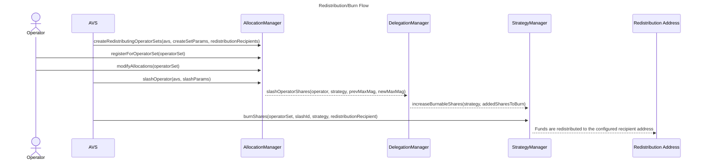

| Author(s) | Created | Status | References | Discussions |
|-------------|-----------|---------|------|----------|
| [Matt Nelson](mailto:matt.nelson@eigenlabs.org) | 2025-04-30 | `Draft` | [List of relevant work/PRs, if any] | [Link to discussion forum or thread] |

# ELIP-006: Redistributable Slashing

---

# Executive Summary

Slashing ([ELIP-002](./ELIP-002.md))is a key piece of EigenLayer’s vision; it enables enforcement of crypto-economic commitments made by Service builders to their consumers and users. When leveraging slashing on EigenLayer today, security funds are always burned or locked when penalizing Operators. This creates a challenge for builders of use-cases that involve lending, insurance, risk hedging, or, broadly, commitments with a need to compensate harmed parties or amortize risk.

Redistributable Slashing is a feature that gives Service Builders a means to not just burn, but repurpose slashed funds. Redistribution represents an expansion of the types of use-cases builders can launch on EigenLayer, by expanding the expressivity of slashing on the platform. A new type of Operator Set with strict configuration controls allows for specifying a redistribution recipient by the AVS that receives slashed funds. This new feature requires, and is shipped with, adjustments to the EigenLayer security model and stake guarantees for AVSs to support this new slashing paradigm.

# Motivation

Slashings within EigenLayer cause an immediate and irreversible burn of funds. The existing slashing mechanism is restrictive in terms of capital expressivity; funds are either permanently destroyed or necessitate off-protocol methods to repurpose. This limitation significantly narrows the scope of potential applications—particularly in key areas like insurance and lending. Meanwhile, out-of-protocol or competing solutions embrace redistributable slashing. The absence of redistribution impacts Service Builders exploring new token models and liquidity strategies for use-cases like DeFi or insurance.

Introducing redistributable slashing significantly expands the expressivity and practicality of slashing on EigenLayer. More sophisticated slashing unblocks valuable protocol applications such as insurance, lending, bridging, and DeFi services on EigenLayer. Enabling Service Builders to design protocols around redistributable slashing improves capital efficiency for AVSs, Operators, and Stakers through new liquidity and yield opportunities. These slashing changes represent high-impact opportunities with only modest engineering effort. 

Collectively, Redistributable slashing promises expanded use-case diversity, greater AVS participation, increased value accrual for both security assets and AVS tokens, and ultimately, stronger revenue growth in the EigenLayer ecosystem.

# Features & Specification

## Overview

As of today, when slashed, funds are burned at the `0x0...00316e4` address. This is done asynchronously following the `slashOperator` function. There is more detail in [ELIP-002](./ELIP-002.md#slashing-of-unique-stake) on slashing mechanics. The same `slashOperator` mechanics apply, in large part. Redistributable Slashing requires minimal changes to the core protocol...

- to create a new type of Redistributable Operator Set,
- to handle a `redistributionRecipient`, that replaces the burn address when `burnFunds` is called to transfer funds out of the protocol,
- to better decorate a slash with identifiers that help in upstream programmatic redistribution,
- and to modify some permission handling to strengthen guarantees of `slashOperator`. 

These changes are externally facing in the `AllocationManager` interface. This is accompanied by changes to the storage of the `AllocationManager` as well. Internally, we have modified the `ShareManager` and `StrategyManager` interfaces, as well as some storage and internal logic. The `PermissionController` is modified to address new role enforcement surrounding the Slasher. 

## Specifications

### Redistributing Operator Sets

To take advantage of redistributable slashing, an AVS must instantiate a new `RedistributingOperatorSet`. These sets specify a `redistributionRecipient` address that CANNOT be changed later on. AVSs may set whatever contracts they like upstream, but should make strong guarantees about the way they function in order to attract and retain Stakers and Operators. 

New getter and setter functions are provided in the `AllocationManger` interface: 

```solidity
interface IAllocationManager {
    /// STRUCTS (exists in `IAllocationManager`)
    
    struct CreateSetParams {
        uint32 operatorSetId;
        IStrategy[] strategies;
    }
    
    /// READ

    /**
     * @notice Returns the address where slashed funds will be sent for a given operator set.
     * @param operatorSet The Operator Set to query.
     * @return For redistributing Operator Sets, returns the configured redistribution address set during Operator Set creation.
     *         For non-redistributing operator sets, returns the `DEFAULT_BURN_ADDRESS`.
     */
    function getRedistributionRecipient(
        OperatorSet memory operatorSet
    ) external view returns (address);
    
    /**
     * @notice Returns whether a given operator set supports redistribution 
     * or not when funds are slashed and burned from EigenLayer. 
     * @param operatorSet The Operator Set to query.
     * @return For redistributing Operator Sets, returns true.
     *         For non-redistributing Operator Sets, returns false.
     *         This is based on a non-`DEFAULT_BURN_ADDRESS` being set, `0x0...314e6`.
     */
    function isRedistributingOperatorSet(
        OperatorSet memory operatorSet
    ) external view returns (bool);

    /// WRITE
    
    /**
     * @notice Allows an AVS to create new Redistribution operator sets.
     * @param avs The AVS creating the new operator sets.
     * @param params An array of operator set creation parameters.
     * @param redistributionRecipients An array of addresses that will receive redistributed funds when operators are slashed.
     * @dev Same logic as `createOperatorSets`, except `redistributionRecipients` corresponding to each Operator Set are stored.
     *      Additionally, emits `RedistributionOperatorSetCreated` event instead of `OperatorSetCreated` for each created operator set.
     * TODO: change og fn as well
     */
    function createRedistributingOperatorSets(
        address avs,
        CreateSetParams[] memory params,
        address[] memory redistributionRecipients
    ) external returns (uint32[] memory operatorSetIds);

    /// @dev This function is updated to return the `slashId`, `strategies` and `shares` (to be burned or redistributed, not those that remain).
    /// TODO: natspec
    function slashOperator(
        address avs,
        SlashingParams memory params
    ) external returns (uint256 slashId, IStrategy[] memory strategies, uint256[] memory shares);

    ///EVENTS

    /// @notice Emitted when an operator is slashed by an operator set for a strategy
    /// `wadSlashed` is the proportion of the operator's total delegated stake that was slashed
    /// TODO natspec
    event OperatorSlashed(
        address operator, 
        OperatorSet operatorSet, 
        IStrategy[] strategies, 
        uint256[] wadSlashed, 
        uint256 slashId,
        uint256[] slashAmounts, 
        string description
    );
}
```

`RedistributingOperatorSets` act the same way in the core as normal Operator Sets. We store an additional field in storage that maps that Operator Set ID to a given `redistributionRecipient`. The `slashOperator` function has been updated to return a `slashId` (acting as a nonce), the `strategies` slashed, and the amount slashed in `shares`. This return data is to aid in programmatic handling of funds in redistribution logic by upstream contracts. The new storage model is below:

```solidity
abstract contract AllocationManagerStorage {
    /// @dev Returns 
    mapping(bytes32 operatorSetKey => uint256 slashId) public slashCount;
    
    /**
     * @notice Returns the address where slashed funds will be sent for a given operator set.
     * @param operatorSet The Operator Set to query.
     * @return For redistributing Operator Sets, returns the configured redistribution address set during Operator Set creation.
     *         For non-redistributing operator sets, returns the `DEFAULT_BURN_ADDRESS`.
     */
    mapping(bytes32 operatorSetKey => address redistributionAddr) internal _redistributionRecipients;
}
```

The [logic and control flow for Operator Set creation and registration](./ELIP-002.md#creation-registration--deregistration) as it relates to the protocol and `AVSRegistrar` contract remain the same. 

## Redistribution Flow & Distribution Mechanics

The redistribution flow remains largely the same as [the slash and burn process](./ELIP-002.md#burning-of-slashed-funds) that exists today. To accommodate redistribution versus burning of funds, the `StrategyManager`, `ShareManager`, and `EigenPodManager` interfaces and internal contracts are modified. Primarily, existing events and functions are modified to handle the addition of the `slashId`. Below the `ShareManager` is modified for `slashId`:

```solidity
interface IShareManager {

    /**
     * @notice Increase the amount of burnable or redistributable shares for a given Strategy. This is called by the DelegationManager
     * when an operator is slashed in EigenLayer.
     * @param strategy The strategy to burn shares in.
     * @param operatorSet The operatorSet to burn shares on behalf of. This is used to check for a redistribution address.
     * @param slashId The identifier associated with the slash
     * @param addedSharesToBurn The amount of added shares to burn.
     * @dev This function is only called by the DelegationManager when an operator is slashed.
     */
    function increaseBurnableShares(
        IStrategy strategy, 
        OperatorSet memory operatorSet, 
        uint256 slashId, 
        uint256 addedSharesToBurn
    ) external;
} 
```

The `StrategyManager` interface has numerous changes. Here we have added the additional `burnOrDistribute` shares function alongside the original `burnShares`. The logic remains largely the same. This function is permissionless and asynchronous with regard to `slashOperator`. It is provided in a few forms for convenience, depending on *how many or what type* of slashes are being distributed. By consuming the Operator Set, these functions can also parse where to send the funds, via the `redistributionRecipient`.

```solidity
interface IStrategyManager {
    /// @notice Emitted when an operator is slashed and shares to be burned/redistributed are increased
    event BurnableSharesIncreased(OperatorSet operatorSet, uint256 slashId, IStrategy strategy, uint256 shares);

    /// @notice Emitted when shares are burned/redistributed
    event BurnableSharesDecreased(OperatorSet operatorSet, uint256 slashId, IStrategy strategy, uint256 shares);
    
    /// NOTE: we're keeping the original `burnShares`
    
    /**
     * @notice Burns/Redistributes Strategy shares for the given strategy and slashId by calling into the strategy to transfer
     * to the operatorSet's burn address
     * @param operatorSet The operatorSet to burn or redistribute shares for
     * @param slashId the identifier associated with the slash
     * @param strategy The strategy to burn shares in
     * @dev This is a permissionless function callable by anyone
     */
    function burnOrDistributeShares(
        OperatorSet memory operatorSet
        uint256 slashId
        IStrategy strategy,
    ) external;
    
    /**
     * @notice Burns/Redistributes Strategy shares for all strategies by calling into the strategy to transfer. This is an arrayified version of the above.
     * to the operatorSet's burn address
     * @param operatorSet The operatorSet to burn or redistribute shares for
     * @param slashId the identifier associated with the slash
     * @dev This is a permissionless function callable by anyone
     */
    function burnOrDistributeShares(
		    OperatorSet memory operatorSet
		    uint256 slashId
		);

    /**  
     * @notice: THIS MAY BE DELETED IN FINAL INTERFACE
     * @notice Burns/Redistributes Strategy shares for all strategies slashed by an operatorSet. This will redistribute every slash for a given Operator Set, regardless of ID.
     * @param operatorSet The operatorSet to burn or redistribute shares for
     * @dev This is a permissionless function callable by anyone
     */
    function burnOrDistributeShares(
        OperatorSet memory operatorSet
    ) external;
 

    // TODO: rework, two separate fns

    // TODO: may want to know if an operator in redistributable operator sets, at least one?
    
    /**
     * @notice Gets every Operator Set that has burned/redistributable shares, 
     * and for each set, get all SlashIDs and slashed strategies.
     *
     * @return (operatorSets, slashIds, strategies)
     */
    function getOperatorSetsWithSlashedShares(OperatorSet memory operatorSet) external returns (OperatorSet[] memory, uint256[][] memory, address[][] memory);
}   
```

**TODO: Update for pending decision RE instant redistributions**

Below is a sequence diagram outlining the new flows: 



The `EigenPodManager` interfaces are updated to avoid breaking changes in the internal flows. 

To recap:

- New Operator Set types enable a fixed `redistributionRecipient`. 
- Additional meta-data has been added to each slash to help AVSs build programmatic redistribution.
- The `StrategyManager` has a modified flow to accommodate redistribution versus burning.

**TODO: SLASHER PERMISSION CONTROL CHANGERS**

# Rationale

## Guarantees & Legibility  

Redistributable slashing is a modest upgrade in code, but has broad ramifications to the incentives and guarantees of the EigenLayer system. The majority of the design in this proposal is to ensure as much safety as possible for Stakers as redistribution creates a direct increase in the incentive to slash Operators by AVSs. 

As funds are released from the protocol to an address specified by the AVS, it is important that Stakers have the right legibility to understand the risk of allocating to any Operators running an AVS with redistributable slashing enabled. This is the primary reason for the `redistributionRecipient` being an immutable address that must be set at the instantiation of the Operator Set. This provides a few guarantees:

- The AVS cannot change this address. While they may use an upstream proxy or pass-through contract, the immutability of this address in EigenLayer means an AVS can layer additional guarantees by guarding the upgradability of the upstream contract via controls such as governance, timelocks, immutability, etc.
- The capability to redistribute cannot be modified. An Operator Set must be redistributable at its creation. As a result, the protocol can make guarantees to Stakers and Operators over the lifetime of that Operator Set. A standard Operator Set cannot suddenly redistribute. And one that redistributes cannot remove that property.
- Legibility on the front-end and in metadata. By forcing immutability of the above properties, EigenLayer can better differentiate on its application and in chain meta-data where redistributable slashing is enabled for its users (and any implied or associated risk and reward tradeoffs of interaction).

These guarantees provide a hedge to increased slashing risk and changed incentives. 

**TODO: UPDATE BELOW AFTER DESIGN DECISION**

> Additionally, the `slasher` address for the AVS is added to the Operator Set to make the same types of guarantees about what sits at that address and its immutability (or lack thereof). As redistributable slashing changes the incentive to slash, making guarantees about the slashing contract address is important. This is why we have removed this functionality from [UAM](./ELIP-003.md). 

**TODO: ANY DELAYS ^^** 

## Native ETH Redistribution 

Native ETH will not be included in the scope of this proposal. Its exclusion is primarily tied to mechanics of the beacon chain. With redistributable slashing on the ETH strategy, exiting validators from the beacon chain to compensate the `redistributionRecipient` is required. We cannot make guarantees that the effective balance is high enough or that a partial withdrawal covers the balance of a slash without dipping validator balance below the 32 ETH minimum. 

Consistently exiting Ethereum validators creates some problems for users and the network:

- Exits require waiting in the validator exit queue, which can range in length from hours to weeks. 
- Funds have to wait to be swept before they will arrive at the specified withdrawal addresses in EigenPods. AVSs will not have access to any funds until this queue is cleared, which can impact programmatic designs.
- Impacts Ethereum network security, in some adversarial cases. 

Together, these are enough to forgo this scope in the initial implementation of redistributable slashing. With the increase in the [max effective balance of validators](https://eips.ethereum.org/EIPS/eip-7251) being shipped in Pectra, there are possible designs that can alleviate the above concerns (like partial withdrawals above the minimum required balance of 32 ETH). These are being actively explored as part of improvements to EigenPods.  

# Security Considerations

**TODO: DELAY ADDITION FOR TVL DRAIN & STAKE WASHING**


# Impact Summary

## AVSs & Service Builders

AVSs will gain access to a powerful new primitive in redistributable slashing upon which to develop use-cases. This comes with an even heavier emphasis on proper key management and op-sec requirements. An attacker that gains access to AVS keys on the `slasher` and `redistributionRecipient` can drain the entirety of Operator and Staker allocated stake for a given Operator Set. This will have heavy repercussions on the AVSs reputation and continued trust. 

Because redistribution may allow AVSs to benefit from slashing, additional design care must be taken to consider the incentives of all parties that can interact with it. When handled appropriately, AVSs will have access to more liquid stake and higher risk to hose running their code, which should be countered with additional rewards to price these levers with the right incentives.

## Operators

Operators must similarly ensure focus is given to key management and op-sec when running *any* redistributable AVS. A compromise in an Operator key could cause a malicious actor to register for a malicious AVS, and slash and redistribute allocated Staker funds to some address. Operators would suffer potentially irreparable reputational damage and distrust from Stakers. 

Operators should be aware that meta-data will identify them as `Redistributable` when participating in any redistributing Operator Sets. This is to aid in Staker risk legibility. Operators may wish to avoid this change in their presented profile when seeking to attract Stake (or may chose to engage protocols of various risks with higher rewards). Running an Operator Set with redistributable slashing will always remain opt-in for Operators. 

## Stakers 

This proposal has the largest impact to the risk, reward, and incentive model for Stakers. In general, there is a larger incentive to slash user funds when redistribution is enabled. Stakers should carefully consider the protocols that their delegated Operators are running, and consider the risk and reward trade-offs. Redistributable Operator Sets may offer higher rewards, but these should be considered against the increased slashing risks. 

Additionally, Stakers are potentially at risk from malicious AVSs and malicious Operator. If the AVSs governance or its slashing functionality is corrupted, an attacker may be able to drain Operator-delegated funds. If an Operator itself is compromised, it may stand-up its own AVS to steal user funds. Stakers should carefully consider the reputation and legitimacy of Operators when making delegations. These attack scenarios are outlined in more detail [here](https://forum.eigenlayer.xyz/t/risks-of-an-in-protocol-redistribution-design/14458).

# Action Plan

This proposal will move to a testing phase on testnet with the above interfaces and approaches. EigenLayer is actively soliciting community feedback on the feature before moving it to Mainnet. As this is primarily an opt-in feature for Operators (and, by proxy Stakers).

1. Implementation and public comment period (now)
2. Public testing period and iteration of the code-base, with a public audit and associated patches (next)
3. Evaluation by Protocol Council and release to Mainnet, following acceptance (later)

This proposal is intended to be completed within a two to three month period. 

# References & Relevant Discussions

- [Risks of an In-Protocol Redistribution Design](https://forum.eigenlayer.xyz/t/risks-of-an-in-protocol-redistribution-design/14458)
- [Out-of-Protocol Redistribution](https://forum.eigenlayer.xyz/t/redistribution-vault-with-an-overloaded-erc20/14434)