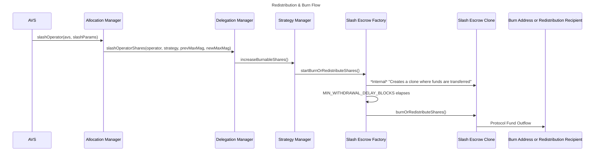

| Author(s) | Created | Status | References | Discussions |
|-------------|-----------|---------|------|----------|
| [Matt Nelson](mailto:matt.nelson@eigenlabs.org), [0xClandestine](https://github.com/0xClandestine) | 2025-04-30 | `Draft` | [List of relevant work/PRs, if any] | [Discussion Forum Post](https://forum.eigenlayer.xyz/t/elip-006-redistributable-slashing/14553) |

# ELIP-006: Redistributable Slashing

---

# Executive Summary

Slashing ([ELIP-002](./ELIP-002.md))is a key piece of EigenLayer’s vision; it enables enforcement of crypto-economic commitments made by Service builders to their consumers and users. When leveraging slashing on EigenLayer today, security funds are always burned or locked when penalizing Operators. This creates a challenge for builders of use-cases that involve lending, insurance, risk hedging, or, broadly, commitments with a need to compensate harmed parties or amortize risk.

Redistributable Slashing is a feature that gives Service Builders a means to not just burn, but repurpose slashed funds. Redistribution represents an expansion of the types of use-cases builders can launch on EigenLayer, by expanding the expressivity of slashing on the platform. A new type of Operator Set with strict configuration controls allows for specifying a redistribution recipient by the AVS that receives slashed funds. This new feature requires, and is shipped with, adjustments to the EigenLayer security model and stake guarantees for AVSs to support this new slashing paradigm.

# Motivation

Slashings within EigenLayer cause an immediate and irreversible burn of funds. The existing slashing mechanism is restrictive in terms of capital expressivity; funds are either permanently destroyed or necessitate off-protocol methods to repurpose. This limitation significantly narrows the scope of potential applications—particularly in key areas like insurance and lending. Meanwhile, out-of-protocol or competing solutions embrace redistributable slashing. The absence of redistribution impacts Service Builders exploring use-cases like DeFi or insurance.

Introducing redistributable slashing significantly expands the expressivity and practicality of slashing on EigenLayer. More sophisticated slashing unblocks valuable protocol applications such as insurance, lending, bridging, and DeFi services on EigenLayer. Enabling Service Builders to design protocols around redistributable slashing improves capital efficiency for AVSs, Operators, and Stakers. These slashing changes represent high-impact opportunities with only modest engineering effort.

Collectively, Redistributable slashing promises expanded use-case diversity, greater AVS participation, increased value accrual for both security assets and AVS tokens, and ultimately, stronger revenue growth in the EigenLayer ecosystem.

# Features & Specification

## Overview

As of today, when slashed, ERC-20 funds are burned at the `0x0...00316e4` address; EigenPod Native ETH funds are permanently locked when slashed. This is done asynchronously following the `slashOperator` function. There is more detail in [ELIP-002](./ELIP-002.md#slashing-of-unique-stake) on slashing mechanics. The same `slashOperator` mechanics apply, in large part. Redistributable Slashing requires minimal changes to the core protocol...

- to create a new type of Redistributable Operator Set,
- to handle a `redistributionRecipient`, that replaces the burn address when `burnFunds` is called to transfer funds out of the protocol,
- to better decorate each slash with an identifier (`slashId`) that helps in downstream programmatic redistribution and accounting,
- and to modify some permission and withdrawal handling to strengthen guarantees of `slashOperator` (in both the burn and redistribute case).

These changes are externally facing in the `AllocationManager` interface. This is accompanied by changes to the storage of the `AllocationManager` as well. Internally, we have modified the `ShareManager` and `StrategyManager` interfaces, as well as some storage and internal logic.

This proposal outlines a new core contract, the `SlashEscrowFactory` that brings new guarantees to `slashOperator` and protocol outflows. In the case of an implementation bug that would allow an AVS to slash *beyond its allocated unique stake* (e.g. a total protocol TVL drain), the `SlashEscrowFactory` exists to enable a governance pause and intervention. The `SlashEscrowFactory` creates contracts that hold and apply a four day delay on all slashed funds exiting the protocol to allow for this intervention, whether burned or redistributed.

## Specifications

### Redistributing Operator Sets

To take advantage of redistributable slashing, an AVS must instantiate a new `RedistributingOperatorSet`. These sets specify a `redistributionRecipient` address that CANNOT be changed later on. AVSs may set whatever contracts they like upstream, but should make strong guarantees about the way they function in order to attract and retain Stakers and Operators.

New getter and setter functions are provided in the `AllocationManger` interface:

```solidity
interface IAllocationManager {
    /// STRUCTS (exists in `IAllocationManager`)
    
    struct CreateSetParams {
        uint32 operatorSetId;
        IStrategy[] strategies;
    }
    
    /// READ

    /**
     * @notice Returns the address where slashed funds will be sent for a given operator set.
     * @param operatorSet The Operator Set to query.
     * @return For redistributing Operator Sets, returns the configured redistribution address set during Operator Set creation.
     *         For non-redistributing operator sets, returns the `DEFAULT_BURN_ADDRESS`.
     */
    function getRedistributionRecipient(
        OperatorSet memory operatorSet
    ) external view returns (address);
    
    /**
     * @notice Returns whether a given operator set supports redistribution 
     * or not when funds are slashed and burned from EigenLayer. 
     * @param operatorSet The Operator Set to query.
     * @return For redistributing Operator Sets, returns true.
     *         For non-redistributing Operator Sets, returns false.
     *         This is based on a non-`DEFAULT_BURN_ADDRESS` being set, `0x0...314e6`.
     */
    function isRedistributingOperatorSet(
        OperatorSet memory operatorSet
    ) external view returns (bool);

    /// WRITE
    
    /**
     * @notice Allows an AVS to create new Redistribution operator sets.
     * @param avs The AVS creating the new operator sets.
     * @param params An array of operator set creation parameters.
     * @param redistributionRecipients An array of addresses that will receive redistributed funds when operators are slashed.
     * @dev Same logic as `createOperatorSets`, except `redistributionRecipients` corresponding to each Operator Set are stored.
     *      Additionally, emits `RedistributionOperatorSetCreated` event instead of `OperatorSetCreated` for each created operator set.
     * TODO: change og fn as well
     */
    function createRedistributingOperatorSets(
        address avs,
        CreateSetParams[] memory params,
        address[] memory redistributionRecipients
    ) external returns (uint32[] memory operatorSetIds);

    /// @dev This function is updated to return the `slashId`, `strategies` and `shares` (to be burned or redistributed, not those that remain).
    /// TODO: natspec
    function slashOperator(
        address avs,
        SlashingParams memory params
    ) external returns (uint256 slashId, IStrategy[] memory strategies, uint256[] memory shares);

    ///EVENTS

    /// @notice Emitted when an operator is slashed by an operator set for a strategy
    /// `wadSlashed` is the proportion of the operator's total delegated stake that was slashed
    /// TODO natspec
    event OperatorSlashed(
        address operator, 
        OperatorSet operatorSet, 
        IStrategy[] strategies, 
        uint256[] wadSlashed, 
        uint256 slashId,
        uint256[] slashAmounts, 
        string description
    );
}
```

`RedistributingOperatorSets` act the same way in the core as normal Operator Sets. The [logic and control flow for Operator Set creation and registration](./ELIP-002.md#creation-registration--deregistration) as it relates to the protocol and `AVSRegistrar` contract remain the same. We store an additional field in storage that maps that Operator Set ID to a given `redistributionRecipient`. [Stake allocation mechanics](ELIP-002#allocating-and-deallocating-to-operator-sets) act the same as other Operator Sets.

### Slash Identifiers

Slashes are largely handled the same as in [the existing protocol](./ELIP-002.md#burning-of-slashed-funds). The `slashOperator` function has been updated to return a `slashId` (acting as a nonce), the `strategies` slashed, and the amount slashed in `shares`. This addition of the `slashId` in return data is to aid in programmatic handling of funds in redistribution logic by upstream (and out-of-protocol) contracts. Accounting of stake has not changed. The new storage model is below:

```solidity
abstract contract AllocationManagerStorage {
    /// @dev Returns 
    mapping(bytes32 operatorSetKey => uint256 slashId) public slashCount;
    
    /**
     * @notice Returns the address where slashed funds will be sent for a given operator set.
     * @param operatorSet The Operator Set to query.
     * @return For redistributing Operator Sets, returns the configured redistribution address set during Operator Set creation.
     *         For non-redistributing operator sets, returns the `DEFAULT_BURN_ADDRESS`.
     */
    mapping(bytes32 operatorSetKey => address redistributionAddr) internal _redistributionRecipients;
}
```

All core contracts handling a slash, the `DelegationManager`, `ShareManager`, `StrategyManager`, and `EigenPodManager` have certain inputs updated to accept the `slashId`. This is for proper downstream accounting during burn or redistribution of funds. Below the `ShareManager` is modified for `slashId`

```solidity
interface IShareManager {

    /**
     * @notice Increase the amount of burnable or redistributable shares for a given Strategy. This is called by the DelegationManager
     * when an operator is slashed in EigenLayer.
     * @param strategy The strategy to burn shares in.
     * @param operatorSet The operatorSet to burn shares on behalf of. This is used to check for a redistribution address.
     * @param slashId The identifier associated with the slash
     * @param addedSharesToBurn The amount of added shares to burn.
     * @dev This function is only called by the DelegationManager when an operator is slashed.
     */
    function increaseBurnableShares(
        IStrategy strategy, 
        OperatorSet memory operatorSet, 
        uint256 slashId, 
        uint256 addedSharesToBurn
    ) external;
} 
```

### Burn & Distribution Mechanics

The flow and code-paths for exiting slashed funds from the protocol have changed. Perviously, funds were exited only through a burn (transfer to `0x00...00316e4`) at a regular cadence. Following this upgrade, when a slash occurs, funds are atomically moved from the `StrategyManager` through the `SlashEscrowFactory` to be held in individual `SlashEscrow` contracts. The `SlashEscrowFactory` now interfaces directly with the `AllocationManager` following a slash. In the cloned child contracts, slashed funds are escrowed for a four day period to intervene in the case of slashing bugs. ***Funds no longer sit in the `DelegationManager` marked for a `burn` and are no longer exited via functions on the `ShareManager`.*** The new flow is illustrated in the below diagram:



The rationale for this new contract, process, and delay is [outlined in the rationale](./ELIP-006.md#outflow-delay). A global minimum escrow period is introduced that is set by governance. This is a constant value, set at a minimum of four days.

The interface for the `SlashEscrowFactory` is provided below:

```solidity
interface ISlashEscrowFactoryErrors {
    /// @notice Thrown when a caller is not the strategy manager.
    error OnlyStrategyManager();

    /// @notice Thrown when a caller is not the redistribution recipient.
    error OnlyRedistributionRecipient();

    /// @notice Thrown when a redistribution is not mature.
    error RedistributionNotMature();

    /// @notice Thrown when a burn or redistribution delay is less than the minimum burn or redistribution delay.
    error BurnOrRedistributionDelayLessThanMinimum();
}

interface ISlashEscrowFactoryEvents {
    /// @notice Emitted when a redistribution is initiated.
    event StartBurnOrRedistribution(
        OperatorSet operatorSet, uint256 slashId, IStrategy strategy, uint256 underlyingAmount, uint32 startBlock
    );

    /// @notice Emitted when a redistribution is released.
    event BurnOrRedistribution(
        OperatorSet operatorSet, uint256 slashId, IStrategy strategy, uint256 underlyingAmount, address recipient
    );

    /// @notice Emitted when a redistribution is paused.
    event RedistributionPaused(OperatorSet operatorSet, uint256 slashId);

    /// @notice Emitted when a redistribution is unpaused.
    event RedistributionUnpaused(OperatorSet operatorSet, uint256 slashId);

    /// @notice Emitted when a global burn or redistribution delay is set.
    event GlobalBurnOrRedistributionDelaySet(uint256 delay);

    /// @notice Emitted when a burn or redistribution delay is set.
    event StrategyBurnOrRedistributionDelaySet(IStrategy strategy, uint256 delay);
}

interface ISlashEscrowFactory is ISlashEscrowFactoryErrors, ISlashEscrowFactoryEvents {
    /**
     * @notice Initializes the initial owner and paused status.
     * @param initialOwner The initial owner of the router.
     * @param initialPausedStatus The initial paused status of the router.
     */
    function initialize(address initialOwner, uint256 initialPausedStatus) external;

    /**
     * @notice Locks up a redistribution.
     * @param operatorSet The operator set whose redistribution is being locked up.
     * @param slashId The slash ID of the redistribution that is being locked up.
     * @param strategy The strategy that whose underlying tokens are being redistributed.
     * @param underlyingAmount The amount of underlying tokens that are being redistributed.
     */
    function startBurnOrRedistributeShares(
        OperatorSet calldata operatorSet,
        uint256 slashId,
        IStrategy strategy,
        uint256 underlyingAmount
    ) external;

    /**
     * @notice Releases a redistribution.
     * @param operatorSet The operator set whose redistribution is being released.
     * @param slashId The slash ID of the redistribution that is being released.
     * @dev The caller must be the redistribution recipient, unless the redistribution recipient
     * is the default burn address in which case anyone can call.
     */
    function burnOrRedistributeShares(
        OperatorSet calldata operatorSet,
        uint256 slashId
    ) external;

    /**
     * @notice Pauses a redistribution.
     * @param operatorSet The operator set whose redistribution is being paused.
     * @param slashId The slash ID of the redistribution that is being paused.
     */
    function pauseRedistribution(OperatorSet calldata operatorSet, uint256 slashId) external;

    /**
     * @notice Unpauses a redistribution.
     * @param operatorSet The operator set whose redistribution is being unpaused.
     * @param slashId The slash ID of the redistribution that is being unpaused.
     */
    function unpauseRedistribution(OperatorSet calldata operatorSet, uint256 slashId) external;

    /**
     * @notice Sets the delay for the burn or redistribution of a strategies underlying token.
     * @dev If the strategy delay is less than the global delay, the strategy delay will be used.
     * @param strategy The strategy whose burn or redistribution delay is being set.
     * @param delay The delay for the burn or redistribution.
     */
    function setStrategyBurnOrRedistributionDelay(IStrategy strategy, uint256 delay) external;

    /**
     * @notice Sets the delay for the burn or redistribution of all strategies underlying tokens globally.
     * @param delay The delay for the burn or redistribution.
     */
    function setGlobalBurnOrRedistributionDelay(
        uint256 delay
    ) external;

    /**
     * @notice Returns the operator sets that have pending burn or redistributions.
     * @return operatorSets The operator sets that have pending burn or redistributions.
     */
    function getPendingOperatorSets() external view returns (OperatorSet[] memory operatorSets);

    /**
     * @notice Returns the total number of operator sets with pending burn or redistributions.
     * @return The total number of operator sets with pending burn or redistributions.
     */
    function getTotalPendingOperatorSets() external view returns (uint256);

    /**
     * @notice Returns whether an operator set has pending burn or redistributions.
     * @param operatorSet The operator set whose pending burn or redistributions are being queried.
     * @return Whether the operator set has pending burn or redistributions.
     */
    function isPendingOperatorSet(
        OperatorSet calldata operatorSet
    ) external view returns (bool);

    /**
     * @notice Returns the pending slash IDs for an operator set.
     * @param operatorSet The operator set whose pending slash IDs are being queried.
     */
    function getPendingSlashIds(
        OperatorSet calldata operatorSet
    ) external view returns (uint256[] memory);

    /**
     * @notice Returns the total number of slash IDs for an operator set.
     * @param operatorSet The operator set whose total slash IDs are being queried.
     * @return The total number of slash IDs for the operator set.
     */
    function getTotalPendingSlashIds(
        OperatorSet calldata operatorSet
    ) external view returns (uint256);

    /**
     * @notice Returns whether a slash ID is pending for an operator set.
     * @param operatorSet The operator set whose pending slash IDs are being queried.
     * @param slashId The slash ID of the slash that is being queried.
     * @return Whether the slash ID is pending for the operator set.
     */
    function isPendingSlashId(OperatorSet calldata operatorSet, uint256 slashId) external view returns (bool);

    /**
     * @notice Returns the pending burn or redistributions for an operator set and slash ID.
     * @dev This is a variant that returns the pending burn or redistributions for an operator set and slash ID.
     * @param operatorSet The operator set whose pending burn or redistributions are being queried.
     * @param slashId The slash ID of the burn or redistribution that is being queried.
     * @return strategies The strategies that are pending burn or redistribution.
     * @return underlyingAmounts The underlying amounts that are pending burn or redistribution.
     */
    function getPendingBurnOrRedistributions(
        OperatorSet calldata operatorSet,
        uint256 slashId
    ) external view returns (IStrategy[] memory strategies, uint256[] memory underlyingAmounts);

    /**
     * @notice Returns all pending burn or redistributions for an operator set.
     * @dev This is a variant that returns all pending burn or redistributions for an operator set.
     * @param operatorSet The operator set whose pending burn or redistributions are being queried.
     * @return strategies The nested list of strategies that are pending burn or redistribution.
     * @return underlyingAmounts The nested list of underlying amounts that are pending burn or redistribution.
     */
    function getPendingBurnOrRedistributions(
        OperatorSet calldata operatorSet
    ) external view returns (IStrategy[][] memory strategies, uint256[][] memory underlyingAmounts);

    /**
     * @notice Returns all pending burn or redistributions for all operator sets.
     * @dev This is a variant that returns all pending burn or redistributions for all operator sets.
     * @return strategies The nested list of strategies that are pending burn or redistribution.
     * @return underlyingAmounts The nested list of underlying amounts that are pending burn or redistribution.
     */
    function getPendingBurnOrRedistributions()
        external
        view
        returns (IStrategy[][][] memory strategies, uint256[][][] memory underlyingAmounts);

    /**
     * @notice Returns the number of pending burn or redistributions for an operator set and slash ID.
     * @param operatorSet The operator set whose pending burn or redistributions are being queried.
     * @param slashId The slash ID of the burn or redistribution that is being queried.
     * @return The number of pending burn or redistributions.
     */
    function getPendingBurnOrRedistributionsCount(
        OperatorSet calldata operatorSet,
        uint256 slashId
    ) external view returns (uint256);

    /**
     * @notice Returns the pending underlying amount for a strategy for an operator set and slash ID.
     * @param operatorSet The operator set whose pending underlying amount is being queried.
     * @param slashId The slash ID of the burn or redistribution that is being queried.
     * @param strategy The strategy whose pending underlying amount is being queried.
     * @return The pending underlying amount.
     */
    function getPendingUnderlyingAmountForStrategy(
        OperatorSet calldata operatorSet,
        uint256 slashId,
        IStrategy strategy
    ) external view returns (uint256);

    /**
     * @notice Returns the paused status of a redistribution.
     * @param operatorSet The operator set whose redistribution is being queried.
     * @param slashId The slash ID of the redistribution that is being queried.
     * @return The paused status of the redistribution.
     */
    function isBurnOrRedistributionPaused(
        OperatorSet calldata operatorSet,
        uint256 slashId
    ) external view returns (bool);

    /**
     * @notice Returns the start block for a slash ID.
     * @param operatorSet The operator set whose start block is being queried.
     * @param slashId The slash ID of the start block that is being queried.
     * @return The start block.
     */
    function getBurnOrRedistributionStartBlock(
        OperatorSet calldata operatorSet,
        uint256 slashId
    ) external view returns (uint256);

    /**
     * @notice Returns the burn or redistribution delay for a strategy.
     * @param strategy The strategy whose burn or redistribution delay is being queried.
     * @return The burn or redistribution delay.
     */
    function getStrategyBurnOrRedistributionDelay(
        IStrategy strategy
    ) external view returns (uint256);

    /**
     * @notice Returns the global burn or redistribution delay.
     * @return The global burn or redistribution delay.
     */
    function getGlobalBurnOrRedistributionDelay() external view returns (uint256);

    /**
     * @notice Returns the salt for a slash escrow.
     * @param operatorSet The operator set whose slash escrow is being queried.
     * @param slashId The slash ID of the slash escrow that is being queried.
     * @return The salt for the slash escrow.
     */
    function computeSlashEscrowSalt(
        OperatorSet calldata operatorSet,
        uint256 slashId
    ) external pure returns (bytes32);

    /**
     * @notice Returns whether a slash escrow is deployed or still counterfactual.
     * @param operatorSet The operator set whose slash escrow is being queried.
     * @param slashId The slash ID of the slash escrow that is being queried.
     * @return Whether the slash escrow is deployed.
     */
    function isDeployedSlashEscrow(OperatorSet calldata operatorSet, uint256 slashId) external view returns (bool);

    /**
     * @notice Returns whether a slash escrow is deployed.
     * @param slashEscrow The slash escrow that is being queried.
     * @return Whether the slash escrow is deployed.
     */
    function isDeployedSlashEscrow(
        ISlashEscrow slashEscrow
    ) external view returns (bool);

    /**
     * @notice Returns the slash escrow for an operator set and slash ID.
     * @param operatorSet The operator set whose slash escrow is being queried.
     * @param slashId The slash ID of the slash escrow that is being queried.
     * @return The slash escrow.
     */
    function getSlashEscrow(OperatorSet calldata operatorSet, uint256 slashId) external view returns (ISlashEscrow);
}
```

This contract carves out roles and functions for pausing (and unpausing) in-flight slash outflows.

> 🏛️   **Note**
>
> The `pause` functionality in this contract is gated to the `Pauser multi-sig`, as [outlined in Eigen Foundation governance](https://docs.eigenfoundation.org/protocol-governance/technical-architecture). This role can *only* pause (or later unpause) outflows if there are still pending blocks (time) between slash initiation and the end of the escrow period. During a pause, governance and social consensus is the anticipated adjudication mechanism to determine if a rescue is needed for funds due to an [invalid bug](./ELIP-006.md#security-considerations). If funds are to be rescued, the `Community multi-sig` has the authority to upgrade the contract and return the funds to the protocol. The rationale for this is [outlined further below](./ELIP-006.md#governance-design).

For each slash, a child `SlashEscrow` contract is created from the factory. It is a very simple contract intended to hold tokens for the delay period. One contract is instantiated per slash and has a relatively small impact on Ethereum state. The `SlashEscrowFactory` controls the ability to call `burnOrRedistributeUnderlyingTokens`, meaning a pause on the `SlashEscrowFactory` by the `pauser` will freeze calls to the child contracts for certain `slashId`s. There additionally is a global `PAUSEALL` for all outflows, in the case of a widely abused slashing bug. Below is the interface:

```solidity
interface ISlashEscrow {
    /// @notice Burns or redistributes the underlying tokens of the strategies.
    /// @param slashEscrowFactory The factory contract that created the slash escrow.
    /// @param slashEscrowImplementation The implementation contract that was used to create the slash escrow.
    /// @param operatorSet The operator set that was used to create the slash escrow.
    /// @param slashId The slash ID that was used to create the slash escrow.
    /// @param recipient The recipient of the underlying tokens.
    /// @param strategy The strategy that was used to create the slash escrow.
    function burnOrRedistributeUnderlyingTokens(
        ISlashEscrowFactory slashEscrowFactory,
        ISlashEscrow slashEscrowImplementation,
        OperatorSet calldata operatorSet,
        uint256 slashId,
        address recipient,
        IStrategy strategy
    ) external;

    /// @notice Verifies the deployment parameters of the slash escrow.
    /// @param slashEscrowFactory The factory contract that created the slash escrow.
    /// @param slashEscrowImplementation The implementation contract that was used to create the slash escrow.
    /// @param operatorSet The operator set that was used to create the slash escrow.
    /// @param slashId The slash ID that was used to create the slash escrow.
    /// @return True if the provided parameters create this contract's address, false otherwise.
    function verifyDeploymentParameters(
        ISlashEscrowFactory slashEscrowFactory,
        ISlashEscrow slashEscrowImplementation,
        OperatorSet calldata operatorSet,
        uint256 slashId
    ) external view returns (bool);
}
```

The `StrategyManager` interface has numerous changes; the majority of the functionality has been moved to the `SlashEscrowFactory`, including the previously available `burnShares` functionality.

```solidity
interface IStrategyManager {
    /// @notice Emitted when an operator is slashed and shares to be burned/redistributed are increased
    event BurnableSharesIncreased(OperatorSet operatorSet, uint256 slashId, IStrategy strategy, uint256 shares);

    /// @notice Emitted when shares are burned/redistributed
    event BurnableSharesDecreased(OperatorSet operatorSet, uint256 slashId, IStrategy strategy, uint256 shares);
    
    /// NOTE: we're keeping the original `burnShares`
    
    /**
     * @notice Burns/Redistributes Strategy shares for the given strategy and slashId by calling into the strategy to transfer
     * to the operatorSet's burn address
     * @param operatorSet The operatorSet to burn or redistribute shares for
     * @param slashId the identifier associated with the slash
     * @param strategy The strategy to burn shares in
     * @dev This is a permissionless function callable by anyone
     */
    function burnOrDistributeShares(
        OperatorSet memory operatorSet
        uint256 slashId
        IStrategy strategy,
    ) external;
    
    /**
     * @notice Burns/Redistributes Strategy shares for all strategies by calling into the strategy to transfer. This is an arrayified version of the above.
     * to the operatorSet's burn address
     * @param operatorSet The operatorSet to burn or redistribute shares for
     * @param slashId the identifier associated with the slash
     * @dev This is a permissionless function callable by anyone
     */
    function burnOrDistributeShares(
        OperatorSet memory operatorSet
        uint256 slashId
    );

    /**  
     * @notice: THIS MAY BE DELETED IN FINAL INTERFACE
     * @notice Burns/Redistributes Strategy shares for all strategies slashed by an operatorSet. This will redistribute every slash for a given Operator Set, regardless of ID.
     * @param operatorSet The operatorSet to burn or redistribute shares for
     * @dev This is a permissionless function callable by anyone
     */
    function burnOrDistributeShares(
        OperatorSet memory operatorSet
    ) external;
 

    // TODO: rework, two separate fns

    // TODO: may want to know if an operator in redistributable operator sets, at least one?
    
    /**
     * @notice Gets every Operator Set that has burned/redistributable shares, 
     * and for each set, get all SlashIDs and slashed strategies.
     *
     * @return (operatorSets, slashIds, strategies)
     */
    function getOperatorSetsWithSlashedShares(OperatorSet memory operatorSet) external returns (OperatorSet[] memory, uint256[][] memory, address[][] memory);
}   
```

The `EigenPodManager` interfaces are updated to avoid breaking changes in the internal flows.

To recap the new or modified functionality:

- New Operator Set types enable a fixed `redistributionRecipient`.
- Additional meta-data has been added to each slash to help AVSs build programmatic redistribution.
- The `StrategyManager` has a modified flow to accommodate redistribution versus burning.

# Rationale

## Outflow Delay

There are many interactions between the normal code-paths of the protocol and redistribution that are handled carefully with new security mechanisms. With redistributable slashing, the protocol implements what amounts to a new withdrawal path for funds. EigenLayer provides guarantees around withdrawals via the 14-day stake guarantee window. If the protocol provided the same delay, a two week period would detrimentally impact the usability of redistributable slashing, including programmatic fund redistribution use-cases and insurance products.

To this end, this proposal suggests a default slash escrow period amounting to four day, in blocks. This is enough time to ensure oversight by the `Pauser multi-sig`, accounting for coordination (or extraneous) delays and on-chain censorship resistance. This delay exists *only* to allow the `Pauser multi-sig` to execute a pause on slashes that are deemed implementation bugs (e.g. a slash value is greater than the Operator Sets allocated stake).

## Governance Design

The governance design for the `SlashEscrowFactory` in redistributable slashing uses existing protocol governance structures to minimize complexity and oversight. The `Pauser multi-sig` is chosen as the primary control point for pausing buggy slashes, as this aligns with its existing role of pausing the protocol in case of critical bugs. The `Pauser multi-sig` already has established governance controls through Eigen Foundation and maintains the ability to quickly respond to potential implementation issues.

For the rescue of any funds in extreme cases, the `Community multi-sig` is designated as the authority, with a near complete degree of control over contract upgrades in case of emergency. This choice stems from the `Community multi-sig`'s existing position as the social consensus oversight body for the EigenLayer protocol, with its high thresholds (and required signatures) for action to avoid capture. By utilizing these existing governance structures rather than creating new ones, the design maintains simplicity while preserving the strong security guarantees already present in the protocol.

Governance will *only* interface with the `SlashEscrow` contracts in the case of a "catastrophic bug" as defined in the [Security Considerations](./ELIP-006.md#security-considerations). The governance process will not intervene in individual AVS slashings when they are the product of faulty implementations, bugs, or lost keys. The EigenLayer middleware contracts provide [templates for vetoable slashing designs](https://github.com/Layr-Labs/eigenlayer-middleware/blob/dev/src/slashers/VetoableSlasher.sol). The [documentation contains guidance on how to design controls](https://docs.eigenlayer.xyz/developers/HowTo/build/slashing/slashing-veto-committee-design) for these cases for AVS builders.

## Redistributing AVS Guarantees & Legibility  

Redistributable slashing is a modest upgrade in code, but has broad ramifications to the incentives and guarantees of the EigenLayer system. The majority of the design in this proposal is to ensure as much safety as possible for Stakers as redistribution creates a direct increase in the incentive to slash Operators by AVSs.

As funds are released from the protocol to an address specified by the AVS, it is important that Stakers have the right legibility to understand the risk of allocating to any Operators running an AVS with redistributable slashing enabled. This is the primary reason for the `redistributionRecipient` being an immutable address that must be set at the instantiation of the Operator Set. This provides a few guarantees:

- The AVS cannot change this address. While they may use an upstream proxy or pass-through contract, the immutability of this address in EigenLayer means an AVS can layer additional guarantees by guarding the upgradability of the upstream contract via controls such as governance, timelocks, immutability, etc.
- The capability to redistribute cannot be modified. An Operator Set must be redistributable at its creation. As a result, the protocol can make guarantees to Stakers and Operators over the lifetime of that Operator Set. A standard Operator Set cannot suddenly redistribute. And one that redistributes cannot remove that property.
- Legibility on the front-end and in metadata. By forcing immutability of the above properties, EigenLayer can better differentiate on its application and in chain meta-data where redistributable slashing is enabled for its users (and any implied or associated risk and reward tradeoffs of interaction).

These guarantees provide a hedge to increased slashing risk and changed incentives.

## Native ETH Redistribution

Native ETH will not be included in the scope of this proposal. Its exclusion is primarily tied to mechanics of the beacon chain. With redistributable slashing on the ETH strategy, exiting validators from the beacon chain to compensate the `redistributionRecipient` is required. We cannot make guarantees that the effective balance is high enough or that a partial withdrawal covers the balance of a slash without dipping validator balance below the 32 ETH minimum.

Consistently exiting Ethereum validators creates some problems for users and the network:

- Exits require waiting in the validator exit queue, which can range in length from hours to weeks.
- Funds have to wait to be swept before they will arrive at the specified withdrawal addresses in EigenPods. AVSs will not have access to any funds until this queue is cleared, which can impact programmatic designs.
- Impacts Ethereum network security, in some adversarial cases.

Together, these are enough to forgo this scope in the initial implementation of redistributable slashing. With the increase in the [max effective balance of validators](https://eips.ethereum.org/EIPS/eip-7251) being shipped in Pectra, there are possible designs that can alleviate the above concerns (like partial withdrawals above the minimum required balance of 32 ETH). These are being actively explored as part of improvements to EigenPods, including exploration of forced withdrawal mechanisms with regard to slashing on EigenLayer and ETH validators.

# Security Considerations

The original slashing design, launched alongside [ELIP-002](./ELIP-002.md), did not account for the protocol's ability to handle a catastrophic slashing bug. A catastrophic slashing bug is considered to be one where an AVS (or malicious party) can...

- slash more stake than is allocated to a given Operator in an Operator Set (or more than the sum of the set, up to the entire protocol TVL),
- slash the unique stake of an Operator that is not registered to an AVS's Operator Set,
- trigger a slash without being a registered AVS.

These cases generally represent where governance will intervene to prevent a malicious party from slashing too much or slashing someone they shouldn't. These interventions are especially important with redistributable slashing, as the feature, coupled with these bugs, could enable theft of all assets from EigenLayer. These cases are the only cases in which governance will interface with the escrow contracts. Governance will not intervene in other cases, as stated in the [governance design](./ELIP-006.md#governance-design).

As always this update requires very careful management of keys, as a compromised AVS key can lead to theft of user funds when redistributable slashing is in use causing reputational and monetary harm.

# Impact Summary

## AVSs & Service Builders

AVSs will gain access to a powerful new primitive in redistributable slashing upon which to develop use-cases. This comes with an even heavier emphasis on proper key management and op-sec requirements. An attacker that gains access to AVS keys on the `slasher` and `redistributionRecipient` can drain the entirety of Operator and Staker allocated stake for a given Operator Set. This will have heavy repercussions on the AVSs reputation and continued trust.

Because redistribution may allow AVSs to benefit from slashing, additional design care must be taken to consider the incentives of all parties that can interact with it. When handled appropriately, AVSs will balance new use-case opportunities against higher risk and slash incentive for those running their code. Builders should consider how to counter these changes with additional rewards to offset risk with the right incentives for Stakers and Operators.

## Operators

Operators must similarly ensure focus is given to key management and op-sec when running *any* redistributable AVS. A compromise in an Operator key could cause a malicious actor to register for a malicious AVS, and slash and redistribute allocated Staker funds to some address. Operators would suffer potentially irreparable reputational damage and distrust from Stakers.

Operators should be aware that meta-data will identify them as `Redistributable` when participating in any redistributing Operator Sets. This is to aid in Staker risk legibility. Operators may wish to avoid this change in their presented profile when seeking to attract Stake (or may chose to engage protocols of various risks with higher rewards). Running an Operator Set with redistributable slashing will always remain opt-in for Operators.

## Stakers

This proposal has the largest impact to the risk, reward, and incentive model for Stakers. In general, there is a larger incentive to slash user funds when redistribution is enabled. Stakers should carefully consider the protocols that their delegated Operators are running, and consider the risk and reward trade-offs. Redistributable Operator Sets may offer higher rewards, but these should be considered against the increased slashing risks.

Additionally, Stakers are potentially at risk from malicious AVSs and malicious Operator. If the AVSs governance or its slashing functionality is corrupted, an attacker may be able to drain Operator-delegated funds. If an Operator itself is compromised, it may stand-up its own AVS to steal user funds. Stakers should carefully consider the reputation and legitimacy of Operators when making delegations. These attack scenarios are outlined in more detail [here](https://forum.eigenlayer.xyz/t/risks-of-an-in-protocol-redistribution-design/14458).

# Action Plan

This proposal will move to a testing phase on testnet with the above interfaces and approaches. EigenLayer is actively soliciting community feedback on the feature before moving it to Mainnet. As this is primarily an opt-in feature for Operators (and, by proxy Stakers).

1. Implementation and public comment period (now)
2. Public testing period and iteration of the code-base, with a public audit and associated patches (next)
3. Evaluation by Protocol Council and release to Mainnet, following acceptance (later)

This proposal is intended to be completed within a two to three month period.

# References & Relevant Discussions

- [Risks of an In-Protocol Redistribution Design](https://forum.eigenlayer.xyz/t/risks-of-an-in-protocol-redistribution-design/14458)
- [Out-of-Protocol Redistribution](https://forum.eigenlayer.xyz/t/redistribution-vault-with-an-overloaded-erc20/14434)
