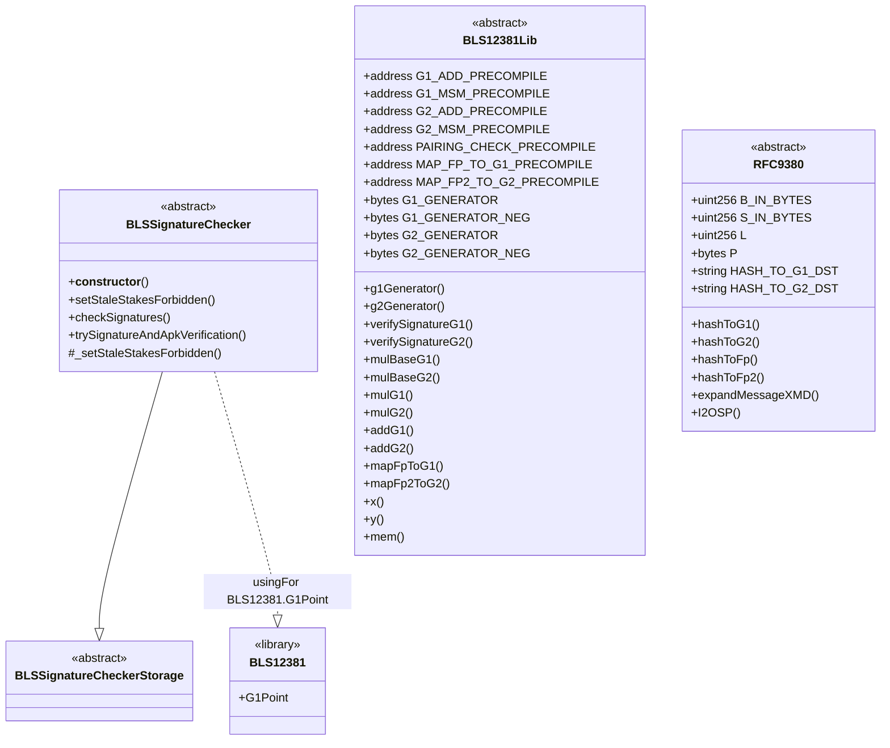

# EigenLayer Improvement Proposal: [Title]

| Author(s) | Created | Status | References | Discussions |
|-------------|-----------|---------|------|----------|
| [Ron Turetzky](turetzkyron@gmail.com), [Ram Veigman](rubydusa@protonmail.com)| 2025-05-29 | `Draft` | [BLS381 EIP2537](https://eips.ethereum.org/EIPS/eip-2537),[RFC 9380](https://datatracker.ietf.org/doc/rfc9380/),[BLS381 WIP solidity lib](https://github.com/BreadchainCoop/bls12381-sol)| N/A |

# ELIP-007: BLS12-381 Curve Support

## Executive Summary
Integrating BLS12-381 enhances EigenLayer's scalability and security by enabling efficient ,secure and compliant cryptographic signature aggregation. Higher bit security, standardized hash-to-curve and pre-existing best practice remote signing utilities makes this curve an ideal first class primitive for Eigenlayer AVS teams.  

## Motivation
EigenLayer provides the cryptoeconomic foundations for secure, scalable, and flexible Active Validation Services (AVSs). As these services grow in complexity and scale, there is an increasing demand for advanced cryptographic primitives that enable efficient and secure signature aggregation schemes.

Integrating BLS12-381 directly addresses this need by offering a pairing-friendly elliptic curve with proven robustness and industry-wide adoption. Its incorporation into EigenLayer will empower AVSs with a reliable and widely supported cryptographic standard, facilitating interoperability and ease of integration with external tooling and services.

BLS12-381 provides superior bit security (128-bit), effectively future-proofing EigenLayer AVSs against evolving computational threats. Additionally, its standardized hash-to-curve method (as opposed to BN254 - see this [open security vunerablity](https://github.com/Layr-Labs/eigenlayer-middleware/issues/172)) ensures consistent and secure implementations across various services, significantly reducing potential attack surfaces.

The widespread ecosystem support for BLS12-381, including mature libraries and established remote-signing infrastructure, simplifies deployment and reduces development overhead for AVSs, allowing EigenLayer teams to focus on core service logic rather than cryptographic implementation details.

Ultimately, adding BLS12-381 as a first-class primitive enhances EigenLayer’s security posture, scalability potential, and accessibility, enabling richer AVS functionality and fostering greater trust and adoption across the EigenLayer ecosystem.
# Features & Specification

#### BLS12381 Verification Library
The equivalent of [the BN254 library](https://github.com/Layr-Labs/eigenlayer-middleware/blob/3fb5b61076475108bd87d4e6c7352fd60b46af1c/src/libraries/BN254.sol) , but working with the precompiles introduced in the Pectra update compliant with [EIP2537](https://eips.ethereum.org/EIPS/eip-2537). 

#### BLS12381 Key Registrar Support 
As defined in the [Key Registrar](https://github.com/Layr-Labs/eigenlayer-middleware/pull/481) feature, support for BLS12381 registration as a first class curve primitive would include:
- Inclusion in the CurveType enum 
- Rogue Key Attack Prevention/ Proof of Possession on registration 
- APK updates 
- Support for all setter/getter methods established for BN254 

#### BLS12381 Stake Weighted Verification Support 
The equivalent of the [BN254 BLS Signature Checker](https://github.com/Layr-Labs/eigenlayer-middleware/blob/3fb5b61076475108bd87d4e6c7352fd60b46af1c/src/BLSSignatureChecker.sol) , for equivalent support the following would need to be implemented 
- Signer APK construction derived from non-signer bitmap 

Multi-quorum/operator set verification is highly reccomended to *not be implemented* for this ELIP if possible, as the added complexity is highly use-case specific and adds friction for implementing teams. 
## Specifications 

The following are UMLs and functions for the previously established feature set, an implementation can be found [here](https://github.com/BreadchainCoop/bls12381-sol)

```solidity 
library BLS12381Lib {

    /**
     * @dev Returns the generator point of the G1 group on BLS12-381
     * @return result The G1 generator point
     */
    function g1Generator() internal pure returns (_T.G1Point result) 

    /**
     * @dev Returns the generator point of the G2 group on BLS12-381
     * @return result The G2 generator point
     */
    function g2Generator() internal pure returns (_T.G2Point result) 

    /**
     * @dev Verifies a G1 BLS12-381 signature
     * @dev https://datatracker.ietf.org/doc/html/draft-irtf-cfrg-bls-signature-04#section-3.1
     * @param signature The signature to verify (pk, signature, message)
     * @return result True if the signature is valid, false otherwise
     */
    function verifySignatureG1(_T.Signature memory signature) internal view returns (bool) 

    /**
     * @dev Verifies a G2 BLS12-381 signature
     * @dev https://datatracker.ietf.org/doc/html/draft-irtf-cfrg-bls-signature-04#section-3.1
     * @param signature The signature to verify (pk, signature, message)
     * @return result True if the signature is valid, false otherwise
     */
    function verifySignatureG2(_T.Signature memory signature) internal view returns (bool) 

    /**
     * @dev Multiplies the G1 generator point by a scalar using the G1 multi-scalar multiplication precompile
     * @param scalar The scalar to multiply the generator point by
     * @return result The resulting G1 point after scalar multiplication
     */
    function mulBaseG1(uint256 scalar) internal view returns (_T.G1Point result) 

    /**
     * @dev Multiplies the G2 generator point by a scalar using the G2 multi-scalar multiplication precompile
     * @param scalar The scalar to multiply the generator point by
     * @return result The resulting G2 point after scalar multiplication
     */
    function mulBaseG2(uint256 scalar) internal view returns (_T.G2Point result) 

    /**
     * @dev Multiplies a G1 curve point by a scalar using the G1 multi-scalar multiplication precompile
     * @param point The G1 point to multiply
     * @param scalar The scalar to multiply the point by
     * @return result The resulting G1 point after scalar multiplication
     */
    function mulG1(_T.G1Point point, uint256 scalar) internal view returns (_T.G1Point result) 

    /**
     * @dev Multiplies a G2 curve point by a scalar using the G2 multi-scalar multiplication precompile
     * @param point The G2 point to multiply
     * @param scalar The scalar to multiply the point by
     * @return result The resulting G2 point after scalar multiplication
     */
    function mulG2(_T.G2Point point, uint256 scalar) internal view returns (_T.G2Point result) 

    /**
     * @dev Adds two G1 curve points using the G1 addition precompile
     * @param point1 The first G1 point to add
     * @param point2 The second G1 point to add
     * @return result The resulting G1 point after addition
     */
    function addG1(_T.G1Point point1, _T.G1Point point2) internal view returns (_T.G1Point result) 

    /**
     * @dev Adds two G2 curve points using the G2 addition precompile
     * @param point1 The first G2 point to add
     * @param point2 The second G2 point to add
     * @return result The resulting G2 point after addition
     */
    function addG2(_T.G2Point point1, _T.G2Point point2) internal view returns (_T.G2Point result) 

    /**
     * @dev Maps a field element in Fp to a point on the G1 curve using the map-to-curve precompile
     * @param element The Fp field element to map to G1
     * @return result The resulting G1 point after mapping
     */
    function mapFpToG1(IBLSTypes.Fp element) internal view returns (_T.G1Point result) 

    /**
     * @dev Maps a field element in Fp2 to a point on the G2 curve using the map-to-curve precompile
     * @param element The Fp2 field element to map to G2
     * @return result The resulting G2 point after mapping
     */
    function mapFp2ToG2(IBLSTypes.Fp2 element) internal view returns (_T.G2Point result) 
}
library RFC9380 {

    /**
     * @dev https://datatracker.ietf.org/doc/html/rfc9380#section-3-4.2.1
     * @dev Hashes an arbitrary input to a point on the G1 curve using the hash-to-curve method from RFC9380
     * @dev This implements the hash_to_curve operation for BLS12-381 G1 as specified in RFC9380 section 8.8.1
     * @param input The input bytes to hash to a curve point
     * @return result A point on the G1 curve derived deterministically from the input
     */
    function hashToG1(bytes memory input) internal view returns (_T.G1Point result) {

    function hashToG2(bytes memory input) internal view returns (_T.G2Point result) {

    // m = 1, extension field degree
    /**
     * @dev https://datatracker.ietf.org/doc/html/rfc9380#name-hash_to_field-implementatio
     * @dev Hashes an arbitrary input to one or more field elements in the base field Fp of BLS12-381
     * @param input The input bytes to hash
     * @param dst The domain separation tag to prevent collisions between different hash usages
     * @param count The number of field elements to generate
     * @return result An array of count field elements in Fp
     */
    function hashToFp(bytes memory input, string memory dst, uint256 count)

    // m = 2, extension field degree
    function hashToFp2(bytes memory input, string memory dst, uint256 count)

    /**
     * @dev https://datatracker.ietf.org/doc/html/rfc9380#name-expand_message_xmd
     * @dev Expands a message using the expand_message_xmd method as per RFC9380.
     * @param message The input message as bytes.
     * @param dst The domain separation tag as a string.
     * @param len_in_bytes The desired length of the output in bytes.
     * @return result The expanded message as a byte array.
     */
    function expandMessageXMD(bytes memory message, string memory dst, uint16 len_in_bytes)
interface IBLSSignatureChecker {

    /*
     * @notice This function is called by disperser when it has aggregated all the signatures of the operators
     * that are part of the quorum for a particular taskNumber and is asserting them into onchain. The function
     * checks that the claim for aggregated signatures are valid.
     *
     * The thesis of this procedure entails:
     * 1. Getting the aggregated pubkey of all registered nodes at the time of pre-commit by the
     * disperser (represented by apk in the parameters)
     * 2. Subtracting the pubkeys of all non-signers (nonSignerPubkeys) and storing
     * the output in apk to get aggregated pubkey of all operators that are part of quorum
     * 3. Using this aggregated pubkey to verify the aggregated signature under BLS scheme
     *
     * @param msgHash The hash of the message that was signed

     * @param referenceBlockNumber The block number at which the stake information is being verified
     * @param nonSignerStakesAndSignature Contains non-signer information and aggregated signature data.
     * @return StakeTotal The struct containing the total and signed stake
     * @return signatoryRecordHash The hash of the signatory record, which is used for fraud proofs
     * @dev Before signature verification, the function verifies operator stake information. This includes
     * ensuring that the provided referenceBlockNumber is valid and recent enough, and that the stake is
     * either the most recent update for the total stake (of the operator) or latest before the referenceBlockNumber.
     */
    function checkSignatures(
        bytes32 msgHash,
        uint32 referenceBlockNumber,
        NonSignerStakesAndSignature memory nonSignerStakesAndSignature
    ) external view returns (QuorumStakeTotal memory, bytes32);

    /*
     * @notice Attempts to verify signature `sigma` against message hash `msgHash` using aggregate public keys `apk` and `apkG2`.
     * @param msgHash The hash of the message that was signed.
     * @param apk The aggregate public key in G1.
     * @param apkG2 The aggregate public key in G2.
     * @param sigma The signature to verify.
     * @return pairingSuccessful True if the pairing check succeeded.
     * @return signatureIsValid True if the signature is valid.
     */
    function trySignatureAndApkVerification(
        bytes32 msgHash,
        _T.G1Point memory apk,
        _T.G2Point memory apkG2,
        _T.G1Point memory sigma
    ) external view returns (bool pairingSuccessful, bool signatureIsValid);
}

}
```

## Rationale

Support for multi-quorum signature verification was removed due to increased complexity, reduced efficiency, and limited practical utility. Initially, multi-quorum verification aimed to optimize gas consumption by aggregating signatures across multiple quorums. However, this introduced substantial complexity in both contract logic and off-chain aggregation processes, leading to increased potential for bugs and audit complexity.

Practically, multi-quorum verification scenarios proved rare or unnecessary in typical EigenLayer use-cases. Individual quorum signature verifications simplify implementation, reduce attack vectors, improve auditability, and align closely with common AVS integration patterns. Consequently, focusing exclusively on single quorum verification enhances security, reduces complexity, and provides clear, predictable contract behavior.

## Security Considerations
Integrating BLS12-381 as a cryptographic primitive introduces specific security considerations that must be carefully managed to maintain EigenLayer's security posture:

#### Collision Resistance of Message Hashes
It is crucial that all messages hashed for signature verification are collision-resistant. EigenLayer AVS teams must ensure that message inputs cannot be manipulated to produce identical hashes, which could enable signature replay attacks. Thus, messages must include unique, domain-separated, and collision-resistant elements.

#### Proper Use of Domain Separation Tags (DSTs)
When employing hash-to-curve operations (RFC 9380), correct usage of Domain Separation Tags (DSTs) is essential. Failure to correctly apply DSTs can lead to signature collisions across different applications, potentially allowing attackers to reuse valid signatures maliciously. Therefore, all implementations must follow standardized DST usage.

#### Aggregation Pitfalls
While BLS signatures facilitate efficient aggregation, improper aggregation processes can introduce vulnerabilities. Aggregated signatures must always correspond correctly to their aggregated public keys, and AVS operators must carefully manage non-signers' public keys to avoid false validations. The Ethereum implementation or [`commonware`](commonware.xyz) (for a more decoupled , modular , avs native design) can serve as a reference for how to implement aggregation.  

#### Reliance on Precompiles
EigenLayer's integration heavily relies on BLS12-381 precompiles, which are EVM implementation-dependent. Teams should monitor underlying platform changes (e.g., EVM upgrades) closely, promptly adapting implementations to maintain compatibility and security guarantees (*especially on L2s*).

#### Key Management Practices
As cryptographic strength depends heavily on secure key management, AVS operators must enforce robust key lifecycle management, including secure generation, storage, rotation policies, and proactive key revocation procedures to prevent unauthorized access or compromise. [Web3Signer](https://github.com/Consensys/web3signer) is a widely adopted and maintained solution that may be utilized for this. 

Addressing these considerations ensures the secure, efficient, and reliable use of BLS12-381 signatures within EigenLayer's AVS ecosystem.

## Impact Summary

#### Enhanced Scalability and Efficiency for AVS teams 

Integrating BLS12-381 significantly enhances cryptographic operation efficiency through signature aggregation, substantially reducing on-chain data storage and computational overhead. This reduction directly translates into lower gas costs, optimizing the overall scalability and performance of EigenLayer AVS deployments.

#### Strengthened Security Guarantees for Operators

The integration of BLS12-381 enables higher security standards for operators, empowering stringent private key management practices. 

#### Simplified Aggregation and Reduced Operational Complexity for L2/Estranged L1 support

Existing threshold aggregation methods for BLS12-381 (as opposed to BN254) allow leveraging a single AVS public key,  dramatically reducing gas complexity. Moreover, this singular aggregation method eliminates the operational overhead associated with maintaining the APK across separate, non-Ethereum execution environments such as Layer-2s or other Layer-1 chains.

#### Standardization and Interoperability

By adopting the standardized BLS12-381 curve, EigenLayer aligns itself with widely accepted cryptographic standards (RFC 9380). This standardization ensures interoperability with existing cryptographic libraries, tools, and practices, thereby reducing integration friction and enhancing operational consistency.

In summary, integrating BLS12-381 offers substantial operational, security, and compliance benefits, streamlining EigenLayer operations and enhancing its resilience and scalability.

## Action Plan
Action Plan

To ensure a smooth integration of BLS12-381 into EigenLayer, the following steps will be undertaken:

#### Finalization of Implementation

Complete the Solidity library implementation (BLS12381Lib) adhering strictly to the BLS12-381 cryptographic standards.

Conduct comprehensive unit tests to ensure correctness and security of each precompile and cryptographic operation.

#### Security Audit

Engage a reputable third-party auditor specializing in cryptographic libraries and smart contract security.

Resolve any vulnerabilities identified during the audit phase and re-audit critical changes.

#### Testnet Deployment

Deploy the updated EigenLayer contracts with BLS12-381 support onto a suitable testnet environment.

Conduct extensive performance testing and security stress tests under realistic network conditions.

#### Documentation and Community Engagement

Update developer documentation clearly illustrating new capabilities, usage guidelines, and best practices for integrating BLS12-381.

Communicate actively with existing AVS teams and new developers to facilitate seamless adoption.

#### Mainnet Release

Schedule a coordinated mainnet release ensuring adequate communication, minimal disruption, and providing clear upgrade instructions to node operators and AVS teams.

#### Continuous Monitoring and Support

Provide proactive support to AVS teams leveraging BLS12-381, ensuring consistent security standards and operational efficiency.

## References & Relevant Discussions
[BLS12-381 Explainer](https://hackmd.io/@benjaminion/bls12-381)

[BLS12-381 Rust Implementation](https://github.com/commonwarexyz/monorepo/tree/main/cryptography/src/bls12381)

[BLS12-381 Remote Signer Implementation](https://github.com/Consensys/web3signer)