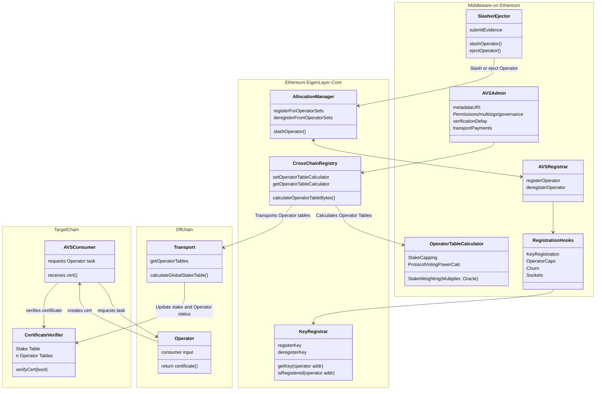

| Author(s) | Created | Status | References | Discussions |
|-------------|-----------|---------|------|----------|
| [Matt Nelson](mailto:matt.nelson@eigenlabs.org), [Yash Patil](mailto:yash@eigenlabs.org) | 2025-06-03 | `draft` | [List of relevant work/PRs, if any] | Discussion Forum Post|

# ELIP-008: EigenLayer Multi-Chain Verification

---

# Executive Summary

Today, Service Builders are constrained on where they can launch their AVSs. Consumers of AVS services (apps and dapps) can only integrate on Ethereum if they want to inherit the strong security and stake guarantees of EigenLayer. It is costly for AVSs to develop, maintain, and execute (gas) a multi-chain solution today as all of the data and accounting lives on Ethereum.

**Enter Multi-Chain Verification.** EigenLayer today uses the maximally secure, decentralized Ethereum L1 for stake accounting. This proposal outlines a set of open standards and contracts that bring AVS and Operator stake weights to many chains. New EigenLayer contracts, deployed on many EVM chains, will enable verification of Operator outputs on target chains with the same protocol guarantees as on Ethereum. The target chain core contracts house Operator stake weights and registration status while providing a consistent integration pattern no matter the environment.

With this proposal, AVSs can launch their services and make verified Operator outputs available on any EVM chain, meeting their customers where they are. The standards-based model makes uniform existing AVS multi-chain solutions and accelerates net-new ones. App builders can easily and cheaply consume verifiable services with a code-once, deploy-anywhere integration across their supported chains. Projects on Layer 2s can integrate AVSs into their protocols with minimal additional trust assumptions and low dev and gas costs. Together, these new features make it easier than ever to launch verifiable service across web3.

# Motivation

AVS developers face significant limitations in their ability to service customers beyond Ethereum L1 without introducing additional development complexity or trust assumptions. This constraint is particularly impactful as many new projects that need verifiable components or services launch on alternative chains like Layer 2s to reach new customers or lower costs. The current situation forces app developers building across multiple chains to implement and maintain costly integrations to leverage AVS services effectively (or to avoid them altogether). As AVSs themselves are often offchain, this limitation is challenging when seeking to bring results back onchain.

The core challenge stems from EigenLayer's current architecture. All critical information - including Operator registration status and delegated/allocated stake - is written and stored exclusively on Ethereum. This is a key property for decentralization and security of EigenLayer. While Operators running AVS code output results with accompanying signatures, the economic weights that validate these signatures are currently stored in non-standardized formats in the EigenLayer middleware on L1.

This creates problems...

1. App developers seeking to leverage AVS services with EigenLayer's trust and security model need local copies of stake tables on target chains to verify signatures and consume AVS outputs.
2. EigenLayer doesn't currently provide services to make stake tables available outside of Ethereum, limiting builder reach.
3. This limitation has led to various non-standard and costly alternatives or places a heavy development burden on both AVS and app developers.
4. Non-standard formats and interfaces on target chains create multiplicative integration patterns among apps, AVSs, and supported chains.

The impact of these limitations is substantial...

- Few AVSs can effectively service clients outside Ethereum L1,
- Operational complexity and cost increases significantly when offering services across multiple chains,
- Workaround solutions may introduce additional trust assumptions or centralization,
- Service builders spend time developing alternative solutions instead of building for and delighting their customers.

This proposal introduces Multi-Chain Verification to address these challenges, aiming to create a standardized framework for AVSs to launch and apps to consume services on any chain through simplified core and middleware verification contracts and infrastructure. These will provide straightforward tooling for integrating AVSs into applications while maintaining EigenLayer's trust and security properties, reducing the development overhead for cross-chain deployments of AVSs.

# Features & Specification

## Overview

**Multi-chain Verification** introduces a comprehensive framework that enables AVSs to operate across multiple chains while maintaining the security guarantees of EigenLayer. AVSs need a way for the offchain outputs that Operators generate to be consumed on target chains. Outputs need to have applied stake weighting in order to be trusted. For onchain verification of stake-weighting, a trusted and local copy of the stake table is needed. This solution aims to have AVSs leverage standardized infrastructure for key management, stake verification, and certificate validation so they can focus on developing core business logic.

To support multi-chain verification and consumption of AVS outputs on chains like Layer 2s, several concepts are introduced to the architecture:

- **An Operator Table**: A data structure for representing stake-weighted Operator delegations and Allocations of a given Operator Set. This is a representation of EigenLayer stake subjective to the AVS's needs and perspective within their protocol.
- **The Stake Table**: A data structure representing the global view of all Operator Sets with AVS-decorated stake weights. One of these lives on each target chain, and represents many Operator Tables.
- **Stake Weighting & Table Calculation**: Previously a non-standard or enforced concept on EigenLayer outside of `multipliers`, stake weighting now has a standardized process in the core and middleware. An `OperatorTableCalculator` is vended for AVSs to decorate stake weighting of different assets and to apply the formats required by the Operator Table.
- **Certificates & Certificate Verification**: A data structure for signed Operator outputs (`certificate`) and a core contract (`certificateVerifier`) for verifying those outputs against the Operator Table and stake-weighted rules (e.g. signed weight above nominal or proportional stake thresholds).
- **Stake Generation & Transport**: A specification for generating and verifying the global stake table Merkle root and transporting it to core contracts on many chains. This proposal outlines one approach taken by EigenLabs, but this process is pluggable by AVSs and other third-parties.

These pieces of architecture work together to transport a single global root to many target chains. In sequence...

1. The AVS writes and deploys the logic for calculating its single, weighted Operator Table (or using an undecorated one).
2. EigenLayer then combines the many Operator Set representations to generate a merkelize a global stake table.
3. This is then transported to target chains and rehydrated. The Operator Tables can then be used for verifying Operator certificates.
4. Daily, or as forcible updates are needed (e.g. when an Operator is ejected or slashed), the table is re-generated and transported again. This ensures up-to-date stake representations wherever the AVS is consumed.

This multi-chain architecture dramatically reduces the complexity for AVS developers by abstracting away cross-chain coordination mechanics.  The framework maintains EigenLayer's security model while enabling efficient stake table generation (daily on mainnet, every 6 hours on testnet) and trust-minimized transport to supported chains including Base and Optimism.

This architecture maintains simplicity for AVS devs by allowing them to focus their efforts on the Certificate Verification as the sole entry point for their consumers, regardless of chain; the `CertificateVerifier` contract is the key concern of AVS and app builders. By leveraging out-of-the-box stake weight verification, AVSs can go-to-market with stake-backed verifiability of their services without any extra code. If service builders (or their customers) need more complex logic, they can wrap the interface to add functionality, like integrating stake caps or more complex Operator aggregate weighting.

The multi-chain framework, in a simplified form, has the following architecture, where any application consuming an EigenLayer AVS is the `AVSConsumer`:

## Contract Architecture

The Multi-Chain Verification framework introduces three new core contracts and accompanying updates to EigenLayer middleware. These are not pluggable and are intended to interface with offchain, modular components. Below is a list:

| Contract | Deployer | Deployment Target | Description |
|----------|------|-------------------|-------------|
| **`KeyRegistry`** | Core Singleton | Ethereum | A unified module for managing BN254 and ECDSA cryptographic keys with built-in key rotation support, extensible to additional curves like BLS381 |
| **`CrossChainRegistry`** | Core Singleton | Ethereum | A coordination contract that manages AVS multi-chain configuration when interacting with EigenLayer's first-party generation and transport  |
| **`OperatorTableCalculator`** | Middleware Singleton | Ethereum | A contract for specifying stake weights per asset, or decorating more custom logic like stake capping |
| **`CertificateVerifier`** | Core Replicated | Ethereum, Layer 2s | A verification contract deployed on multiple chains that enables AVS consumers to verify tasks against operator sets using transported stake tables |

The `CertificateVerifier` is the key new architectural piece and the primary integration point that AVSs need to understand. This contract, deployed on every supported chain, is the gateway to all EigenLayer services and holds the stake values from Ethereum for verifying Operator tasks. The `CertificateVerifier` is designed around an integration pattern that does not change between AVSs and their customers. The goals of its design are an AVS to Consumer "code once and deploy everywhere" pattern to reduce overhead and maintenance and insure a smooth experience for builders across chains (and when integrating *multiple AVSs*).

The `KeyRegistry` is also provided to give AVSs a secure interface to register, deregister, and rotate Operator signing Keys. This is a canonicalization of the key solutions provided via the `AVSRegistrar` middleware. In this core contract, AVSs can register, deregister, and rotate keys associated with Operators in-protocol. This contract allows for the right keys to be accepted across the supported multi-chain ecosystem where EigenLayer is supported.

The `CrossChainRegistry` stores mappings and configurations for contracts deployed by the AVSs on Layer 1 and other chains. This contract is used in generation of Operator tables and for setting things like staleness periods of stakes used in verification on target chains, along as control over which chains to support.

The `OperatorTableCalculator` is an AVS-deployed contract that can be used for decorating stake weights with custom logic. For example, if an AVS wishes to weight certain assets as more than others, or integrate different services like an Oracle, an open-ended contract interface is provided. Default templates that require no interaction or custom logic are provided for AVSs out of the box.

While some standards and contracts in this framework are modifiable or pluggable, the primary mandatory component is the `CertificateVerifier`. The `OperatorTableCalculator` is also mandatory in the initial multi-chain implementation. Supporting, modular infrastructure includes the stake table generation and transport mechanisms, with the initial implementation managed by Eigen Labs as the primary transporter.

Altogether, the contracts fit together in a configuration pictured below:

## Specifications

### Certificates & Verification

Provided are:

- Standardized methods for AVSs to define operator stake weights
- Cryptographic certificate verification for cross-chain task validation
- Support for both small (ECDSA) and large (BN254) Operator Sets
- Stake staleness controls, governing expiry

# Rationale

## Technical Design Decisions

### Singleton CertVerifier Architecture

A single verification contract per chain reduces deployment complexity and provides a unified interface for all AVS consumers. This design enables efficient gas usage through shared infrastructure while maintaining clear separation between operator sets.

### Daily Stake Table Generation

Daily updates balance freshness with operational efficiency. This frequency accommodates most AVS use cases while keeping infrastructure costs manageable. Force updates ensure critical events (slashing, ejections) propagate immediately when needed.

### Multi-Curve Cryptography Support

ECDSA support enables smaller operator sets (<50 operators) with lower gas costs, while BN254 accommodates larger sets with aggregate signatures. This dual approach optimizes for different AVS scales and security requirements.

## Economic Considerations

### Infrastructure Provider Model

Eigen Labs serves as the initial stake table generator and transporter to establish reliable service. The protocol design enables future decentralization to the EigenDA operator set, creating sustainable economic incentives for infrastructure provision.

### Reservation-Based Access

AVSs make upfront reservations for generation and transport services, ensuring predictable costs and enabling infrastructure planning. This model prevents spam while guaranteeing service availability for legitimate users.

# Security Considerations

## Cross-Chain Attack Vectors

### Stake Table Manipulation**

Malicious generation of incorrect stake tables could enable unauthorized task validation. Mitigation: Cryptographic commitments from trusted `GlobalRootConfirmerSet` with social consensus fallback for disputes.

### Transport Censorship

Transport providers could selectively delay or prevent stake table updates. Mitigation: Multiple transport providers and emergency update mechanisms allowing direct on-chain posting.

### Key Compromise Scenarios

Operator key compromise could enable unauthorized certificate signing. Mitigation: Key rotation mechanisms with configurable delays and emergency ejection capabilities.

## Protocol-Level Safeguards

### Staleness Controls

Maximum age limits for operator tables prevent reliance on outdated security assumptions. Each operator set can configure appropriate staleness thresholds based on their security model.

### Emergency Ejection

Immediate operator removal bypasses normal update cycles when security incidents require rapid response. This mechanism prevents compromised operators from continuing to validate tasks.

### Pause Mechanisms

System-wide pause capabilities enable rapid response to critical vulnerabilities while governance coordinates emergency fixes.

# Impact Summary

## AVS Ecosystem Impact

### Reduced Development Complexity

AVSs can focus on core business logic rather than cross-chain infrastructure. Standard interfaces eliminate custom bridge implementations and reduce audit requirements.

### Enhanced Market Access

Multichain operation opens new revenue streams and user bases without proportional increases in development or operational complexity.

## Operator Impact

### Simplified Multichain Participation

Single registration process enables operators to serve multiple chains without managing separate infrastructure per network.

### New Revenue Opportunities

Infrastructure providers earn fees for stake table generation and transport services, creating additional income streams beyond standard operator rewards.

## Protocol Impact

### Market Expansion

Access to Base, Optimism, and future L2 ecosystems significantly expands EigenLayer's addressable market and competitive positioning.

### Infrastructure Efficiency

Shared multichain infrastructure reduces per-AVS costs while enabling economies of scale for security provision.

# Action Plan

# References & Relevant Discussions
