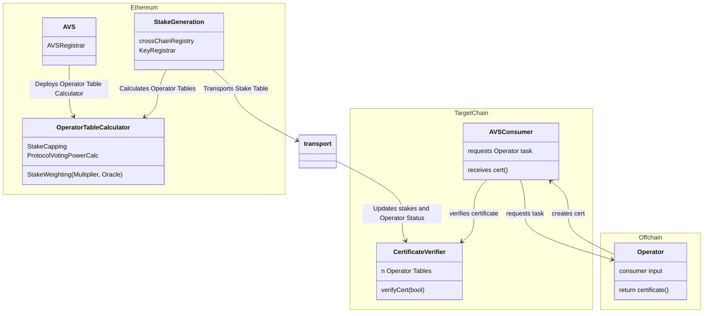

| Author(s) | Created | Status | References | Discussions |
|-------------|-----------|---------|------|----------|
| [Matt Nelson](mailto:matt.nelson@eigenlabs.org), [Yash Patil](mailto:yash@eigenlabs.org) | 2025-06-03 | `draft` | [List of relevant work/PRs, if any] | Discussion Forum Post|

# ELIP-008: EigenLayer Multi-Chain Verification

---

# Executive Summary

Today, Service Builders are constrained on where they can launch their AVSs. Consumers of AVS services (apps and dapps) can only integrate on Ethereum if they want to inherit the strong security and stake guarantees of EigenLayer. It is costly for AVSs to develop, maintain, and execute (gas) a multi-chain solution today as all of the data and accounting lives on Ethereum.

**Enter Multi-Chain Verification.** EigenLayer today uses the maximally secure, decentralized Ethereum L1 for stake accounting. This proposal outlines a set of open standards and contracts that bring AVS and Operator stake weights to many chains. New EigenLayer contracts, deployed on many EVM chains, will enable verification of Operator outputs on target chains with the same protocol guarantees as on Ethereum. The target chain core contracts house Operator stake weights and registration status while providing a consistent integration pattern no matter the environment.

With this proposal, AVSs can launch their services and make verified Operator outputs available on any EVM chain, meeting their customers where they are. The standards-based model makes uniform existing AVS multi-chain solutions and accelerates net-new ones. App builders can easily and cheaply consume verifiable services with a code-once, deploy-anywhere integration across their supported chains. Projects on Layer 2s can integrate AVSs into their protocols with minimal additional trust assumptions and low dev and gas costs. Together, these new features make it easier than ever to launch verifiable service across web3.

# Motivation

AVS developers face significant limitations in their ability to service customers beyond Ethereum L1 without introducing additional development complexity or trust assumptions. This constraint is particularly impactful as many new projects that need verifiable components or services launch on alternative chains like Layer 2s to reach new customers or lower costs. The current situation forces app developers building across multiple chains to implement and maintain costly integrations to leverage AVS services effectively (or to avoid them altogether). As AVSs themselves are often offchain, this limitation is challenging when seeking to bring results back onchain.

The core challenge stems from EigenLayer's current architecture. All critical information - including Operator registration status and delegated/allocated stake - is written and stored exclusively on Ethereum. This is a key property for decentralization and security of EigenLayer. While Operators running AVS code output results with accompanying signatures, the economic weights that validate these signatures are currently stored in non-standardized formats in the EigenLayer middleware on L1.

This creates problems...

1. App developers seeking to leverage AVS services with EigenLayer's trust and security model need local copies of stake tables on target chains to verify signatures and consume AVS outputs.
2. EigenLayer doesn't currently provide services to make stake tables available outside of Ethereum, limiting builder reach.
3. This limitation has led to various non-standard and costly alternatives or places a heavy development burden on both AVS and app developers.
4. Non-standard formats and interfaces on target chains create multiplicative integration patterns among apps, AVSs, and supported chains.

The impact of these limitations is substantial...

- Few AVSs can effectively service clients outside Ethereum L1,
- Operational complexity and cost increases significantly when offering services across multiple chains,
- Workaround solutions may introduce additional trust assumptions or centralization,
- Service builders spend time developing alternative solutions instead of building for and delighting their customers.

This proposal introduces Multi-Chain Verification to address these challenges, aiming to create a standardized framework for AVSs to launch and apps to consume services on any chain through simplified core and middleware verification contracts and infrastructure. These will provide straightforward tooling for integrating AVSs into applications while maintaining EigenLayer's trust and security properties, reducing the development overhead for cross-chain deployments of AVSs.

# Features & Specification

## Overview

**Multi-chain Verification** introduces a comprehensive framework that enables AVSs to operate across multiple chains while maintaining the security guarantees of EigenLayer. AVSs need a way for the offchain outputs that Operators generate to be consumed on target chains. Outputs need to have applied stake weighting in order to be trusted. For onchain verification of stake-weighting, a trusted and local copy of the stake table is needed. This solution aims to have AVSs leverage standardized infrastructure for key management, stake verification, and certificate validation so they can focus on developing core business logic.

To support multi-chain verification and consumption of AVS outputs on chains like Layer 2s, several concepts are introduced to the architecture:

- **An Operator Table**: A data structure for representing stake-weighted Operator delegations and Allocations of a given Operator Set. This is a representation of EigenLayer stake subjective to the AVS's needs and perspective within their protocol.
- **The Stake Table**: A data structure representing the global view of all Operator Sets with AVS-decorated stake weights. One of these lives on each target chain, and represents many Operator Tables.
- **Stake Weighting & Table Calculation**: Previously a non-standard or enforced concept on EigenLayer outside of `multipliers`, stake weighting now has a standardized process in the core and middleware. An `OperatorTableCalculator` is vended for AVSs to decorate stake weighting of different assets and to apply the formats required by the Operator Table.
- **Certificates & Certificate Verification**: A data structure for signed Operator outputs (`certificate`) and a core contract (`CertificateVerifier`) for verifying those outputs against the Operator Table and stake-weighted rules (e.g. signed weight above nominal or proportional stake thresholds).
- **Stake Generation & Transport**: A specification for generating and verifying the global stake table Merkle root and transporting it to core contracts on many chains. This proposal outlines one approach taken by EigenLabs, but this process is pluggable by AVSs and other third-parties.

These pieces of architecture work together to transport a single global root to many target chains. In sequence...

1. The AVS writes and deploys the logic for calculating its single, weighted Operator Table (or using an undecorated one).
2. EigenLayer then combines the many Operator Set representations to generate a merkelize a global stake table.
3. This is then transported to target chains and rehydrated. The Operator Tables can then be used for verifying Operator certificates.
4. Weekly, or as forcible updates are needed (e.g. when an Operator is ejected or slashed), the table is re-generated and transported again. This ensures up-to-date stake representations wherever the AVS is consumed.

This multi-chain architecture dramatically reduces the complexity for AVS developers by abstracting away cross-chain coordination mechanics. The framework maintains EigenLayer's security model while enabling efficient stake table generation (weekly, with immediate force updates for critical events like slashing/ejection) and trust-minimized transport to supported chains including Base and Optimism.

This architecture was designed around simplifying onchain AVS integrations with their customers. A secondary goal is complete abstraction of the multi-chain system for developers comfortable with the default implementation. In this design, AVSs are intended to focus their efforts on the `CertificateVerifier` as the sole entry point for their consumers, regardless of chain. By leveraging out-of-the-box stake weight verification, AVSs can go-to-market with stake-backed verifiability of their services without any extra code. If AVS builders (or their customers) need more complex verification logic, the `CertificateVerifier` interface can be wrapped with additional functionality, like integrating stake caps or more complex Operator aggregate weighting.

The EigenLayer multi-chain framework, in a simplified form, has the following architecture, where any application consuming an EigenLayer AVS is the `AVSConsumer`:



## Contract Architecture

The Multi-Chain Verification framework introduces four new core contracts and new templates in EigenLayer middleware. These are not pluggable and are intended to interface with offchain, modular components. Below is a table of the new components:

| Contract Name | Deployment Target | Deployer | Description |
|----------|-------------|--------------------| -------------|
| **`KeyRegistrar`** | Ethereum Singleton | EigenLayer Core Protocol | A unified module for managing and retrieving BN254 and ECDSA cryptographic keys for Operators with built-in key rotation support, extensible to additional curves like BLS381 |
| **`CrossChainRegistry`** |  Ethereum Singleton | EigenLayer Core Protocol | A coordination contract that manages AVS multi-chain configuration and tracks deployment addresses when using EigenLayer's generation and transport mechanisms  |
| **`OperatorTableCalculator`** |  Ethereum Singleton | AVS Middleware | A required middleware contract deployed by an AVS for specifying stake weights per asset, or decorating more custom logic like stake capping |
| **`OperatorTableUpdater`** |  One per target chain | EigenLayer Core Protocol | A contract intended to parse and verify the global Stake Table Root and rehydrate individual Operator tables in the `CertificateVerifier` |
| **`CertificateVerifier`** | One per target chain | EigenLayer Core Protocol | A verification contract deployed on multiple chains that enables AVS consumers to verify tasks against operator sets using transported stake tables; the single integration point between AVSs and their consumers |

The `CertificateVerifier` is the key new architectural piece and the primary integration point that AVSs need to understand. This contract, deployed on every supported chain, is the gateway to all EigenLayer services and holds the stake values from Ethereum for verifying Operator tasks. The `CertificateVerifier` is designed around an integration pattern that does not change between AVSs and their customers. The goals of its design are an AVS to Consumer "code once and deploy everywhere" pattern to reduce overhead and maintenance and insure a smooth experience for builders across chains (and when integrating *multiple AVSs*).

The `KeyRegistrar` is also provided to give AVSs a secure interface to register, deregister, and rotate Operator signing Keys. This is a canonicalization of the key solutions provided via the `AVSRegistrar` middleware. In this core contract, AVSs can register, deregister, and rotate keys associated with Operators in-protocol. This contract allows for the right keys to be accepted across the supported multi-chain ecosystem where EigenLayer is supported.

The `CrossChainRegistry` stores mappings and configurations for contracts deployed by the AVSs on Layer 1 and other chains. This contract is used in generation of Operator tables and for setting things like staleness periods of stakes used in verification on target chains, along as control over which chains to support.

The `OperatorTableCalculator` is an AVS-deployed contract that can be used for decorating stake weights with custom logic. For example, if an AVS wishes to weight certain assets as more than others, or integrate different services like an Oracle, an open-ended contract interface is provided. Default templates that require no interaction or custom logic are provided for AVSs out of the box.

The `OperatorTableUpdater` exists to interface with off-chain transport mechanisms. It confirms the data that it is given from the global stake table and parses it into individual Operator Table updates on the `CertificateVerifier`. This ensures accuracy, timely updates for individual AVS's Operator Tables as Operators are slashed or ejected, and simplifies verification logic.

Altogether, the contracts fit together in a configuration pictured below:


## Specifications

### Operator Table Calculation & Stake Weighting

The `OperatorTableCalculator` is where AVSs define how Operator stakes should be weighted and formatted for their specific use case. This is a mandatory contract that each AVS must deploy to participate in multi-chain verification.

The core purpose of this contract is to convert raw EigenLayer stake data into weighted Operator Tables that reflect the AVS's specific requirements - whether that's capping certain operators, weighting different assets differently, or integrating external price feeds.

For example, default "weights" of USDC and ETH would be treated the same if no weighting is given to either (e.g. 10 "ETH" == 10 "USDC" when presented as raw stake values). Operator shares of a given strategy (i.e. staked value for one asset) are stored in a numerical format and should be converted for the AVSs use-case. This was previously handled by the optional middleware "multipliers".

The weights are capture in `OperatorInfo` structs:

```solidity
struct ECDSAOperatorInfo {
    address pubkey;    // ECDSA signing key from KeyRegistrar (not operator address)
    uint256[] weights; // Flexible array: [slashable_stake, delegated_stake, strategy_i_stake, ...]
}

struct BLSOperatorInfo {
    BN254.G1Point pubkey;  // BLS public key from KeyRegistrar
    uint256[] weights;     // Flexible array: [slashable_stake, delegated_stake, strategy_i_stake, ...]
}
```

The `weights` array is completely flexible - AVSs can define any groupings they need. Common patterns include:

- **Simple**: `[total_stake]`
- **Asset-specific**: `[eth_stake, steth_stake, eigen_stake]`
- **Detailed**: `[slashable_stake, delegated_stake, strategy_1_stake, strategy_2_stake]`

Some examples of customization options are...

- Stake Capping: Limit any single operator to maximum 10% of total weight
- Asset Weighting: Weight ETH stakes 2x higher than other assets  
- Oracle Integration: Use external price feeds to convert all stakes to USD values
- Minimum Requirements: Filter out operators below certain stake thresholds (i.e. set their verification weight to zero)

Defaults are provided out of the box. For AVSs that don't need custom logic, default calculators are provided for both `ECDSATableCalculator` and `BLSTableCalculator` that simply return unweighted stake values. For larger Operator Sets (50+ operators), BLS provides more efficient verification through aggregate signatures. The BLS calculator follows a similar pattern but optimizes for larger scale operations.

The Calculator contract is left largely flexible for AVSs, with easy defaults. As long as the return type is an array of `OperatorInfos`, the upstream contracts will be able to parse them appropriately. The goal of the `OperatorTableCalculator` is to give AVSs complete control over how their stake is weighted while maintaining standardized interfaces for the broader multi-chain system. These stake weights are key to properly [verifying Operator certificates](./ELIP-008.md#certificates--verification).

Below is provided the template for ECDSA (BLS is provided in the contracts repository):

```solidity
interface IECDSATableCalculatorTypes {
    /**
     * @notice A struct that contains information about a single operator
     * @param pubkey The address of the signing ECDSA key of the operator and not the operator address itself.
     * This is read from the KeyRegistrar contract.
     * @param weights The weights of the operator for a single operatorSet
     * @dev The `weights` array can be defined as a list of arbitrary groupings. For example,
     * it can be [slashable_stake, delegated_stake, strategy_i_stake, ...]
     */
    struct ECDSAOperatorInfo {
        address pubkey;
        uint256[] weights;
    }
}

interface IECDSATableCalculatorEvents {
    /// @notice Emitted when the lookahead blocks are set
    event LookaheadBlocksSet(uint256 lookaheadBlocks);
}

interface IECDSATableCalculatorErrors {
    /// @notice Emitted when the lookahead blocks are too high
    error LookaheadBlocksTooHigh();
}

interface IECDSATableCalculator is
    IOperatorTableCalculator,
    IECDSATableCalculatorTypes,
    IECDSATableCalculatorEvents,
    IECDSATableCalculatorErrors
{
    /**
     * @notice calculates the operatorInfos for a given operatorSet
     * @param operatorSet the operatorSet to calculate the operator table for
     * @return operatorInfos the list of operatorInfos for the given operatorSet
     * @dev The output of this function is converted to bytes via the `calculateOperatorTableBytes` function
     */
    function calculateOperatorTable(
        OperatorSet calldata operatorSet
    ) external view returns (ECDSAOperatorInfo[] memory operatorInfos);
}
```

#### Implementation Examples

**Simple Equal Weighting:**

```solidity
// Basic implementation: return raw stake values without modification
function calculateOperatorTable(OperatorSet calldata operatorSet) 
    external view returns (ECDSAOperatorInfo[] memory) {
    return getRawStakeValues(operatorSet);
}
```

**Advanced Custom Weighting:**

```solidity
// Advanced implementation with asset weighting and stake capping
function calculateOperatorTable(OperatorSet calldata operatorSet) 
    external view returns (ECDSAOperatorInfo[] memory) {
    ECDSAOperatorInfo[] memory operators = getRawStakeValues(operatorSet);
    
    for (uint i = 0; i < operators.length; i++) {
        // Apply asset-specific weighting
        // weights[0] = ETH stake, weights[1] = stablecoin stake
        operators[i].weights[0] *= 2;  // Weight ETH 2x higher
        operators[i].weights[1] *= 1;  // Keep stablecoins at 1x
        
        // Implement stake capping - limit any operator to 10% of total
        uint256 maxWeight = getTotalStake() / 10;
        if (operators[i].weights[0] > maxWeight) {
            operators[i].weights[0] = maxWeight;
        }
        
        // Filter out operators below minimum threshold
        if (operators[i].weights[0] < MINIMUM_STAKE_THRESHOLD) {
            operators[i].weights[0] = 0;  // Zero weight = excluded from verification
        }
    }
    return operators;
}
```

### Cross-chain & Key Registries

For convenience and reduced middleware trust assumptions, this proposal canonicalizes a `CrossChainRegistry` and a `KeyRegistrar`. Previously, key management was handled by the AVS in middleware, with room for error and lack of support for consistent key rotation. The `KeyRegistrar` brings these key mappings into the core and makes convenient view and setter functions available to AVSs and Operators. Additionally, with the introduction of multi-chain EigenLayer, the Core on Ethereum needs a mapping for where AVSs and contracts live on certain chains, as well as a way to capture AVS configuration and intent. The `CrossChainRegistry` is a contract that allows AVSs to enroll in multi-chain and select their target chains. This contract also captures trust parameters, like the staleness period of stake (i.e. an Operator Table updated at a certain reference block will fail verification after the configured staleness period elapses.)

Provided below is the `KeyRegistrar` interface:

```solidity
interface IKeyRegistrarEvents is IKeyRegistrarTypes {
    event KeyRegistered(OperatorSet operatorSet, address indexed operator, CurveType curveType, bytes pubkey);
    event KeyDeregistered(OperatorSet operatorSet, address indexed operator, CurveType curveType);
    event AggregateBN254KeyUpdated(OperatorSet operatorSet, BN254.G1Point newAggregateKey);
    event OperatorSetConfigured(OperatorSet operatorSet, CurveType curveType);
}

interface IKeyRegistrar is IKeyRegistrarErrors, IKeyRegistrarEvents, ISemVerMixin {
    /**
     * @notice Configures an operator set with curve type
     * @param operatorSet The operator set to configure
     * @param curveType Type of curve (ECDSA, BN254)
     * @dev Only authorized callers for the AVS can configure operator sets
     */
    function configureOperatorSet(OperatorSet memory operatorSet, CurveType curveType) external;

    /**
     * @notice Registers a cryptographic key for an operator with a specific operator set
     * @param operator Address of the operator to register key for
     * @param operatorSet The operator set to register the key for
     * @param pubkey Public key bytes
     * @param signature Signature proving ownership (only needed for BN254 keys)
     * @dev Can be called by operator directly or by addresses they've authorized via PermissionController
     * @dev Reverts if key is already registered
     */
    function registerKey(
        address operator,
        OperatorSet memory operatorSet,
        bytes calldata pubkey,
        bytes calldata signature
    ) external;

    /**
     * @notice Deregisters a cryptographic key for an operator with a specific operator set
     * @param operator Address of the operator to deregister key for
     * @param operatorSet The operator set to deregister the key from
     * @dev Can be called by avs directly or by addresses they've authorized via PermissionController
     * @dev Reverts if key was not registered
     * @dev Keys remain in global key registry to prevent reuse
     */
    function deregisterKey(address operator, OperatorSet memory operatorSet) external;

    /**
     * @notice Checks if an operator has a registered key
     * @param operatorSet The operator set to check and update
     * @param operator Address of the operator
     * @return whether the operator has a registered key
     * @dev This function is called by the AVSRegistrar when an operator registers for an AVS
     * @dev Only authorized callers for the AVS can call this function
     * @dev Reverts if operator doesn't have a registered key for this operator set
     */
    function checkKey(OperatorSet memory operatorSet, address operator) external view returns (bool);

    /**
     * @notice Checks if a key is registered for an operator with a specific operator set
     * @param operatorSet The operator set to check
     * @param operator Address of the operator
     * @return True if the key is registered
     */
    function isRegistered(OperatorSet memory operatorSet, address operator) external view returns (bool);

    /**
     * @notice Gets the configuration for an operator set
     * @param operatorSet The operator set to get configuration for
     * @return The operator set configuration
     */
    function getOperatorSetCurveType(
        OperatorSet memory operatorSet
    ) external view returns (CurveType);

    /**
     * @notice Gets the BN254 public key for an operator with a specific operator set
     * @param operatorSet The operator set to get the key for
     * @param operator Address of the operator
     * @return g1Point The BN254 G1 public key
     * @return g2Point The BN254 G2 public key
     */
    function getBN254Key(
        OperatorSet memory operatorSet,
        address operator
    ) external view returns (BN254.G1Point memory g1Point, BN254.G2Point memory g2Point);

    /**
     * @notice Gets the ECDSA public key for an operator with a specific operator set as bytes
     * @param operatorSet The operator set to get the key for
     * @param operator Address of the operator
     * @return pubkey The ECDSA public key
     */
    function getECDSAKey(OperatorSet memory operatorSet, address operator) external view returns (bytes memory);

    /**
     * @notice Gets the ECDSA public key for an operator with a specific operator set
     * @param operatorSet The operator set to get the key for
     * @param operator Address of the operator
     * @return pubkey The ECDSA public key
     */
    function getECDSAAddress(OperatorSet memory operatorSet, address operator) external view returns (address);

    /**
     * @notice Checks if a key hash is globally registered
     * @param keyHash Hash of the key
     * @return True if the key is globally registered
     */
    function isKeyGloballyRegistered(
        bytes32 keyHash
    ) external view returns (bool);

    /**
     * @notice Gets the key hash for an operator with a specific operator set
     * @param operatorSet The operator set to get the key hash for
     * @param operator Address of the operator
     * @return keyHash The key hash
     */
    function getKeyHash(OperatorSet memory operatorSet, address operator) external view returns (bytes32);

    /**
     * @notice Returns the message hash for ECDSA key registration
     * @param operator The operator address
     * @param operatorSet The operator set
     * @param keyAddress The address of the key
     * @return The message hash for signing
     */
    function getECDSAKeyRegistrationMessageHash(
        address operator,
        OperatorSet memory operatorSet,
        address keyAddress
    ) external view returns (bytes32);

    /**
     * @notice Returns the message hash for BN254 key registration
     * @param operator The operator address
     * @param operatorSet The operator set
     * @param keyData The BN254 key data
     * @return The message hash for signing
     */
    function getBN254KeyRegistrationMessageHash(
        address operator,
        OperatorSet memory operatorSet,
        bytes calldata keyData
    ) external view returns (bytes32);

    /**
     * @notice Encodes the BN254 key data into a bytes array
     * @param g1Point The BN254 G1 public key
     * @param g2Point The BN254 G2 public key
     * @return The encoded key data
     */
    function encodeBN254KeyData(
        BN254.G1Point memory g1Point,
        BN254.G2Point memory g2Point
    ) external pure returns (bytes memory);
}
```

Functions are provided to get, set, and verify key material. Initial support covers ECDSA and BN254 keys, but the interface is flexible to new key solutions like BLS12-381. This contract simplifies middleware management by AVSs by moving key concerns into the core. AVS middleware is free to consume these keys on or off-chain.

The `CrossChainRegistry` has a more important role and is designed specifically for multi-chain verification. This is a singleton contract that only lives on Ethereum. AVSs first register in this contract to participate in the optional multi-chain system. AVSs can then specify the chains they wish to have their stake data transported to. Next, the AVS registers (or manages) the address `OperatorTableCalculator`.

The `CrossChainRegistry` captures the addresses of the `OperatorTableCalculators` after deployment. This contract was explained in the [previous section](./ELIP-008.md#operator-table-calculation--stake-weighting). As AVSs deploy their own table calculation logic (or use the default template), they must update this registry contract with the addresses of their calculators. This is to ensure the off-chain generation protocol runs the correct stake weighting functions from each AVS's `OperatorTableCalculator` when it generates the merkelized stake roots for Operator Tables.

When its time to generate a new root...

1. `CrossChainRegistry.getActiveGenerationReservations()` is called to gather the Operator Sets opted-in to multi-chain transport.
2. For each Operator Set, call the `CrossChainRegistry.calculateOperatorTableByes(operatorSet)`.
3. The `CrossChainRegistry` calls into each `OperatorTableCalculator` to apply the right weighting logic, specified by the AVS.
4. A global stake root is calculated from a created merkle tree, where each leaf is the hash of the bytes returned in step 2.

This process yields a global stake root and a merkle tree that is transported to target chains.

Below is the interface for the `CrossChainRegistry`.

```solidity
interface ICrossChainRegistry is ICrossChainRegistryErrors, ICrossChainRegistryEvents {
    /**
     * @notice Creates a generation reservation
     * @param operatorSet the operatorSet to make a reservation for
     * @param operatorTableCalculator the address of the operatorTableCalculator
     * @param config the config to set for the operatorSet
     * @param chainIDs the chainIDs to add as transport destinations
     * @dev msg.sender must be UAM permissioned for operatorSet.avs
     */
    function createGenerationReservation(
        OperatorSet calldata operatorSet,
        IOperatorTableCalculator operatorTableCalculator,
        OperatorSetConfig calldata config,
        uint256[] calldata chainIDs
    ) external;

    /**
     * @notice Removes a generation reservation for a given operatorSet
     * @param operatorSet the operatorSet to remove
     * @dev msg.sender must be UAM permissioned for operatorSet.avs
     */
    function removeGenerationReservation(
        OperatorSet calldata operatorSet
    ) external;

    /**
     * @notice Sets the operatorTableCalculator for the operatorSet
     * @param operatorSet the operatorSet whose operatorTableCalculator is desired to be set
     * @param operatorTableCalculator the contract to call to calculate the operator table
     * @dev msg.sender must be UAM permissioned for operatorSet.avs
     * @dev operatorSet must have an active reservation
     */
    function setOperatorTableCalculator(
        OperatorSet calldata operatorSet,
        IOperatorTableCalculator operatorTableCalculator
    ) external;

    /**
     * @notice Sets the operatorSetConfig for a given operatorSet
     * @param operatorSet the operatorSet to set the operatorSetConfig for
     * @param config the config to set
     * @dev msg.sender must be UAM permissioned for operatorSet.avs
     * @dev operatorSet must have an active generation reservation
     */
    function setOperatorSetConfig(OperatorSet calldata operatorSet, OperatorSetConfig calldata config) external;

    /**
     * @notice Adds destination chains to transport to
     * @param operatorSet the operatorSet to add transport destinations for
     * @param chainIDs to add transport to
     * @dev msg.sender must be UAM permissioned for operatorSet.avs
     * @dev Will create a transport reservation if one doesn't exist
     */
    function addTransportDestinations(OperatorSet calldata operatorSet, uint256[] calldata chainIDs) external;

    /**
     * @notice Removes destination chains to transport to
     * @param operatorSet the operatorSet to remove transport destinations for
     * @param chainIDs to remove transport to
     * @dev msg.sender must be UAM permissioned for operatorSet.avs
     * @dev Will remove the transport reservation if all destinations are removed
     */
    function removeTransportDestinations(OperatorSet calldata operatorSet, uint256[] calldata chainIDs) external;

    /**
     * @notice Adds chainIDs to the whitelist of chainIDs that can be transported to
     * @param chainIDs the chainIDs to add to the whitelist
     * @param operatorTableUpdaters the operatorTableUpdaters for each whitelisted chainID
     * @dev msg.sender must be the owner of the CrossChainRegistry
     */
    function addChainIDsToWhitelist(uint256[] calldata chainIDs, address[] calldata operatorTableUpdaters) external;

    /**
     * @notice Removes chainIDs from the whitelist of chainIDs that can be transported to
     * @param chainIDs the chainIDs to remove from the whitelist
     * @dev msg.sender must be the owner of the CrossChainRegistry
     */
    function removeChainIDsFromWhitelist(
        uint256[] calldata chainIDs
    ) external;

    /**
     *
     *                         VIEW FUNCTIONS
     *
     */

    /**
     * @notice Gets the active generation reservations
     * @return An array of operatorSets with active generationReservations
     */
    function getActiveGenerationReservations() external view returns (OperatorSet[] memory);

    /**
     * @notice Gets the operatorTableCalculator for a given operatorSet
     * @param operatorSet the operatorSet to get the operatorTableCalculator for
     * @return The operatorTableCalculator for the given operatorSet
     */
    function getOperatorTableCalculator(
        OperatorSet memory operatorSet
    ) external view returns (IOperatorTableCalculator);

    /**
     * @notice Gets the operatorSetConfig for a given operatorSet
     * @param operatorSet the operatorSet to get the operatorSetConfig for
     * @return The operatorSetConfig for the given operatorSet
     */
    function getOperatorSetConfig(
        OperatorSet memory operatorSet
    ) external view returns (OperatorSetConfig memory);

    /**
     * @notice Calculates the operatorTableBytes for a given operatorSet
     * @param operatorSet the operatorSet to calculate the operator table for
     * @return the encoded operatorTableBytes containing:
     *         - operatorSet details
     *         - curve type from KeyRegistrar
     *         - operator set configuration
     *         - calculated operator table from the calculator contract
     * @dev This function aggregates data from multiple sources for cross-chain transport
     */
    function calculateOperatorTableBytes(
        OperatorSet calldata operatorSet
    ) external view returns (bytes memory);

    /**
     * @notice Gets the active transport reservations
     * @return An array of operatorSets with active transport reservations
     * @return An array of chainIDs that the operatorSet is configured to transport to
     */
    function getActiveTransportReservations() external view returns (OperatorSet[] memory, uint256[][] memory);

    /**
     * @notice Gets the transport destinations for a given operatorSet
     * @param operatorSet the operatorSet to get the transport destinations for
     * @return An array of chainIDs that the operatorSet is configured to transport to
     */
    function getTransportDestinations(
        OperatorSet memory operatorSet
    ) external view returns (uint256[] memory);

    /**
     * @notice Gets the list of chains that are supported by the CrossChainRegistry
     * @return An array of chainIDs that are supported by the CrossChainRegistry
     * @return An array of operatorTableUpdaters corresponding to each chainID
     */
    function getSupportedChains() external view returns (uint256[] memory, address[] memory);
}
```

### Certificates & Verification

**The `CertificateVerifier` is the key integration point between AVSs and their customers.** This is the contract that allows off-chain services built atop EigenLayer restaking to interface with on-chain environments across all supported chains. Deployed to each target chain, this contract holds the `Operator Table` for each AVS and allows Operator `Certificates` to be verified against stake weighted rules, with options for proportional weighting logic, nominal weighting logic, and custom hooks.

This contract was designed to serve key goals:

- **A Single Integration Point and Pattern**: AVSs and their customers only need to understand one contract interface, not many different patterns. One single contract interface for all EigenLayer services.
- **Consistent Experience**: The same verification interface works identically across Ethereum, Base, Optimism, and other EVM chains with flexibility for future alt-VM support.
- **Code Once, Deploy Everywhere**: Write integration logic once, deploy across all chains.
- **Off-Chain to On-Chain Bridge**: This is where off-chain operator services become verifiable on-chain outputs using stake-weighted commitments.
- **Stake-Weighted Verification**: Operator outputs are verified against stake criteria for acceptance and potential slashing. Operator outputs are backed by EigenLayer stake values from the maximally secure Layer One Ethereum.

Everywhere the `CertificateVerifier` contract is available, AVSs can serve their customers and Operators can have certificates verified.

The verification flow is outlined below:

1. **Operator Execution**: Operators perform off-chain tasks (data feeds, computation, attestations)
2. **Certificate Creation**: Operators sign results creating an `ECDSACertificate` or `BLSCertificate`.
3. **Consumer Verification**: Applications call `CertificateVerifier.verifyCertificate()` to validate any received (or cached) certificates.
4. **Stake Validation**: The `CertificateVerifier` checks the provided Certificate signatures against transported stake table, by comparing Operator keys and weights.
5. **Threshold Enforcement**: Ensures sufficient stake signed the certificate (proportional, nominal, or custom) and returns a result to the requesting application.

Below is the certificate structure:

```solidity
struct ECDSACertificate {
    uint32 referenceTimestamp;  // When certificate was created
    bytes32 messageHash;        // Hash of the signed message
    bytes sig;                  // Concatenated operator signatures
}

/// BLS keys are a bit more complex
/**
    * @notice A witness for an operator
    * @param operatorIndex the index of the nonsigner in the `BN254OperatorInfo` tree
    * @param operatorInfoProofs merkle proofs of the nonsigner at the index. Empty if operator is in cache.
    * @param operatorInfo the `BN254OperatorInfo` for the operator
    */
struct BN254OperatorInfoWitness {
    uint32 operatorIndex;
    bytes operatorInfoProof;
    BN254OperatorInfo operatorInfo;
}

/**
    * @notice A BN254 Certificate
    * @param referenceTimestamp the timestamp at which the certificate was created
    * @param messageHash the hash of the message that was signed by operators and used to verify the aggregated signature
    * @param signature the G1 signature of the message
    * @param apk the G2 aggregate public key
    * @param nonSignerWitnesses an array of witnesses of non-signing operators
    */
struct BN254Certificate {
    uint32 referenceTimestamp;
    bytes32 messageHash;
    BN254.G1Point signature;
    BN254.G2Point apk;
    BN254OperatorInfoWitness[] nonSignerWitnesses;
}
```

The `CertificateVerifier` provides several options out of the box for both `ECDSA` and `BLS` keys...

- `verifyCertificate()`: Returns raw signed stake amounts per weight category
- `verifyCertificateProportion()`: Checks if signed stake meets % thresholds (e.g. >66% of total)
- `verifyCertificateNominal()`: Checks if signed stake meets absolute thresholds (e.g. >1M ETH)

An example integration Pattern flow may look like the following:

```solidity
// Same code works on Ethereum, Base, Optimism, etc.
bool isValid = certificateVerifier.verifyCertificateProportion(
    operatorSet,
    certificate,
    [6600] // Require 66% of stake
);

if (isValid) {
    // Process verified result
    processOperatorOutput(certificate.messageHash);
}
```

The `CertificateVerifier` respects stake staleness configurations set in the `CrossChainRegistry` to invalidate old certificates or stake weight values, ensuring the AVS has control over how long outputs are considered verified.

This contract is the gateway that makes EigenLayer's security and operator network accessible to applications across the multi-chain ecosystem, transforming off-chain operator services into verifiable, stake-backed on-chain outputs.

### Integration Models

The `CertificateVerifier` enables three primary integration patterns for consuming AVS services:

#### Pull Model (Request-Response)

Applications request tasks from operators directly, receive certificates, and verify them on-demand:

```solidity
// 1. Consumer requests task from operator
TaskRequest memory task = TaskRequest({data: inputData, deadline: block.timestamp + 1 hours});
bytes memory result = operator.performTask(task);

// 2. Operator responds with certificate
Certificate memory cert = abi.decode(result, (Certificate));

// 3. Consumer verifies immediately
bool isValid = certificateVerifier.verifyCertificateProportion(operatorSet, cert, [6600]);
require(isValid, "Insufficient stake backing");
```

#### Push Model (Cached Results)

Operators publish certificates to storage (contract storage, IPFS, etc.), and applications pull cached results when needed:

```solidity
// 1. Query cached certificate from storage
Certificate memory cachedCert = avs.getLatestResult(taskType);

// 2. Check certificate freshness and validity
require(block.timestamp - cachedCert.referenceTimestamp < MAX_STALENESS, "Certificate too old");
bool isValid = certificateVerifier.verifyCertificateProportion(operatorSet, cachedCert, [5000]);
require(isValid, "Insufficient stake backing");

// 3. Use cached result
processResult(cachedCert.messageHash);
```

#### Hybrid Model

Combines both approaches - try cached results first, fallback to fresh requests for critical operations or when cache is stale.

#### Custom Verification Logic

For applications requiring specialized verification logic beyond proportional and nominal thresholds, the `CertificateVerifier` exposes raw stake weights:

```solidity
// Get raw stake weights for custom logic
(bool validSigs, uint256[] memory weights) = certificateVerifier.verifyCertificate(operatorSet, cert);
require(validSigs, "Invalid signatures");

// Apply custom business logic
uint256 totalStake = 0;
uint256 validOperators = 0;
for (uint i = 0; i < weights.length; i++) {
    if (weights[i] >= MIN_OPERATOR_STAKE) {
        totalStake += weights[i];
        validOperators++;
    }
}

// Custom requirements: need both 60% stake AND 3+ operators
require(totalStake * 10000 >= getTotalOperatorSetStake() * 6000, "Need 60% stake");
require(validOperators >= 3, "Need 3+ qualified operators");
```

## System Parameters Reference

Provided below are the systems different parameters: mutable, immutable, and configurable. Understanding these will help with proper multi-chain implementation:

### Mutable Parameters

Mutable parameters will update occasionally or after some actions. These are worth monitoring to ensure up-to-date info for implementors and consumers.

| **Parameter** | **Controlled By** | **Update Frequency** | **Impact** | **Monitoring Event** |
| --- | --- | --- | --- | --- |
| **Operator Tables** | EigenLayer Core | Weekly + force updates | Certificate verification validity | `CertificateVerifier.StakeTableUpdated` |
| **Operator Keys** | Operators + AVS Admins | On-demand | Certificate signature validation | `KeyRegistrar.KeyRegistered/Deregistered` |
| **Stake Weights** | `OperatorTableCalculator`, deployed by AVS | Per table update | Verification thresholds | Custom events in calculator contract |
| **Operator Registration** | AVS + Operators | On-demand | Available operators for tasks | `AVSRegistrar.OperatorRegistered/Deregistered` |
| **Slashing/Ejections** | EigenLayer Core | On-demand (immediate transport) | Operator validity and weights | `AllocationManager.OperatorSlashed` |

### Immutable Parameters

Immutable parameters are either fixed or set for usage in the protocol or controlled by protocol governance itself.

| **Parameter** | **Set By** | **Description** |
| --- | --- | --- |
| **Operator Set ID** | AVS | Cryptographic curve and operator list hash |
| **Contract Addresses** | EigenLayer Core | `CertificateVerifier`, `OperatorTableUpdater` addresses per chain |
| **Table Update Frequency** | Off-chain Governance | Frequency for updates. Intended to change over-time or be made permissionless. |

### Configurable Parameters

The following parameters are configurable by users:

| **Parameter** | **Configured By** | **Options** |
| --- | --- | --- |
| **Staleness Period** | AVS | 1-30 days (must exceed 7-day refresh) |
| **Minimum Stake Weight** | AVS | Any uint256 value |
| **Custom Stake Weighting** | AVS | Override `calculateOperatorTable()` with any logic |
| **Verification Thresholds** | Consuming Apps | Proportional % or nominal amounts |

# Rationale

## Technical Design Decisions

### Singleton CertVerifier Architecture

A single verification contract per chain reduces deployment complexity for all participants and provides a unified interface for all AVS consumers. This design enables a code-once, deploy anywhere shared infrastructure while maintaining clear separation between Operator Sets. This also allows for consuming applications to do their own verification and for AVSs and apps to implement complex logic, as needed.

### Weekly Stake Table Generation

Weekly updates balance freshness with operational efficiency. This frequency accommodates most AVS use cases while keeping infrastructure costs manageable (and free to users) during the testing phase. Continued optimizations are being made to see i. Force updates ensure critical events (slashing, ejections) propagate immediately when needed. Post-Preview, this frequency may be adjusted based on usage patterns and requirements.

### Multi-Curve Cryptography Support

ECDSA support enables smaller operator sets (<50 operators) with lower complexity and gas costs in some instances, while BN254 accommodates larger sets with aggregate signatures. This dual approach optimizes for different AVS scales, costs, and security requirements.

## Economic Considerations

### Infrastructure Provider Model

Eigen Labs serves as the initial stake table generator and transporter to establish the multi-chain feature set and to ensure SLAs on reliable service. The protocol design enables future decentralization to custom solutions, partner solutions, or EigenCloud Operators. The goal is to prove value before focusing on economic incentives for infrastructure provision.

### Reservation-Based Access

AVSs make upfront reservations for generation and transport services, ensuring predictable costs and enabling infrastructure planning. This model prevents spam while guaranteeing service availability for legitimate users.

# Security Considerations

## Cross-Chain Attack Vectors

### Stake Table Manipulation

**Risk**: Malicious generation of incorrect stake tables could enable unauthorized task validation.
**Mitigation**: Initial implementation is permissioned for generation and transport of tables to EigenLabs infrastructure. Cryptographic commitments from trusted `GlobalRootConfirmerSet` can be verified permissionlessly, with social consensus fallback for disputes. Over time, we will explore solutions to sufficiently decentralized.

### Timing-based Malicious Verification

**Risk**: Operators may perform malicious actions causing an ejection, slash, or challenge. They would then try to take advantage of timing lag to produce certificates that would have stale stakes on non-L1 chains.
**Mitigation**: Changes that are material to verification (namely, anything impacting the Operator table: a slash, registration, or deregistration) will automatically trigger updates. There is some confirmation lag due to the nature of cross-chain communications, but AVSs can choose to use finalized blocks in their verification designs.

### Key Compromise Scenarios

**Risk**: Operator key compromise could enable unauthorized certificate signing.
**Mitigation**: Key rotation mechanisms with configurable delays and emergency ejection capabilities.

## Protocol-Level Safeguards

### Staleness Controls

Maximum age limits for Operator Table stakes can prevent situations where weights are assumed valid by one party handling a certificate. The AVS is intended to set this parameter based on their use-case. It is provided so that consuming applications shouldn't require deep knowledge of the underlying stake weighting of EigenLayer to verify the data they are given off-chain or do additional diligence to avoid outdated security assumptions. Each Operator Set can configure appropriate staleness thresholds based on their security model.

### Emergency Ejection

Immediate operator removal bypasses the normal seven day update cycle. When security incidents or a breakdown of process requires rapid response, consuming applications should *not* not able to verify certificates from ejected Operators. Ejected Operators should not be able to validate tasks, even if they picked up outstanding requests in that time.

### Pause Mechanisms

System-wide pause capabilities are built into the multi-chain system that enable rapid response to critical vulnerabilities while governance coordinates emergency fixes. These follow the mechanics of the [Pauser multi-sig](https://docs.eigenfoundation.org/protocol-governance/technical-architecture).

## Implementation Security Guidelines

For implementers, the following risk/mitigation pairs provide actionable security guidance:

| **Risk** | **Mitigation** | **Implementation** |
| --- | --- | --- |
| **Stale Stake Data** | Configure appropriate staleness periods | Set `staleness > 7 days` in your `OperatorSetConfig` |
| **Key Compromise** | Monitor for operator ejections and key rotations | Listen for `AllocationManager.OperatorSlashed` and `KeyRegistrar.KeyDeregistered` |
| **Insufficient Stake** | Set minimum thresholds in verification | Use `verifyCertificateNominal()` with minimum stake requirements |
| **Operator Centralization** | Implement stake capping in your calculator | Cap individual operators at 10-20% of total weight |
| **Certificate Replay** | Check certificate freshness | Validate `referenceTimestamp` is recent and within staleness period |
| **Transport Censorship** | Monitor for failed updates and implement fallbacks | Watch for missed `StakeTableUpdated` events, prepare emergency procedures |

# Impact Summary

## AVS Ecosystem Impact

### Enhanced Market Reach and Revenue Opportunities

**Immediate Benefits:**

- **10x Market Expansion**: Access to Layer 2 ecosystems (Base, Optimism, Arbitrum) where significant dApp activity occurs
- **Customer Acquisition**: Meet developers where they build - on cost-effective L2s with faster transaction times
- **Revenue Diversification**: Generate income from multiple chains without proportional infrastructure investment
- **Competitive Differentiation**: First-mover advantage for AVSs that adopt multi-chain early

**Development Workflow Changes:**

- **Simplified Architecture**: Replace custom bridge solutions with standardized `CertificateVerifier` integrations and focus on building business logic and customer value
- **Reduced Audit Surface**: Single codebase works across all chains, reducing security review requirements by ~70%
- **Operational Efficiency**: Monitor one set of contracts and interfaces instead of chain-specific implementations

**Migration Requirements for Existing AVSs:**

1. **Deploy `OperatorTableCalculator`**: Implement stake weighting logic (can use provided templates)
2. **Register with `CrossChainRegistry`**: Opt-in to multi-chain with target chain specification
3. **Update Operator Integration**: Modify operator binaries to produce standardized certificates
4. **Consumer Communication**: Inform customers about new multi-chain capabilities and integration patterns

### Technical Integration Impact

**Breaking Changes:**

- **Certificate Format Standardization**: Existing signature aggregation must conform to `ECDSACertificate` or `BN254Certificate` structures
- **Verification Interface**: Replace custom verification logic with `CertificateVerifier` integration
- **Key Management**: Migrate to `KeyRegistrar` for centralized, secure key rotation

**Backward Compatibility:**

- Existing L1-only operations continue unchanged
- Migration to multi-chain is opt-in
- Gradual transition supported via hybrid L1/multi-chain operation

## Operator Impact

### Operational Simplification and New Revenue Streams

**Simplified Multi-Chain Operations:**

- **Single Registration**: One key registration process via `KeyRegistrar` works across all target chains
- **Unified Monitoring**: Monitor operator health and performance through consistent interfaces
- **Reduced Infrastructure**: No need to maintain separate verification infrastructure per chain

**New Economic Opportunities:**

- **Transport Services**: Qualified operators can participate in stake table generation and transport (post-Preview)
- **Premium Services**: Offer faster certificate generation for real-time applications
- **Specialized Services**: Develop chain-specific optimizations while maintaining standard interfaces

**Operational Requirements:**

1. **Key Registration**: Register ECDSA or BN254 keys via `KeyRegistrar.registerKey()`
2. **Certificate Generation**: Update operator software to produce standardized certificate formats
3. **Multi-Chain Monitoring**: Track stake table updates across target chains
4. **Security Hardening**: Enhanced key management practices given multi-chain exposure

**Risk Considerations:**

- **Increased Attack Surface**: Key compromise affects verification across all chains
- **Stake Freshness**: Must monitor stake table staleness to ensure valid certificate generation
- **Chain-Specific Risks**: Gas price volatility and network congestion on different chains

## Application Developer Impact

### Simplified Integration and Enhanced Capabilities

**Developer Experience Improvements:**

- **Unified Interface**: Single `CertificateVerifier` interface across all AVSs and chains
- **Code Reusability**: 90%+ code reuse across chain deployments
- **Reduced Integration Time**: From weeks to days for multi-chain AVS integration
- **Predictable Gas Costs**: Verification costs are consistent and optimized across chains

**New Integration Patterns:**

- **Pull Model**: Direct operator requests for real-time data
- **Push Model**: Consume cached results for high-throughput applications  
- **Hybrid Model**: Optimize for both latency and freshness
- **Custom Verification**: Implement business-specific verification logic around standard interfaces

**Migration Path:**

1. **Interface Update**: Replace custom verification with `CertificateVerifier` calls
2. **Chain Deployment**: Deploy same contract logic to target chains
3. **Certificate Handling**: Update front-end to handle standardized certificate formats
4. **Monitoring Integration**: Add stake table freshness monitoring

**Cost Optimization Opportunities:**

- **L2 Gas Savings**: 10-100x gas cost reduction on Layer 2s vs Ethereum L1
- **Batched Verification**: Verify multiple certificates in single transaction
- **Selective Verification**: Choose verification frequency based on application requirements

## Staker and Operator Set Impact

### Enhanced Security and Transparency

**Security Enhancements:**

- **Ethereum-Rooted Security**: All stake originates and is secured on Ethereum L1
- **Cryptographic Verification**: Merkle proofs ensure stake table integrity across chains
- **Configurable Staleness**: AVSs set appropriate freshness requirements

**Transparency Improvements:**

- **Public Verification**: Stake table generation is cryptographically verifiable
- **Monitoring Tools**: Real-time visibility into stake distribution and verification activity
- **Emergency Procedures**: Clear escalation paths for operator ejection and key rotation

## Infrastructure Provider Impact

### New Business Models and Opportunities

**EigenLabs (Preview Period):**

- **Infrastructure Development**: Build and operate initial stake table generation and transport
- **Standards Creation**: Establish patterns for future decentralized operation
- **Community Building**: Support ecosystem adoption through tooling and documentation

**Future Decentralized Providers:**

- **Transport Services**: Generate revenue from stake table transport across chains
- **Specialized Infrastructure**: Offer enhanced SLAs, faster updates, or premium features
- **Integration Services**: Provide AVS migration and optimization consulting

## Network Effects and Ecosystem Benefits

### Compounding Value Creation

**Immediate Network Effects:**

- **Standard Interfaces**: Each new AVS increases value for app developers familiar with `CertificateVerifier`
- **Cross-Chain Liquidity**: Stake efficiency improves as operators serve multiple chains
- **Developer Ecosystem**: Shared tooling, documentation, and best practices

**Long-Term Ecosystem Impact:**

- **Security Scaling**: EigenLayer security extends to broader multi-chain ecosystem
- **Innovation Acceleration**: Developers focus on unique value rather than infrastructure
- **Reduced Fragmentation**: Prevents incompatible multi-chain solutions

**Competitive Positioning:**

- **First-Mover Advantage**: EigenLayer becomes the de facto multi-chain security standard
- **Ecosystem Lock-In**: High switching costs once applications integrate multi-chain verification
- **Platform Expansion**: Foundation for future multi-chain features and capabilities

## Breaking Changes and Migration Considerations

### Technical Breaking Changes

**Certificate Format Changes:**

```solidity
// OLD: Custom signature formats per AVS
bytes memory customSignature = avs.getSignature(taskId);

// NEW: Standardized certificate structures
ECDSACertificate memory cert = ECDSACertificate({
    referenceTimestamp: uint32(block.timestamp),
    messageHash: taskHash,
    sig: concatenatedSignatures
});
```

**Verification Interface Changes:**

```solidity
// OLD: AVS-specific verification
bool valid = customAVS.verifyResult(result, signatures);

// NEW: Standardized verification
bool valid = certificateVerifier.verifyCertificateProportion(
    operatorSet, certificate, [6600] // 66% threshold
);
```

**Key Management Migration:**

- **From**: AVS-specific key registries
- **To**: Centralized `KeyRegistrar` with rotation support
- **Benefits**: Reduced trust assumptions, standard key rotation procedures

### Migration Timeline and Support

**Phase 1 - Preparation:**

- AVS deploys `OperatorTableCalculator`
- Operators register keys in `KeyRegistrar`
- Application developers review integration changes

**Phase 2 - Parallel Operation:**

- Run both legacy and multi-chain systems
- Test certificate generation and verification
- Monitor performance and debugging

**Phase 3 - Full Migration:**

- Cut over to multi-chain verification
- Deprecate legacy systems
- Optimize for multi-chain operation

**Support Resources:**

- Migration guides and best practices documentation
- Developer support channels and office hours
- Testing infrastructure and debugging tools
- Reference implementations for common patterns

# Action Plan

This section outlines the comprehensive implementation strategy for EigenLayer Multi-Chain Verification, including development phases, testing protocols, security measures, and long-term evolution plans.

## Implementation Phases

- **Phase 1: Foundation and Preview Launch (2025)**: Support initial chains, enable integrations, gather feedback from the ecosystem. This includes the use of some trusted infrastructure during the preview period. Audit and ship on and offchain components. 
- **Phase 2: Ecosystem Expansion and Optimization (Late 2025,early 2026)**: Expand the number of supported chains, make modular components of the architecture permissionless, iterate features and experience.
- **Phase 3: Decentralization and Scaling (2026)**: Incorporate decentralized and/or staked operation of stake table generation and transport, optimize for cost and usability, consider expansion beyond the EVM.

## Risk Mitigation Strategies

**Centralization Risks (Preview Period):**

- **Risk**: EigenLabs controls stake table generation
- **Mitigation**: Public verification of all generated roots, open-source generation code, public challenges
- **Timeline**: Decentralization by 2026

**Cross-Chain Security Risks:**

- **Risk**: Stake table corruption or manipulation
- **Mitigation**: Cryptographic commitments, third party consensus mechanisms, emergency pausing
- **Monitoring**: Real-time root verification, operator set monitoring

**Key Management Risks:**

- **Risk**: Operator key compromise affecting multiple chains and verification of malicious data
- **Mitigation**: Key rotation procedures, emergency ejection mechanisms, forced stake table updates
- **Best Practices**: Hardware security module requirements, multi-sig operator patterns

## Testing and Quality Assurance

**Testnet Validation:**

- Comprehensive testing on Sepolia and Base Sepolia
- Partner AVS integration testing with real workloads
- Operator onboarding and training programs
- Performance benchmarking and optimization

**Mainnet Preview:**

- Gradual rollout with limited AVS participation
- Real economic incentives with constrained risk exposure
- Continuous monitoring and feedback collection
- Iterative improvements based on operational data

# References & Relevant Discussions
