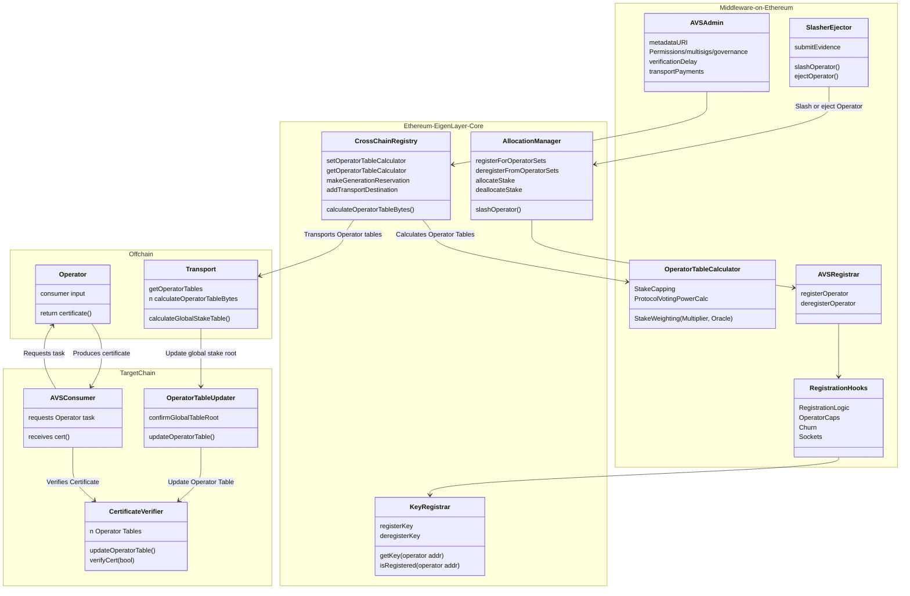
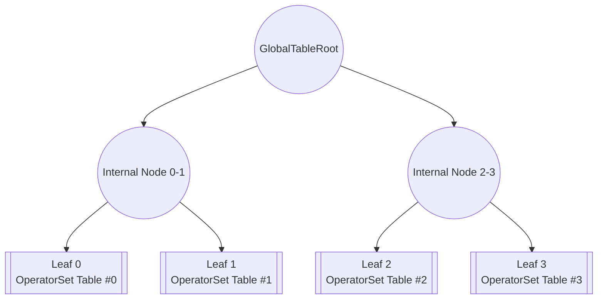
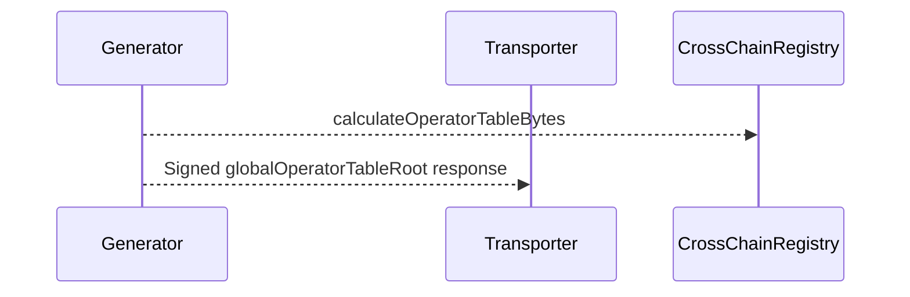
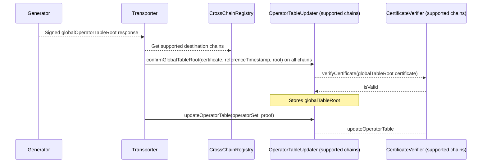

| Author(s) | Created | Status | References | Discussions |
| :---- | :---- | :---- | :---- | :---- |
| [Matt Nelson](mailto:matt.nelson@eigenlabs.org), [Yash Patil](mailto:yash@eigenlabs.org), [Matt Curtis](mailto:matt.curtis@eigenlabs.org), [Madeline Murray](mailto:c-madeline.murray@eigenlabs.orgc-madeline.murray@eigenlabs.org)| 2025-06-03 | `testing` | [PR 1494](https://github.com/Layr-Labs/eigenlayer-contracts/pull/1494), [PR 1549](https://github.com/Layr-Labs/eigenlayer-contracts/pull/1549) | [Discussion Forum Post](https://forum.eigenlayer.xyz/t/elip-008-eigenlayer-multi-chain-verification/14678) |

# ELIP-008: EigenLayer Multi-Chain Verification

---

# Executive Summary

Today, Service Builders are constrained on where they can launch their AVSs. Consumers of AVS services (apps and dapps) can only integrate on Ethereum if they want to inherit the strong security and stake guarantees of EigenLayer. It is costly for AVSs to develop, maintain, and execute (gas) a multi-chain solution today as all of the data and accounting lives on Ethereum.

**Enter Multi-Chain Verification.** EigenLayer today uses the maximally secure, decentralized Ethereum L1 for stake accounting. This proposal outlines a set of open standards and contracts that bring AVS and Operator stake weights to many chains. New EigenLayer contracts, deployed on many EVM chains, will enable verification of Operator outputs on target chains with the same protocol guarantees as on Ethereum. The target chain core contracts house Operator weights and registration status while providing a consistent integration pattern no matter the environment.

With this proposal, AVSs can launch their services and make verified Operator outputs available on any EVM chain, meeting their customers where they are. This standards-based model simplifies existing multi-chain solutions built by AVSs and accelerates the creation of new ones. App builders can easily and cheaply consume verifiable services with a code-once, deploy-anywhere integration across their supported chains. Projects on Layer 2s can integrate AVSs into their protocols with minimal additional trust assumptions and low dev and gas costs. Together, these new features make it easier than ever to launch verifiable service across web3.

# Motivation

AVS developers face significant limitations in their ability to service customers beyond Ethereum L1 without introducing additional development complexity or trust assumptions. This constraint is particularly impactful as many new projects that need verifiable components or services launch on alternative chains like Layer 2s to reach new customers or lower costs. The current situation forces app developers building across multiple chains to implement and maintain costly integrations to leverage AVS services effectively (or to avoid them altogether). As AVS Operators commonly perform tasks offchain, this limitation is challenging when seeking to bring results back into an onchain environment.

The core challenge stems from EigenLayer's current architecture. All critical information including Operator registration status and delegated/allocated stake is written and stored exclusively on Ethereum. This is a key property for decentralization and security of EigenLayer. The economic weights that validate these signatures are currently stored in non-standardized formats in the EigenLayer middleware on L1.

The impact of these limitations is substantial...

- Few AVSs can effectively service clients outside Ethereum L1,  
- Operational complexity and cost increases significantly when offering services across multiple chains,  
- Workaround solutions may introduce additional trust assumptions or centralization,  
- Service builders spend time developing alternative solutions instead of building for and delighting their customers.

This proposal introduces Multi-Chain Verification to address these challenges, aiming to create a standardized framework for AVSs to launch and apps to consume services on any chain through simplified core and middleware verification contracts and infrastructure. These will provide straightforward tooling for integrating AVSs into applications while maintaining EigenLayer's trust and security properties, reducing the development overhead for cross-chain deployments of AVSs.

# Features & Specification

## Overview

**Multi-chain Verification** introduces a comprehensive framework that enables AVSs to operate across multiple chains while maintaining the security guarantees of EigenLayer. AVSs need a way for the offchain outputs that Operators generate to be consumed on target chains. Outputs need to have applied stake weighting in order to be trusted. For onchain verification of stake-weighting, a trusted and local copy of the stake table is needed. This solution aims to have AVSs leverage standardized infrastructure for key management, stake verification, and certificate validation so they can focus on developing core business logic.

To support multi-chain verification and consumption of AVS outputs on chains like Layer 2s, several concepts are introduced to the architecture:

- **Operator Weights**: Previously a non-standard or enforced concept on EigenLayer outside of `multipliers`, stake weighting now has a standardized process in the core and middleware. The AVS defines an array of numerical values that represent an individual Operator's weight for work and reward distribution in the Operator Set. In the simplest form this may represent an Operator’s delegation or Allocation of a single asset; however this is left fully customizable for AVSs with more complicated work distribution criteria.  
- **An Operator Table**: A data structure for representing the Operator Weights of all Operators in a given Operator Set.
- **Table Calculation**: To facilitate the Core protocol’s generation of Operator Weights, AVSs define an `OperatorTableCalculator` for each Operator Set to decorate stake weighting of different assets and apply the formats required by the AVS.  
- **The Stake Table**: A data structure (merkle tree) representing the global view of all Operator Sets and their corresponding Operator Tables. One of these lives on each target chain. The root of the stake table is the global table root.
- **Certificates & Certificate Verification**: A data structure for signed Operator outputs (`certificate`) and a core contract (`CertificateVerifier`) for verifying those outputs against the Operator Table and Operator consensus rules (e.g. signed weight above nominal or proportional stake thresholds).  
- **Stake Generation & Transport**: A specification for generating and verifying the global stake table Merkle root and transporting it to core contracts on many chains. This proposal outlines one approach taken by EigenLabs, but this process is pluggable by AVSs and other third-parties.

These pieces of architecture work together to transport a single global root to many target chains. In sequence...

1. The AVS makes a reservation for Operator Table generation and transport, defining the logic for calculating Operator Weights.  
2. EigenLayer calculates Operator Weights and combines the many Operator Set representations to generate and merkelize a global Stake Table.  
3. The global Stake Table is transported to target chains and rehydrated.
4. Operator Tables can then be used to verify Operator certificates.  
5. Weekly, or as force updates are needed (e.g. when an Operator is ejected or slashed), the table is re-generated and transported again, ensuring up-to-date weight representations wherever the AVS is consumed.

This multi-chain architecture dramatically reduces the complexity for AVS developers by abstracting away cross-chain coordination mechanics. The framework maintains EigenLayer's security model while enabling efficient stake table generation (weekly, with immediate event-driven updates for critical events like slashing/ejection) and trust-minimized transport to supported chains including Base and others.

This architecture was designed around simplifying onchain AVS integrations with their customers. A secondary goal is complete abstraction of the multi-chain system for developers comfortable with the default implementation. In this design, AVSs are intended to focus their efforts on the `CertificateVerifier` as the sole entry point for their consumers, regardless of chain. By leveraging out-of-the-box stake weight verification, AVSs can go-to-market with stake-backed verifiability of their services without any extra code. If AVS builders (or their customers) need more complex verification logic (such as verifying multiple certificates atomically), the `CertificateVerifier` interface can be wrapped with additional functionality.

The EigenLayer multi-chain framework, in a simplified form, has the following architecture, where any application consuming an EigenLayer AVS is the `AVSConsumer`:


## Contract Architecture

The Multi-Chain Verification framework introduces four new core contracts and new templates in EigenLayer middleware. These are intended to interface with offchain, modular components. Below is a table of the new components:

| Contract Name | Deployment Target | Deployer | Description |
| :---- | :---- | :---- | :---- |
| **`KeyRegistrar`** | Ethereum Singleton | EigenLayer Core Protocol | A unified module for managing and retrieving BN254 and ECDSA cryptographic keys for Operators, extensible to additional curves like BLS381 |
| **`CrossChainRegistry`** | Ethereum Singleton | EigenLayer Core Protocol | A coordination contract that  manages the registration/deregistration of operatorSets to the multi-chain protocol and exposes read-only functions to generate the OperatorTable. |
| **`OperatorTableCalculator`** | Ethereum Singleton | AVS Middleware | A middleware contract specified by an AVS for calculating operator  weights, or customizable to decorate weights with custom logic like stake capping |
| **`OperatorTableUpdater`** | One per target chain | EigenLayer Core Protocol | A contract intended to parse and verify the global Stake Table Root and rehydrate individual Operator tables in the `CertificateVerifier` |
| **`CertificateVerifier`** | One per target chain | EigenLayer Core Protocol | A verification contract deployed on multiple chains that enables AVS consumers to verify certificates signed by operators  against transported Operator tables; the single integration point between AVSs and their consumers |

The `CertificateVerifier` is the key new architectural piece and the primary integration point that AVSs need to understand. This contract, deployed on every supported target chain, is the gateway to all EigenLayer services and holds the weight values from Ethereum for verifying Operator tasks. The `CertificateVerifier` is designed around an integration pattern that does not change between AVSs and their customers. The goals of its design are an AVS to Consumer "code once and deploy everywhere" pattern to reduce overhead and maintenance and ensure a smooth experience for builders across chains (and when integrating *multiple AVSs*).

The `KeyRegistrar` manages cryptographic keys for operators across different operator sets. It supports both ECDSA and BN254 key types and ensures global uniqueness of keys across all operator sets. The purpose of this contract is to provide trusted, protocol-controlled code for AVSs to register Operator key material to Operator Sets. This is a canonicalization of the key solutions provided via the `AVSRegistrar` middleware.

The `CrossChainRegistry` is a core contract that manages the registration/deregistration of operatorSets to the multi-chain protocol. The contract also exposes read-only functions to calculate an operator table, which is used offchain to generate the global Stake Table. This is the entrypoint for AVSs utilizing the MultiChain Verification protocol, housing configuration of staleness periods and the `OperatorTableCalculator` that should be used to define operator weights for each Operator Set.

The `OperatorTableCalculator` is an AVS-deployed contract that can be used for decorating stake weights with custom logic. This open-ended contract interface allows AVSs to implement complex weighting features such as stake capping, differential asset weighting, oracle integrations, and minimum requirements. Default templates that require no interaction or custom logic are provided for AVSs out of the box.

The `OperatorTableUpdater` exists to interface with off-chain transport mechanisms. It confirms the data that it is given from the global stake table and parses it into individual Operator Table updates on the `CertificateVerifier`. This ensures accurate, timely updates for individual AVS's Operator Tables as Operators are slashed or ejected.

Altogether, the contracts fit together in a configuration pictured below:



## Specifications

### Operator Weighting & Operator Table Calculation

The `OperatorTableCalculator` is where AVSs define how Operator stakes should be weighted and formatted for their specific use case on a per Operator Set basis. An AVS must deploy their own calculator (setting the weights themselves) or select a calculator address which works for their use-case. The AVS is required to configure the address of their chosen contract in the `CrossChainRegistry` to participate in multi-chain. This must be a valid L1 contract that conforms to the specs below.

The purpose of this contract is to convert raw EigenLayer stake data into Operator weights that reflect the AVS's specific requirements whether that's capping certain operators, weighting different assets differently, or integrating external price feeds.

The weights are captured in `OperatorInfo` structs:

```solidity
struct ECDSAOperatorInfo {
    address pubkey;    // ECDSA signing key from KeyRegistrar (not operator address)
    uint256[] weights; // Flexible array: [slashable_stake, delegated_stake, strategy_i_stake, ...]
}

struct BLSOperatorInfo {
    BN254.G1Point pubkey;  // BLS public key from KeyRegistrar
    uint256[] weights;     // Flexible array: [slashable_stake, delegated_stake, strategy_i_stake, ...]
}
```

The `weights` array is completely flexible AVSs can define any groupings they intend to utilize in the CertificateVerifier. Common patterns include:

- **Simple**: `[total_stake]`  
- **Asset-specific**: `[eth_stake, steth_stake, eigen_stake]`  
- **Detailed**: `[slashable_stake, delegated_stake, strategy_1_stake, strategy_2_stake]`

For AVSs that don't need custom logic, default calculators are provided for both `ECDSATableCalculator` and `BLSTableCalculator` that simply return the number of underlying strategy shares. For larger Operator Sets (50+ operators), BLS provides more efficient verification through aggregate signatures.

Below is provided the interface for ECDSA (BLS is provided in the contracts repository):

```solidity
interface IECDSATableCalculatorTypes {
    /**
     * @notice A struct that contains information about a single operator
     * @param pubkey The address of the signing ECDSA key of the operator and not the operator address itself.
     * This is read from the KeyRegistrar contract.
     * @param weights The weights of the operator for a single operatorSet
     * @dev The `weights` array can be defined as a list of arbitrary groupings. For example,
     * it can be [slashable_stake, delegated_stake, strategy_i_stake, ...]
     */
    struct ECDSAOperatorInfo {
        address pubkey;
        uint256[] weights;
    }
}

interface IECDSATableCalculatorEvents {
    /// @notice Emitted when the lookahead blocks are set
    event LookaheadBlocksSet(uint256 lookaheadBlocks);
}

interface IECDSATableCalculatorErrors {
    /// @notice Emitted when the lookahead blocks are too high
    error LookaheadBlocksTooHigh();
}

interface IECDSATableCalculator is
    IOperatorTableCalculator,
    IECDSATableCalculatorTypes,
    IECDSATableCalculatorEvents,
    IECDSATableCalculatorErrors
{
    /**
     * @notice calculates the operatorInfos for a given operatorSet
     * @param operatorSet the operatorSet to calculate the operator table for
     * @return operatorInfos the list of operatorInfos for the given operatorSet
     * @dev The output of this function is converted to bytes via the `calculateOperatorTableBytes` function
     */
    function calculateOperatorTable(
        OperatorSet calldata operatorSet
    ) external view returns (ECDSAOperatorInfo[] memory operatorInfos);
}
```

The default implementation weighs operators by the number of allocated strategy shares across all strategies in the Operator Set. This is a sufficient proxy for Operator Sets with single strategies, or if the value of all underlying shares are identical. Note that the number of shares is decimal dependent: assets with non-standard decimals (E.G. USDC, USDT, WBTC) will return significantly lower numbers of shares. For example, `1 wETH \= 10^18 shares`. `1 USDC \= 10^6 shares`.

AVSs that wish to weight Operator Sets by other metrics, such as asset value, will need to modify the default implementation of the TableCalculator for their use case. Some examples of customization options might include...

- Hard Coded Asset Weighting: Weight ETH share 3000x higher than USD shares.  
- Oracle Integration: Use external price feeds to convert all stakes to USD values  
- Stake Capping: Limit any single Operator to maximum 10% of total weight  
- Minimum Requirements: Filter out Operators below certain stake thresholds (i.e. set their verification weight to zero)  
- Operator Bonding: Operator self-staked assets have double weight

The Calculator contract is left largely flexible for AVSs, with easy defaults. As long as the return type is an array of `OperatorInfos`, the upstream contracts will be able to parse them appropriately. The goal of the `OperatorTableCalculator` is to give AVSs complete control over how their Operators are weighted while maintaining standardized interfaces for the broader multi-chain system. These Operator weights are key to properly [verifying Operator certificates](./ELIP-008.md#certificates--verification).

The following is the default implementation for calculating Operator Weights in the `ECDSATableCalculator`:

```solidity
/**
 * @notice Get the operator weights for a given operatorSet based on the slashable stake.
 * @param operatorSet The operatorSet to get the weights for
 * @return operators The addresses of the operators in the operatorSet
 * @return weights The weights for each operator in the operatorSet, this is a 2D array where the first index is the operator
 * and the second index is the type of weight. In this case its of length 1 and returns the slashable stake for the operatorSet.
 */
function _getOperatorWeights(
    OperatorSet calldata operatorSet
) internal view override returns (address[] memory operators, uint256[][] memory weights) {
    // Get all operators & strategies in the operatorSet
    address[] memory registeredOperators = allocationManager.getMembers(operatorSet);
    IStrategy[] memory strategies = allocationManager.getStrategiesInOperatorSet(operatorSet);

    // Get the minimum slashable stake for each operator
    uint256[][] memory minSlashableStake = allocationManager.getMinimumSlashableStake({
        operatorSet: operatorSet,
        operators: registeredOperators,
        strategies: strategies,
        futureBlock: uint32(block.number + LOOKAHEAD_BLOCKS)
    });

    operators = new address[](registeredOperators.length);
    weights = new uint256[][](registeredOperators.length);
    uint256 operatorCount = 0;
    for (uint256 i = 0; i < registeredOperators.length; ++i) {
        // For the given operator, loop through the strategies and sum together to calculate the operator's weight for the operatorSet
        uint256 totalWeight;
        for (uint256 stratIndex = 0; stratIndex < strategies.length; ++stratIndex) {
            totalWeight += minSlashableStake[i][stratIndex];
        }

        // If the operator has nonzero slashable stake, add them to the operators array
        if (totalWeight > 0) {
            // Initialize operator weights array of length 1 just for slashable stake
            weights[operatorCount] = new uint256[](1);
            weights[operatorCount][0] = totalWeight;

            // Add the operator to the operators array
            operators[operatorCount] = registeredOperators[i];
            operatorCount++;
        }
    }

    // Resize arrays to be the size of the number of operators with nonzero slashable stake
    assembly {
        mstore(operators, operatorCount)
        mstore(weights, operatorCount)
    }

    return (operators, weights);
}
```

### Key Registrar

For convenience and reduced middleware trust assumptions, this proposal canonicalizes a `CrossChainRegistry` and a `KeyRegistrar`. Previously, key management was handled by the AVS in middleware, without standardization and a lack of support for consistent key rotation. The `KeyRegistrar` brings these key mappings into the core and makes convenient view and setter functions available to AVSs and Operators.

This contract enforces global uniqueness of Operator keys across all registered Operator Sets. Operators are responsible for supplying unique key material prior to registering for an Operator Set. Operators can rotate keys by deregistering a key for a given Operator Set; however, to prevent the possibility of race conditions, this can only be performed after an Operator has removed all Allocations and is no longer slashable by the AVS. While we recognize that this is not an ideal rotation path, this functionality ensures that key rotation is possible without fully migrating stake to a new Operator, and we will continue to explore more convenient options. Deregistered keys are also retained in the global database to ensure that reuse is not possible.

Provided below is the `KeyRegistrar` interface:

```solidity
interface IKeyRegistrarEvents is IKeyRegistrarTypes {
    /// @notice Emitted when a key is registered
    event KeyRegistered(OperatorSet operatorSet, address indexed operator, CurveType curveType, bytes pubkey);
    /// @notice Emitted when a key is deregistered
    event KeyDeregistered(OperatorSet operatorSet, address indexed operator, CurveType curveType);
    /// @notice Emitted when the aggregate BN254 key is updated
    event AggregateBN254KeyUpdated(OperatorSet operatorSet, BN254.G1Point newAggregateKey);
    /// @notice Emitted when an operator set is configured
    event OperatorSetConfigured(OperatorSet operatorSet, CurveType curveType);
}

/// @notice The `KeyRegistrar` is used by AVSs to set their key type and by operators to register and deregister keys to operatorSets    /// @notice The `KeyRegistrar` is used by AVSs to set their key type and by operators to register and deregister keys to operatorSets
/// @notice The integration pattern is as follows:
/// 1. The AVS calls `configureOperatorSet` to set the key type for their operatorSet
/// 2. Operators call `registerKey` to register their keys to the operatorSet
/// @dev This contract requires that keys are unique across all operatorSets, globally
/// @dev For the multichain protocol, the key type of the operatorSet must be set in the `KeyRegistrar`, but the
///      AVS is not required to use the KeyRegistrar for operator key registration/deregistration and can implement its own registry
interface IKeyRegistrar is IKeyRegistrarErrors, IKeyRegistrarEvents, ISemVerMixin {
    /**
     * @notice Configures an operator set with curve type
     * @param operatorSet The operator set to configure
     * @param curveType Type of curve (ECDSA, BN254)
     * @dev Only authorized callers for the AVS can configure operator sets
     */
    function configureOperatorSet(OperatorSet memory operatorSet, CurveType curveType) external;

    /**
     * @notice Registers a cryptographic key for an operator with a specific operator set
     * @param operator Address of the operator to register key for
     * @param operatorSet The operator set to register the key for
     * @param pubkey Public key bytes. For ECDSA, this is the address of the key. For BN254, this is the G1 and G2 key combined (see `encodeBN254KeyData`)
     * @param signature Signature proving ownership. For ECDSA this is a signature of the `getECDSAKeyRegistrationMessageHash`. For BN254 this is a signature of the `getBN254KeyRegistrationMessageHash`.
     * @dev Can be called by operator directly or by addresses they've authorized via PermissionController
     * @dev Reverts if key is already registered
     * @dev There exist no restriction on the state of the operator with respect to the operatorSet. That is, an operator
     *      does not have to be registered for the operator in the `AllocationManager` to register a key for it
     * @dev For ECDSA, we allow a smart contract to be the pubkey (via ERC1271 signatures), but note that the multichain protocol DOES NOT support smart contract signatures
     */
    function registerKey(
        address operator,
        OperatorSet memory operatorSet,
        bytes calldata pubkey,
        bytes calldata signature
    ) external;

    /**
     * @notice Deregisters a cryptographic key for an operator with a specific operator set
     * @param operator Address of the operator to deregister key for
     * @param operatorSet The operator set to deregister the key from
     * @dev Can be called by the operator directly or by addresses they've authorized via PermissionController
     * @dev Reverts if key was not registered
     * @dev Reverts if operator is still slashable for the operator set (prevents key rotation while slashable)
     * @dev Keys remain in global key registry to prevent reuse
     */
    function deregisterKey(address operator, OperatorSet memory operatorSet) external;

    /**
     * @notice Checks if a key is registered for an operator with a specific operator set
     * @param operatorSet The operator set to check
     * @param operator Address of the operator
     * @return True if the key is registered, false otherwise
     * @dev If the operatorSet is not configured, this function will return false
     */
    function isRegistered(OperatorSet memory operatorSet, address operator) external view returns (bool);

    /**
     * @notice Gets the curve type for an operator set
     * @param operatorSet The operator set to get the curve type for
     * @return The curve type, either ECDSA, BN254, or NONE
     */
    function getOperatorSetCurveType(
        OperatorSet memory operatorSet
    ) external view returns (CurveType);

    /**
     * @notice Gets the BN254 public key for an operator with a specific operator set
     * @param operatorSet The operator set to get the key for
     * @param operator Address of the operator
     * @return g1Point The BN254 G1 public key
     * @return g2Point The BN254 G2 public key
     * @dev Reverts if the operatorSet is not configured for BN254
     */
    function getBN254Key(
        OperatorSet memory operatorSet,
        address operator
    ) external view returns (BN254.G1Point memory g1Point, BN254.G2Point memory g2Point);

    /**
     * @notice Gets the ECDSA public key for an operator with a specific operator set as bytes
     * @param operatorSet The operator set to get the key for
     * @param operator Address of the operator
     * @return pubkey The ECDSA public key in bytes format
     * @dev Reverts if the operatorSet is not configured for ECDSA
     */
    function getECDSAKey(OperatorSet memory operatorSet, address operator) external view returns (bytes memory);

    /**
     * @notice Gets the ECDSA public key for an operator with a specific operator set
     * @param operatorSet The operator set to get the key for
     * @param operator Address of the operator
     * @return pubkey The ECDSA public key in address format
     * @dev Reverts if the operatorSet is not configured for ECDSA
     */
    function getECDSAAddress(OperatorSet memory operatorSet, address operator) external view returns (address);

    /**
     * @notice Checks if a key hash is globally registered
     * @param keyHash Hash of the key
     * @return True if the key is globally registered
     */
    function isKeyGloballyRegistered(
        bytes32 keyHash
    ) external view returns (bool);

    /**
     * @notice Gets the key hash for an operator with a specific operator set
     * @param operatorSet The operator set to get the key hash for
     * @param operator Address of the operator
     * @return keyHash The key hash
     * @dev Reverts if the operatorSet is not configured
     */
    function getKeyHash(OperatorSet memory operatorSet, address operator) external view returns (bytes32);

    /**
     * @notice Gets the operator from signing key
     * @param operatorSet The operator set to get the operator for
     * @param keyData The key data. For ECDSA, this is the signing key address. For BN254, this can be either the G1 key or the G1 and G2 key combined.
     * @return operator. Returns 0x0 if the key is not registered
     * @return status registration status. Returns false if the key is not registered
     * @dev This function decodes the key data based on the curve type of the operator set
     * @dev This function will return the operator address even if the operator is not registered for the operator set
     */
    function getOperatorFromSigningKey(
        OperatorSet memory operatorSet,
        bytes memory keyData
    ) external view returns (address, bool);

    /**
     * @notice Returns the message hash for ECDSA key registration, which must be signed by the operator when registering an ECDSA key
     * @param operator The operator address
     * @param operatorSet The operator set
     * @param keyAddress The address of the key
     * @return The message hash for signing
     */
    function getECDSAKeyRegistrationMessageHash(
        address operator,
        OperatorSet memory operatorSet,
        address keyAddress
    ) external view returns (bytes32);

    /**
     * @notice Returns the message hash for BN254 key registration, which must be signed by the operator when registering a BN254 key
     * @param operator The operator address
     * @param operatorSet The operator set
     * @param keyData The BN254 key data
     * @return The message hash for signing
     */
    function getBN254KeyRegistrationMessageHash(
        address operator,
        OperatorSet memory operatorSet,
        bytes calldata keyData
    ) external view returns (bytes32);

    /**
     * @notice Encodes the BN254 key data into a bytes array
     * @param g1Point The BN254 G1 public key
     * @param g2Point The BN254 G2 public key
     * @return The encoded key data
     */
    function encodeBN254KeyData(
        BN254.G1Point memory g1Point,
        BN254.G2Point memory g2Point
    ) external pure returns (bytes memory);
}
```

Functions are provided to get, set, and verify key material. Initial support covers ECDSA and BN254 keys, but the interface is flexible and may be extended in the future to include new key solutions like BLS12-381. The `KeyRegistrar` simplifies middleware management by AVSs by moving key concerns into the core. AVS middleware is free to consume these keys on or off-chain.

### Cross Chain Registry

The `CrossChainRegistry` is the entrypoint for participation in multi-chain Operator Table generation and transport. This is a singleton contract deployed on Ethereum. It is responsible for storing GenerationReservations created by AVSs for each Operator Set.

A GenerationReservation is composed of:

- The Operator Set the Reservation is made for,
- The `OperatorTableCalculator` used to calculate Operator weights for the Operator Set,
- An `OperatorSetConfig` that contains:
  - An `owner` address that is given permission to call setters on downstream L2 contracts,  
  - the `maxStalenessPeriod` defining how long an Operator Table remains valid after being transported. When set to 0, the Operator Table does not expire.

The contract then exposes read-only functions used by the transporter to generate each Operator Set’s Operator Table and combine them into a global Stake Table.

When it’s time to generate a new root...

1. `CrossChainRegistry.getActiveGenerationReservations()` is called to gather the Operator Sets opted-in to multi-chain transport.  
2. For each Operator Set, call the `CrossChainRegistry.calculateOperatorTableByes(operatorSet)`.  
3. The `CrossChainRegistry` calls into each `OperatorTableCalculator` to apply the weighting logic specified by the AVS.  
4. A global stake root is calculated from a created merkle tree, where each leaf is the hash of the bytes returned in step 2.

This process yields a `globalTableRoot` and a merkle tree that is transported to target chains.

The tree for the `globalTableRoot` is:



Where each OperatorSet Table is the bytes generated by the `CrossChain Registry`.

Below is the interface for the `CrossChainRegistry`.

```solidity
interface ICrossChainRegistry is ICrossChainRegistryErrors, ICrossChainRegistryEvents {
    /**
     * @notice Creates a generation reservation
     * @param operatorSet the operatorSet to make a reservation for
     * @param operatorTableCalculator the address of the operatorTableCalculator
     * @param config the config to set for the operatorSet
     * @dev msg.sender must be an authorized caller for operatorSet.avs
     * @dev Once a generation reservation is created, the operator table will be transported to all chains that are whitelisted
     * @dev It is expected that the AVS has:
     *      - Deployed or is using a generalizable `OperatorTableCalculator` to calculate its operator's stake weights
     *      - Set the `KeyType` for the operatorSet in the `KeyRegistrar`, even if the AVS is not using the `KeyRegistrar` for operator key registration/deregistration
     *      - Created an operatorSet in the `AllocationManager`
     */
    function createGenerationReservation(
        OperatorSet calldata operatorSet,
        IOperatorTableCalculator operatorTableCalculator,
        OperatorSetConfig calldata config
    ) external;

    /**
     * @notice Removes a generation reservation for a given operatorSet
     * @param operatorSet the operatorSet to remove
     * @dev msg.sender must be an authorized caller for operatorSet.avs
     */
    function removeGenerationReservation(
        OperatorSet calldata operatorSet
    ) external;

    /**
     * @notice Sets the operatorTableCalculator for the operatorSet
     * @param operatorSet the operatorSet whose operatorTableCalculator is desired to be set
     * @param operatorTableCalculator the contract to call to calculate the operator table
     * @dev msg.sender must be an authorized caller for operatorSet.avs
     * @dev operatorSet must have an active reservation
     */
    function setOperatorTableCalculator(
        OperatorSet calldata operatorSet,
        IOperatorTableCalculator operatorTableCalculator
    ) external;

    /**
     * @notice Sets the operatorSetConfig for a given operatorSet
     * @param operatorSet the operatorSet to set the operatorSetConfig for
     * @param config the config to set
     * @dev msg.sender must be an authorized caller for operatorSet.avs
     * @dev operatorSet must have an active generation reservation
     * @dev The max staleness period is NOT checkpointed and is applied globally regardless of the reference timestamp of a certificate
     */
    function setOperatorSetConfig(OperatorSet calldata operatorSet, OperatorSetConfig calldata config) external;

    /**
     * @notice Adds chainIDs to the whitelist of chainIDs that are transported to by the multichain protocol
     * @param chainIDs the chainIDs to add to the whitelist
     * @param operatorTableUpdaters the operatorTableUpdaters for each whitelisted chainID
     * @dev msg.sender must be the owner of the CrossChainRegistry
     */
    function addChainIDsToWhitelist(uint256[] calldata chainIDs, address[] calldata operatorTableUpdaters) external;

    /**
     * @notice Removes chainIDs from the whitelist of chainIDs
     * @param chainIDs the chainIDs to remove from the whitelist
     * @dev msg.sender must be the owner of the CrossChainRegistry
     */
    function removeChainIDsFromWhitelist(
        uint256[] calldata chainIDs
    ) external;

    /**
     * @notice Sets the table update cadence in seconds
     * @param tableUpdateCadence the table update cadence
     * @dev msg.sender must be the owner of the CrossChainRegistry
     * @dev The table update cadence cannot be 0
     */
    function setTableUpdateCadence(
        uint32 tableUpdateCadence
    ) external;

    /**
     *
     *                         VIEW FUNCTIONS
     *
     */

    /**
     * @notice Gets the active generation reservations
     * @return An array of operatorSets with active generationReservations
     */
    function getActiveGenerationReservations() external view returns (OperatorSet[] memory);

    /**
     * @notice Gets the operatorTableCalculator for a given operatorSet
     * @param operatorSet the operatorSet to get the operatorTableCalculator for
     * @return The operatorTableCalculator for the given operatorSet
     */
    function getOperatorTableCalculator(
        OperatorSet memory operatorSet
    ) external view returns (IOperatorTableCalculator);

    /**
     * @notice Gets the operatorSetConfig for a given operatorSet
     * @param operatorSet the operatorSet to get the operatorSetConfig for
     * @return The operatorSetConfig for the given operatorSet
     */
    function getOperatorSetConfig(
        OperatorSet memory operatorSet
    ) external view returns (OperatorSetConfig memory);

    /**
     * @notice Calculates the operatorTableBytes for a given operatorSet
     * @param operatorSet the operatorSet to calculate the operator table for
     * @return the encoded operatorTableBytes containing:
     *         - operatorSet details
     *         - curve type from KeyRegistrar
     *         - operator set configuration
     *         - calculated operator table from the calculator contract
     * @dev This function aggregates data from multiple sources for cross-chain transport
     */
    function calculateOperatorTableBytes(
        OperatorSet calldata operatorSet
    ) external view returns (bytes memory);

    /**
     * @notice Gets the list of chains that are supported by the CrossChainRegistry
     * @return An array of chainIDs that are supported by the CrossChainRegistry
     * @return An array of operatorTableUpdaters corresponding to each chainID
     */
    function getSupportedChains() external view returns (uint256[] memory, address[] memory);

    /**
     * @notice Gets the table update cadence
     * @return The table update cadence
     * @dev The table update cadence is applicable to all chains
     */
    function getTableUpdateCadence() external view returns (uint32);
}
```

### Generation

Initially EigenLabs will take the role of Generator executing the globalTableRoot generation process at minimum every 7 days, in addition to any time forced updates are required. Forced updates will be triggered whenever an Operator is added or removed from an Operator Set (voluntarily or by ejection), in addition to any slashing of an Operator.

Internally, the Generator is represented as an Operator Set that generates a certificate signing the globalTableRoot with its BN254 keys. The system is designed such that this responsibility can readily be transitioned to a decentralized and stake-backed Operator Set in the future.



### Transport & Rehydration

The `OperatorTableUpdater` is a contract deployed by EigenLabs to each destination chain to facilitate the transportation and rehydration Operator Tables. It maintains a set of valid `globalTableRoots` that are confirmed by a designated generator (using the certificate verification methods described below) along with the `referenceTimestamp` at which they were generated, and allows updating individual operator tables by providing merkle proofs against these roots. Both functions are permissionless.

After the `globalTableRoot` is generated, a Transporter must provide the valid globalTableRoot certificate to the contract, then make calls to update each individual Operator Table in the `CertificateVerifier`. EigenLabs will perform this on a weekly cadence for all Operator Sets. In the case of forced updates, only the triggering Operator Sets will have their Operator Table updated. Other AVSs may permissionlessly update their Operator Table by submitting a valid proof if desired.



### Certificates & Verification

**The `CertificateVerifier` is the key integration point between AVSs and their customers.** This is the contract that allows off-chain services built atop EigenLayer restaking to interface with on-chain environments across all supported chains. Deployed to each target chain, this contract holds the `Operator Table` for each AVS and allows Operator `Certificates` to be verified against Operator weighted rules (as defined by the AVS in the OperatorTableCalculator), with built in options for proportional and nominal weighting logics.

This contract was designed to serve key goals:

- **A Single Integration Point and Pattern**: AVSs and their customers only need to understand one contract interface, not many different patterns. One single contract interface for all EigenLayer services.  
- **Consistent Experience**: The same verification interface works identically across Ethereum, Base, Optimism, and other EVM chains with flexibility for future alt-VM support.  
- **Code Once, Deploy Everywhere**: Write integration logic once, deploy across all chains.  
- **Off-Chain to On-Chain Bridge**: This is where off-chain operator services become verifiable on-chain outputs using stake-weighted commitments.  
- **Stake-Weighted Verification**: Operator outputs are verified against stake criteria for acceptance and potential slashing. Operator outputs are backed by EigenLayer stake values from the maximally secure Layer One Ethereum.

Everywhere the `CertificateVerifier` contract is available, AVSs can serve their customers and Operators can have certificates verified.

The verification flow is outlined below:

1. **Operator Execution**: Operators perform off-chain tasks (data feeds, computation, attestations)  
2. **Certificate Creation**: Operators sign results creating an `ECDSACertificate` or `BLSCertificate`.  
3. **Consumer Verification**: Applications call `CertificateVerifier.verifyCertificate()` to validate any received (or cached) certificates.  
4. **Stake Validation**: The `CertificateVerifier` checks the Certificate signatures against the transported stake table’s Operator keys and sums the weight of signing Operators.  
5. **Threshold Enforcement**: Ensures sufficient stake signed the certificate (proportional, nominal, or custom) and returns a result to the requesting application.

Below is the certificate structure:

```solidity
    /**
     * @notice A Certificate used to verify a set of ECDSA signatures
     * @param referenceTimestamp a reference timestamp that corresponds to a timestamp at which an operator table was updated for the operatorSet.
     * @param messageHash the hash of the message that was signed by the operators. The messageHash
     *        MUST be calculated using `calculateCertificateDigest`
     * @param sig the concatenated signature of each signing operator, in ascending order of signer address
     * @dev ECDSA certificates DO NOT support smart contract signatures
     * @dev The `referenceTimestamp` is used to key into the operatorSet's stake weights. It is NOT the timestamp at which the certificate was generated off-chain
     */
    struct ECDSACertificate {
        uint32 referenceTimestamp;
        bytes32 messageHash;
        bytes sig;
    }

/// BLS keys are a bit more complex
    /**
     * @notice A witness for an operator, used to identify the non-signers for a given certificate
     * @param operatorIndex the index of the nonsigner in the `BN254OperatorInfo` tree
     * @param operatorInfoProofs merkle proof of the nonsigner at the index. Empty if the non-signing operator is   already stored from a previous verification
     * @param operatorInfo the `BN254OperatorInfo` for the operator. Empty if the non-signing operator is already stored from a previous verification
     * @dev Non-signing operators are stored in the `BN254CertificateVerifier` upon the first successful certificate verification that includes a merkle proof for the non-signing operator.
     *  This is done to avoid the need for resupplying proofs of non-signing operators for each certificate verification at a given reference timestamp
     */
    struct BN254OperatorInfoWitness {
        uint32 operatorIndex;
        bytes operatorInfoProof;
        BN254OperatorInfo operatorInfo;
    }

    /**
     * @notice A BN254 Certificate
     * @param referenceTimestamp a reference timestamp that corresponds to a timestamp at which an operator table was updated for the operatorSet.
     * @param messageHash the hash of the message that was signed by operators and used to verify the aggregated signature
     * @param signature the G1 signature of the message
     * @param apk the G2 aggregate public key
     * @param nonSignerWitnesses an array of witnesses of non-signing operators
     * @dev The `referenceTimestamp` is used to key into the operatorSet's stake weights. It is NOT the timestamp at which the certificate was generated off-chain
     */
    struct BN254Certificate {
        uint32 referenceTimestamp;
        bytes32 messageHash;
        BN254.G1Point signature;
        BN254.G2Point apk;
        BN254OperatorInfoWitness[] nonSignerWitnesses;
    }

```

Each certificate must include a `referenceTimestamp` that corresponds to the timestamp of an Operator Table update. This timestamp is used to validate the staleness of the Operator Table. If the referenceTimestamp is older than the maxStalenessPeriod configured in the CrossChainRegistry, the Operator Table is considered stale and validation will fail.

Note that the `CertificateVerifier` checks for age-related staleness only. Certificates referencing old Operator Tables remain valid until the `maxStalenessPeriod` configured in the `GenerationReservation`, even if an Operator is slashed based on their contents. For example: consider a oracle certificate backed by $1M of allocated stake that says the Bitcoin price is $1. Even though all signing operators are slashed for 100% of their allocations, the original certificate will indicate that $1M of allocated stake attested that the Bitcoin price is $1. AVS consumers must be aware of and account for other forms of certificate staleness.

The `CertificateVerifier` provides several options out of the box for both `ECDSA` and `BLS` keys...

- `verifyCertificate()`: Returns raw signed stake amounts per weight category  
- `verifyCertificateProportion()`: Checks if signed stake meets % thresholds (e.g. >66% of total)  
- `verifyCertificateNominal()`: Checks if signed stake meets absolute thresholds (e.g. >1M ETH)

An example integration Pattern flow may look like the following:

```solidity
// Same code works on Ethereum, Base, etc.
bool isValid = certificateVerifier.verifyCertificateProportion(
    operatorSet,
    certificate,
    [6600] // Require 66% of stake
);

if (isValid) {
    // Process verified result
    processOperatorOutput(certificate.messageHash);
}
```

The `CertificateVerifier` respects stake staleness configurations set in the `CrossChainRegistry` to invalidate old certificates or stake weight values, ensuring the AVS has control over how long outputs are considered verified.

This contract is the gateway that makes EigenLayer's security and operator network accessible to applications across the multi-chain ecosystem, transforming off-chain operator services into verifiable, stake-backed on-chain outputs.

### Integration Models

The `CertificateVerifier` enables three primary integration patterns for consuming AVS services:

#### Pull Model (Request-Response)

Applications request tasks from operators directly, receive certificates, and verify them on-demand:

```solidity
// 1. Consumer requests task from operator
TaskRequest memory task = TaskRequest({data: inputData, deadline: block.timestamp + 1 hours});
bytes memory result = operator.performTask(task);

// 2. Operator responds with certificate
Certificate memory cert = abi.decode(result, (Certificate));

// 3. Consumer verifies immediately
bool isValid = certificateVerifier.verifyCertificateProportion(operatorSet, cert, [6600]);
require(isValid, "Insufficient stake backing");
```

#### Push Model (Cached Results)

Operators publish certificates to storage (contract storage, IPFS, etc.), and applications pull cached results when needed:

```solidity
// 1. Query cached certificate from storage
Certificate memory cachedCert = avs.getLatestResult(taskType);

// 2. Check certificate freshness and validity
require(block.timestamp - cachedCert.referenceTimestamp < MAX_STALENESS, "Certificate too old");
bool isValid = certificateVerifier.verifyCertificateProportion(operatorSet, cachedCert, [5000]);
require(isValid, "Insufficient stake backing");

// 3. Use cached result
processResult(cachedCert.messageHash);
```

#### Hybrid Model

Combines both approaches - try cached results first, fallback to fresh requests for critical operations or when cache is stale.

#### Custom Verification Logic

For consumers requiring specialized verification logic beyond proportional and nominal thresholds, the `CertificateVerifier` exposes a number of introspective functions to retrieve stored information such as the latest timestamp that the Operator Table was updated, the total Operator weights for the Operator Set, and the number of registered operators. This allows Certificate consumers to apply their own validation logic. For example, requiring 60% of stake AND 3+ Operators to sign off.

## System Parameters Reference

Provided below are the systems different parameters: mutable, immutable, and configurable. Understanding these will help with proper multi-chain implementation:

### Mutable Parameters

Mutable parameters will update occasionally or after some actions. These are worth monitoring to ensure up-to-date info for implementors and consumers.

| Parameter | Controlled By | Update Frequency | Impact | Monitoring Event |
| :---- | :---- | :---- | :---- | :---- |
| **Operator Tables** | EigenLayer Core | Weekly + event-driven updates | Certificate verification validity | `CertificateVerifier.TableUpdated` |
| **Operator Keys** | Operators | On-demand | Certificate signature validation | `KeyRegistrar.KeyRegistered/KeyDeregistered` |
| **Staleness Period** | AVS | On-demand | Certificate validity | `CrossChainRegistry.OperatorSetConfigSet` |
| **Operator Registration/deregistration** | AVS + Operators | On-demand (immediate transport) | Available operators for tasks | `AVSRegistrar.OperatorRegistered/Deregistered` |
| **Slashing/Ejections** | EigenLayer Core | On-demand (immediate transport) | Operator validity and weights | `AllocationManager.OperatorSlashed` |

### Immutable Parameters

Immutable parameters are either fixed or set for usage in the protocol or controlled by protocol governance itself.

| Parameter | Set By | Description |
| :---- | :---- | :---- |
| **Operator Set ID** | AVS | Unique identifier for the Operator Set |
| **Operator Set Cryptographic Curve** | AVS | Presently ECDSA or BN254 |
| **Contract Addresses** | EigenLayer Core | Core contracts, `CertificateVerifier`, `OperatorTableUpdater` addresses per chain |

### Configurable Parameters

The following parameters are configurable by users:

| Parameter | Configured By | Options |
| :---- | :---- | :---- |
| **Staleness Period** | AVS | 0 (does not expire), > Table Update Frequency |
| **Custom Operator Weighting** | AVS | Supply `calculateOperatorTable()` with any logic |
| **Verification Thresholds** | Certificate Consumer | Proportional % or nominal amounts |

# Rationale

## Technical Design Decisions

### Singleton CertVerifier Architecture

A single verification contract per chain reduces deployment complexity for all participants and provides a unified interface for all AVS consumers. This design enables a code-once, deploy anywhere shared infrastructure while maintaining clear separation between Operator Sets. This also allows for consuming applications to do their own verification and for AVSs and apps to implement complex logic, as needed.

### Weekly Stake Table Generation

Weekly updates balance freshness with operational efficiency. This frequency accommodates most AVS use cases while keeping infrastructure costs manageable (and free to users) during the testing phase. Forced updates ensure critical events (slashing, ejections) propagate immediately when needed. Post-Preview, this frequency may be adjusted based on usage patterns and requirements.

### Multi-Curve Cryptography Support

ECDSA support enables smaller operator sets (<50 operators) with lower complexity and gas costs in some instances, while BN254 accommodates larger sets with aggregate signatures. This dual approach optimizes for different AVS scales, costs, and security requirements.

## Economic Considerations

### Infrastructure Provider Model

Eigen Labs serves as the initial stake table generator and transporter to establish the multi-chain feature set and to ensure SLAs on reliable service. The protocol design enables future decentralization to custom solutions, partner solutions, or EigenCloud Operators. The goal is to prove value before focusing on economic incentives for infrastructure provision.

### Reservation-Based Access

AVSs make upfront reservations for generation and transport services. For the Preview, a whitelist may be used to prevent service issues. Over time, reservations may expand to support different economic or business models for both developers and the multi-chain protocol itself.

# Security Considerations

## Cross-Chain Attack Vectors

### Stake Table Manipulation

**Risk**: Malicious generation of incorrect stake tables could enable unauthorized task validation.  
**Mitigation**: Initial implementation is permissioned for generation and transport of tables to EigenLabs infrastructure. Cryptographic commitments from trusted `Generator` can be verified permissionlessly, with social consensus fallback for disputes. Over time, we will explore solutions to decentralize.

### Timing-based Malicious Verification

**Risk**: Operators may perform malicious actions causing an ejection, slash, or challenge. They would then try to take advantage of timing lag to produce certificates that would have stale stakes on non-L1 chains.
**Mitigation**: Changes that are material to verification (namely, anything impacting the Operator table: a slash, ejection, registration, or deregistration) will automatically trigger updates. While there is some confirmation lag due to the nature of cross-chain communications, Certificates generated against the most recent Operator Table will not include ejected Operators.

### Key Compromise Scenarios

**Risk**: Operator key compromise could enable unauthorized certificate signing.
**Mitigation**: Key rotation mechanisms with configurable delays and emergency ejection capabilities.

## Protocol-Level Safeguards

### Staleness Controls

Maximum age limits for Operator Table stakes can prevent situations where weights are assumed valid by one party handling a certificate. The AVS is intended to set this parameter based on their use-case. It is provided so that consuming applications shouldn't require deep knowledge of the underlying stake weighting of EigenLayer to verify the data they are given off-chain or do additional diligence to avoid outdated security assumptions. Each Operator Set can configure appropriate staleness thresholds based on their security model.

### Emergency Ejection

Immediate operator removal bypasses the normal seven day update cycle. When security incidents or a breakdown of process requires rapid response, AVSs should not continue producing certificates signed by ejected Operators. As long as the AVS generates certificates against the most recently transported Operator Table, the signatures of ejected Operators should not be included, even if they picked up outstanding tasks before the ejection occurs. AVS consumers should be aware that certificates signed on work completed before the Operator Table is updated can still be validated, and must design around that capability.

### Pause Mechanisms

System-wide pause capabilities are built into the multi-chain system that enable rapid response to critical vulnerabilities while governance coordinates emergency fixes. These follow the mechanics of the [Pauser multi-sig](https://docs.eigenfoundation.org/protocol-governance/technical-architecture).

# Impact Summary

## AVS Ecosystem Impact

In-protocol standards for cross-chain AVS consumption patterns will allow developers to focus their energies on a single point of integration with the `CertificateVerifier`, rather than investigating AVS-specific solutions. Similarly, AVS developers need not develop their own custom stake tracking and bridging solutions to access Operator weights - Operator keys can be handled in-protocol via the `KeyRegistrar`, while AVS developers need only to define a method for calculating Operator weights to have the available on all supported chains. This greatly simplifies the scope and complexity of on-chain AVS middleware.

This proposal includes no breaking changes: all contracts and features described are net-new, and existing AVSs will continue to function without modifications. We anticipate gradual migrations to hybrid L1/multi-chain operation over time.

## Operator Impact

Existing Operators will be unaffected. The introduction of the KeyRegistrar gives Operators a mechanism to register and rotate (with a potential delay) AVS-specific keys, in addition to increasing operational security by preventing identical keys from reuse across multiple AVSs. This contract represents a minor modification to the existing AVS registration process for AVSs who opt into using the KeyRegistrar, with Operators registering key material prior to AVS registration rather than during registration.

## Staker Impact

Existing Stakers will be unaffected. Over time, the acceleration of AVS development may make new staking opportunities available.

# Action Plan

Development:

- Code: Complete  
- Testnet: deployed to Ethereum Sepolia and Base Sepolia.  
- Audit: In progress

Multi-chain Support:

- Testnets: Ethereum Sepolia (L1, source chain), Base Sepolia (destination chain)  
- Initial Chains: Ethereum (L1, source chain), Base (destination chain)  
- Additional chains will be evaluated and added over time.

For the initial release, Global Operator Table Generation and Transport will be handled in-house by EigenLabs. In addition, access will initially be restricted to a whitelist of public preview participants. Over time, these limitations will be relaxed, including the decentralization of the Generator and Transporter roles.
