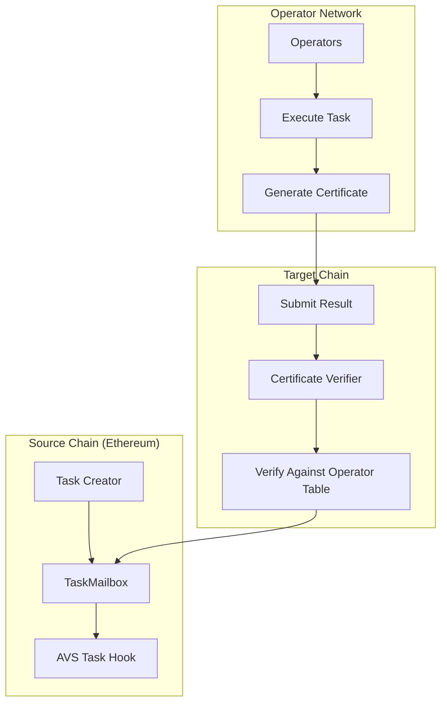

| Author(s) | Created | Status | References | Discussions |
| :---- | :---- | :---- | :---- | :---- |
| [Matt Nelson](mailto:matt.nelson@eigenlabs.org), [Rajath Alex](mailto:rajath@eigenlabs.org) | 2025-07-25 | `Draft` | [PR #1543](https://github.com/Layr-Labs/eigenlayer-contracts/pull/1543), [PR #515](https://github.com/Layr-Labs/eigenlayer-middleware/pull/515) | TBD |

# ELIP-010: Mailbox for Hourglass, a Task-Based AVS Framework

---

# Executive Summary

**Hourglass** is a comprehensive framework and set of enabling contracts for the creation of task-based AVSs on EigenLayer. A task based AVS is one where Operator work is initiated, distributed, and completed in discrete tasks. This proposal specifically introduces the `TaskMailbox` contract and supporting infrastructure that standardize how AVSs can create tasks, have Operators execute them, and submit verified results on-chain.

The framework leverages the `CertificateVerifier` contracts and standards introduced in [ELIP-008](./ELIP-008.md#certificates--verification) to enable stake-weighted verification of operator outputs across multiple chains. By providing a unified interface for task lifecycle management, this framework dramatically simplifies the development of task-based AVSs while maintaining the security guarantees of EigenLayer.

Key benefits include:

- **Standardized task execution model** with built-in fee management and result verification
- **Multi-chain support** through integration with ELIP-008's Certificate Verifiers
- **Flexible consensus mechanisms** supporting both BN254 and ECDSA signature schemes
- **Customizable AVS integration** through task hooks for validation and fee calculation
- **Integration with EigenLayer DevKit** to speed up the creation of task-based AVSs
- **Easier lifecycle management** for AVSs taking advantage of rewards and slashing, by having tasks and results on-chain

# Motivation

Currently, AVS developers face significant complexity when building task-based services that require operators to perform off-chain computations and submit results on-chain. Each AVS must implement its own:

1. **Task creation and management system** - Handling task lifecycle, storage, and state transitions
2. **Result submission and verification logic** - Validating operator outputs and managing consensus
3. **Fee distribution mechanisms** - Collecting fees from task creators and distributing to operators
4. **Multi-signature aggregation** - Combining Operator signatures to verify consensus

This leads to:

- **Duplicated effort** across AVS teams implementing similar functionality
- **Security risks** from custom implementations of critical components
- **Limited composability** between different AVS implementations, with difficult integration patterns
- **High barrier to entry** for developers wanting to build task-based AVSs

The Hourglass framework addresses these challenges by providing a standardized framework and infrastructure for task-based AVS execution. By abstracting common patterns into reusable contracts or EigenLayer's core contracts, AVS developers can focus on their core business logic instead of task management, result verification, and fee distribution.

# Features & Specification

## Overview

To support the Hourglass framework, a few components are needed:

1. **`TaskMailbox` Contract** - Core infrastructure for task lifecycle management
2. **AVS Task Hooks** - Customization points for AVS-specific logic
3. **Certificate Verification** - Integration with [ELIP-008's](./ELIP-008.md) multi-chain verification system
4. **Fee Management** - Built-in support for task fees with configurable splits between AVS's and their Operators and Stakers

This specification lays out the mailbox contract and how it interacts with a templated AVS framework for task-based services, called Hourglass. This is the only on-chain architecture that is needed to support Hourglass architecture, outside of what is covered in ELIP-008. This Mailbox contract is *not limited* to use by task-based AVSs, and is provided as open-infrastructure of the protocol. It is, however, intended to work with developer tools like the EigenCloud DevKit.

## Core Components

### TaskMailbox

The `TaskMailbox` serves as the central coordinator for task-based AVS operations. It acts as a mailbox system where task creators post tasks with fees, and operators compete to execute and submit results with proper consensus verification.

The TaskMailbox uses the following key parameters:

- **Fee Split**: Configurable percentage (0-10000 basis points) that determines how task fees are split between the protocol fee collector and the AVS fee collector
- **Task SLA**: Service Level Agreement duration (in seconds) set per executor operator set, defining how long operators have to complete a task
- **MAX_TASK_SLA**: Maximum allowed task SLA duration (immutable, set at deployment by governance)
- **Consensus Thresholds**: Configurable per operator set, defining the required stake proportion for result verification

The `MAX_TASK_SLA` parameter is particularly important as it ensures AVSs can still slash operators in case of stake deallocation during inflight tasks. The initial default is one week. By limiting task SLAs to half the `DEALLOCATION_DELAY`, the system guarantees that operators cannot avoid slashing by deallocating their stake while a task is still pending.

The mailbox stores configuration parameters for each enrolled Operator Set:

```solidity
/**
    * @notice Configuration for the executor operator set
    * @param taskHook Address of the AVS task hook contract
    * @param taskSLA Time (in seconds) within which the task must be completed
    * @param feeToken ERC20 token used for task fees
    * @param curveType The curve type used for signature verification
    * @param feeCollector Address to receive AVS fees
    * @param consensus Consensus configuration for task verification
    * @param taskMetadata Additional metadata for task execution
    */
struct ExecutorOperatorSetTaskConfig {
    IAVSTaskHook taskHook;
    uint96 taskSLA;
    IERC20 feeToken;
    IKeyRegistrarTypes.CurveType curveType;
    address feeCollector;
    Consensus consensus;
    bytes taskMetadata;
}
```

These parameters define logic for how long tasks live, how they are paid for, what verification scheme is used, and so on. Consensus is left as an open ended typing so that it may be expanded upon later. At the moment, stake weighted consensus is supported out of the box(`m of n` aggregation). A `none` type is provided as well so an AVS can define consensus elsewhere, like with task hooks.

Task hooks enable further customization in AVS contracts. When registering an AVS with the mailbox contract, an address for a `taskHook` contract is set that adds logic for the task lifecycle. This must be an implementation of the `IAVSTaskHook` interface, but the functionality can be left empty if the developer wishes to use one of the default verification logics (like [stake weighted consensus](./ELIP-010.md#certificate-verification-integration)).

#### State Variables

The TaskMailbox maintains the following key state:

- **`_globalTaskCount`**: Counter ensuring unique task hashes
- **`_tasks`**: Mapping from task hash to task details  
- **`_executorOperatorSetTaskConfigs`**: Mapping from operator set to its task configuration
- **`_isExecutorOperatorSetRegistered`**: Tracks registered operator sets
- **`feeSplit`**: Global fee split percentage (basis points)
- **`feeSplitCollector`**: Address receiving protocol portion of fees

#### Core Methods

The mailbox itself, after configured with the Operator Sets parameters, allows for origination and lifecycle management of a task. It provides functions for the AVS to start and end the lifecycle within the EigenLayer core contracts:

```solidity
contract TaskMailbox {
    // Task creation with automatic fee handling
    function createTask(TaskParams memory taskParams) external returns (bytes32 taskHash);
    
    // Result submission with certificate verification
    function submitResult(
        bytes32 taskHash,
        bytes memory executorCert,
        bytes memory result
    ) external;
    
    // Fee refund for expired tasks
    function refundFee(bytes32 taskHash) external;
    
    // Configuration management
    function setExecutorOperatorSetTaskConfig(
        OperatorSet memory executorOperatorSet,
        ExecutorOperatorSetTaskConfig memory config
    ) external;
    
    // Task information retrieval
    function getTaskInfo(bytes32 taskHash) external view returns (Task memory);
    function getTaskStatus(bytes32 taskHash) external view returns (TaskStatus);
    function getTaskResult(bytes32 taskHash) external view returns (bytes memory result);
}
```

### Task Lifecycle

Tasks follow a well-defined state machine. Operator are intended to pick up tasks from the mailbox and execute the requests. Results are either posted or the task expires, following the `taskSLA` timer set above. The states are as follows:

```mermaid
NONE → CREATED → VERIFIED
         ↓
      EXPIRED
```

1. **NONE**: Task does not exist
2. **CREATED**: Task is posted with fee and awaiting execution
3. **VERIFIED**: Result submitted and verified through consensus or stake weighting
4. **EXPIRED**: Task SLA exceeded without valid result submission

The task lifecycle only supports these states within the `TaskMailbox` but the overall flow can be expanded via hooks and business logic elsewhere. For example, task aggregation can be done to enable Operator consensus or combined stake weighting. The [verification step](./ELIP-010.md#certificate-verification-integration) is covered below. If verification conditions are not met, the task will remain in the `CREATED` state until the SLA expires, or verification is retried successfully. Off or onchain logic can interface with the mailbox task hooks and interface to use this state machine in developing an AVS.

#### Task Creation Details

When creating a task, the `createTask` method performs several validations and operations:

1. Validates that the executor operator set is registered and has a valid configuration
2. Validates that the task SLA does not exceed `MAX_TASK_SLA`
3. Certificate Staleness Check: Ensures the Operator table reference timestamp is fresh enough for the task SLA duration (see [the certificate verification spec](./ELIP-008.md#certificates--verification) to understand staleness periods and [Operator Tables](./ELIP-008.md#operator-weighting--operator-table-calculation)).
4. Calls the AVS task hook for pre-creation validation
5. Calculates the task fee using the AVS task hook
6. Generates a unique task hash using the task parameters, block context, and global counter
7. Transfers the fee from the caller to the TaskMailbox
8. Stores the task with its current configuration snapshot
9. Calls the AVS task hook for post-creation handling

**Effects:**

- Increments `_globalTaskCount`
- Stores task in `_tasks` mapping
- Transfers fee tokens from caller
- Emits `TaskCreated` event
- Calls `IAVSTaskHook.validatePreTaskCreation` and `IAVSTaskHook.handlePostTaskCreation`

### AVS Integration

AVSs integrate through the `IAVSTaskHook` interface:

```solidity
interface IAVSTaskHook {
    // Pre-creation validation
    function validatePreTaskCreation(
        address caller,
        TaskParams memory taskParams
    ) external view;
    
    // Dynamic fee calculation
    function calculateTaskFee(
        TaskParams memory taskParams
    ) external view returns (uint96);
    
    // Post-creation side effects
    function handlePostTaskCreation(bytes32 taskHash) external;
    
    // Pre-submission validation
    function validatePreTaskResultSubmission(
        address caller,
        bytes32 taskHash,
        bytes memory cert,
        bytes memory result
    ) external view;
    
    // Post-submission processing
    function handlePostTaskResultSubmission(bytes32 taskHash) external;
}
```

Hooks are provided at each point in the lifecycle to handle pre and post conditions on tasks. These hooks allow for more logic to be layered on elsewhere. This is important for enabling customizable consensus or verification logic. It also allows for onchain acceptance of task results that would trigger additional actions external to the AVS (`handlePostTaskResultSubmission`). This function may be important when integrating an AVS into application logic (or when providing a service to onchain customers).

### Executor Operator Set Management

#### `setExecutorOperatorSetTaskConfig`

```solidity
function setExecutorOperatorSetTaskConfig(
    OperatorSet memory executorOperatorSet,
    ExecutorOperatorSetTaskConfig memory config
) external
```

Configures how tasks should be executed by a specific operator set. The configuration includes:

- **Task Hook**: AVS-specific contract for custom validation and handling
- **Task SLA**: Time limit for task completion (must not exceed `MAX_TASK_SLA`)
- **Fee Token**: Token used for task fees (can be zero address for no fees). Fees will not be collected if this is the zero address
- **Fee Collector**: Address to receive AVS portion of fees
- **Curve Type**: Cryptographic curve used by operators (BN254 or ECDSA)
- **Consensus**: Type and threshold for result verification
- **Task Metadata**: AVS-specific metadata

**Effects:**

- Stores configuration in `_executorOperatorSetTaskConfigs`
- Sets `_isExecutorOperatorSetRegistered` to true if not already registered
- Emits `ExecutorOperatorSetTaskConfigSet` event

**Requirements:**

- Caller must be the Operator Set owner (verified via certificate verifier)
- Task hook must not be zero address
- Task SLA must be greater than zero
- Task SLA must not exceed `MAX_TASK_SLA` (reverts with `TaskSLAExceedsMaximum`)
- Consensus type and curve type must be valid
- Consensus value must be properly formatted

### Result Submission and Verification

Task results are submitted along with cryptographic certificates that prove consensus among the operator set. The verification process depends on the curve type configured for the operator set.

#### `submitResult` Method

```solidity
function submitResult(
    bytes32 taskHash,
    bytes memory executorCert,
    bytes memory result
) external nonReentrant
```

The `submitResult` method performs the following operations:

1. Validates the task exists and hasn't expired or been verified
2. Calls AVS hook for pre-submission validation
3. Verifies the certificate based on both curve type and consensus type:
   - **ConsensusType.NONE**:
     - Validates certificate fields (reference timestamp, message hash, non-empty signature)
     - Calls certificate verifier to validate signature authenticity
     - Does NOT enforce any stake threshold requirements
     - AVS can implement custom consensus logic in `handlePostTaskResultSubmission`
   - **ConsensusType.STAKE_PROPORTION_THRESHOLD**:
     - Performs all validations from NONE
     - Additionally verifies that signers meet the configured stake threshold
     - Uses `verifyCertificateProportion` to ensure minimum stake percentage signed
4. Distributes fees according to fee split configuration
5. Stores the result and marks task as verified
6. Calls AVS hook for post-submission handling

**Effects:**

- Updates task status to `VERIFIED`
- Stores executor certificate and result
- Transfers fees to collectors
- Emits `TaskVerified` event
- Calls `IAVSTaskHook.validatePreTaskResultSubmission` and `IAVSTaskHook.handlePostTaskResultSubmission`

**Requirements:**

- Task must exist and be in `CREATED` status
- Current timestamp must be after task creation time
- Certificate must have valid signature(s)
- Certificate verification must pass consensus threshold (reverts with `ThresholdNotMet` if not)
- AVS validation must pass

## Certificate Verification Integration

The `TaskMailbox` contract leverages the Certificate Verifiers from ELIP-008 to enable stake-weighted verification as an initial form of consensus. Consensus is a typed construct that specifies how an Operator Set can reach agreement on aggregated results (or if a single Operator satisfies the verification requirements, e.g. stake weight). All types of Operator keys are compatible with task consensus: ECDSA and BLS.

### Consensus Configuration

AVSs configure consensus requirements per operator set:

```solidity
struct Consensus {
    ConsensusType consensusType;  // Type of consensus validation, e.g. STAKE_PROPORTION_THRESHOLD
    bytes value;                  // Type-specific parameters, e.g. encoded threshold (6667 = 66.67%)
}

enum ConsensusType {
    NONE,                         // AVS handles consensus validation
    STAKE_PROPORTION_THRESHOLD    // Require minimum stake percentage
}
```

#### Consensus Types

The `TaskMailbox` currently supports the following consensus types: `STAKE_PROPORTION_THRESHOLD`. It is set up to support other consensus types in the future (or custom support can be added via the task hooks). The threshold value is an encoded integer that represents bips in proportion to the total unique stake weight of the Operator Set. In the snippet above, 6667, representing 66.67%, would require signatures from Operators greater than or equal to two thirds of the sets Unique Stake weight. The `TaskMailbox` requires the usage of [ELIP-008-specified certificates](./ELIP-008.md#certificates--verification) in order to use the default stake proportion consensus.

1. NONE

- The TaskMailbox only verifies certificate validity (signature, timestamp, message hash)
- AVS is responsible for implementing custom consensus logic in task hooks
- `value` must be empty bytes
- Useful for AVSs with custom consensus mechanisms or off-chain validation

2. STAKE_PROPORTION_THRESHOLD

- Requires a minimum percentage of total stake to sign the result
- `value` contains `abi.encode(uint16)` representing threshold in basis points (0-10000)
- Example: 6667 = 66.67% stake required (two thirds of the set's Unique Stake weight)
- Certificate verification will fail if threshold is not met
- The `TaskMailbox` requires the usage of [ELIP-008-specified certificates](./ELIP-008.md#certificates--verification) for stake proportion consensus

#### Example Configurations

```solidity
// Example 1: Configure with 66.67% stake threshold
ExecutorOperatorSetTaskConfig memory config = ExecutorOperatorSetTaskConfig({
    taskHook: IAVSTaskHook(0x...),
    taskSLA: 3600, // 1 hour
    feeToken: IERC20(0x...),
    feeCollector: 0x...,
    curveType: CurveType.BN254,
    consensus: Consensus({
        consensusType: ConsensusType.STAKE_PROPORTION_THRESHOLD,
        value: abi.encode(uint16(6667)) // 66.67%
    }),
    taskMetadata: bytes("")
});

// Example 2: Configure with NONE consensus (AVS handles validation)
ExecutorOperatorSetTaskConfig memory config = ExecutorOperatorSetTaskConfig({
    taskHook: IAVSTaskHook(0x...),
    taskSLA: 3600,
    feeToken: IERC20(address(0)), // No fees
    feeCollector: address(0),
    curveType: CurveType.ECDSA,
    consensus: Consensus({
        consensusType: ConsensusType.NONE,
        value: bytes("") // Must be empty
    }),
    taskMetadata: bytes("")
});
```

## Fee Management

The `TaskMailbox` implements a fee system that handles collection, distribution, and refunds. The fee is one-dimensional and tied to tasks. The AVS can set a fee, fee token, and parameters.

There is a `feeSplit` that is left unused. This is a governed parameter for capturing protocol level fees, but, as of this proposal, is left at 0. This is implemented for forward comparability. Given the impact of this fee, any protocol-level fees will need their own proposals and consideration. Fee collection begins, if its implemented, with task creation.

### Fee Collection (Task Creation)

When a task is created:

1. The AVS-specific `taskHook.calculateTaskFee()` determines the fee amount based on task parameters
2. If a fee token is configured and fee > 0, the fee is transferred from the task creator to the TaskMailbox
3. The current global `feeSplit` percentage (if any) is captured and stored with the task

```solidity
// During task creation
uint96 avsFee = taskConfig.taskHook.calculateTaskFee(taskParams);
if (taskConfig.feeToken != IERC20(address(0)) && avsFee > 0) {
    taskConfig.feeToken.safeTransferFrom(msg.sender, address(this), avsFee);
}
```

### Fee Distribution (Task Verification)

When a task result is successfully verified (reaches the `VERIFIED` status):

1. The fee is split based on the task's captured `feeSplit` percentage
2. The split amount is sent to the global, governed `feeSplitCollector` (protocol revenue)
3. The remaining amount is sent to the AVS's configured `feeCollector`

```solidity
// During result submission
uint96 feeSplitAmount = ((uint256(task.avsFee) * task.feeSplit) / 10000);
if (feeSplitAmount > 0) {
    feeToken.safeTransfer(feeSplitCollector, feeSplitAmount);
}
uint96 avsAmount = task.avsFee - feeSplitAmount;
if (avsAmount > 0) {
    feeToken.safeTransfer(task.executorOperatorSetTaskConfig.feeCollector, avsAmount);
}
```

### Fee Refunds (Task Expiration)

If a task expires (`EXPIRED` status) without being completed:

1. Only the designated `refundCollector` can request a refund
2. The full fee amount is refunded (no fee split applied)
3. The task is marked to prevent double refunds

```solidity
function refundFee(bytes32 taskHash) external {
    require(task.refundCollector == msg.sender, "Only refund collector");
    require(!task.isFeeRefunded, "Fee already refunded");
    require(status == TaskStatus.EXPIRED, "Task not expired");
    
    task.isFeeRefunded = true;
    feeToken.safeTransfer(task.refundCollector, task.avsFee);
}
```

## Multi-Chain Architecture

The framework seamlessly integrates with ELIP-008's multi-chain infrastructure:



## Security Considerations

The TaskMailbox implements several security measures:

### Reentrancy Protection

All state-changing functions use OpenZeppelin's `ReentrancyGuardUpgradeable` to prevent reentrancy attacks.

### Certificate Validation

- Reference timestamp verification ensures certificates match task creation time
- Message hash validation prevents result tampering
- Empty signature detection prevents invalid submissions
- Results must include valid consensus proofs verified by the appropriate certificate verifier

### Access Control

- Operator set owners control their configurations
- Contract owner manages global parameters
- Refund collectors have exclusive access to expired task fees

### Timestamp Security

- Tasks cannot be verified at creation timestamp to prevent same-block manipulation attacks
- Certificate staleness protection ensures operator table reference timestamps are fresh enough for the task SLA duration

### Task SLA Limits

- `MAX_TASK_SLA` immutable constant prevents excessively long task durations
- Set to `DEALLOCATION_DELAY / 2` to ensure AVSs can still slash operators during stake deallocation

### Fee Safety

- Uses OpenZeppelin's `SafeERC20` for all token transfers
- Fee transfers are handled atomically during task creation and result submission

# Rationale

## Design Decisions

### Unified Task Interface

By standardizing the task interface, AVSs can leverage common tooling and infrastructure while maintaining flexibility through hooks.

### Certificate Verifier Integration

Reusing ELIP-008's verification infrastructure provides:

- Proven security model
- Multi-chain compatibility
- Reduced implementation complexity

### Flexible Fee Model

The configurable fee split enables:

- Protocol sustainability through fee collection
- AVS monetization flexibility
- Fair refund mechanisms for failed tasks

### Backwards Compatibility

The framework is designed as an opt-in addition that doesn't modify existing EigenLayer contracts, ensuring seamless adoption.

# Impact Summary

## AVS Developers

- **Reduced Development Time**: Focus on core logic instead of infrastructure
- **Core Protocol Security**: Audited common components reduce vulnerability risks in bespoke implementations
- **Multi-Chain Ready**: Automatic support for cross-chain deployments

## Operators

- **Standardized Interface**: Consistent task execution across different AVSs
- **Fair Compensation**: Built-in fee distribution mechanisms
- **Flexible Participation**: Support for both BLS and ECDSA signing

## Task Creators

- **Predictable Costs**: Transparent fee calculation
- **Guaranteed Execution**: SLA enforcement with automatic refunds
- **Cross-Chain Access**: Submit tasks on any supported chain

## EigenLayer Ecosystem

- **Accelerated Innovation**: Lower barriers for new AVS development
- **Increased Adoption**: Standardized patterns improve interoperability
- **Enhanced Security**: Shared infrastructure benefits from collective review

# Action Plan

TBD

# References & Relevant Discussions

- [TaskMailbox Documentation](https://github.com/Layr-Labs/eigenlayer-contracts/blob/release-dev/hourglass/docs/avs/task/TaskMailbox.md)
- [ELIP-008: Multi-Chain Verification](./ELIP-008.md)
- [Hourglass Framework Repository](https://github.com/Layr-Labs/hourglass-monorepo)
- [PR #1543: Core Contracts](https://github.com/Layr-Labs/eigenlayer-contracts/pull/1543)
- [PR #515: Middleware Integration](https://github.com/Layr-Labs/eigenlayer-middleware/pull/515)
