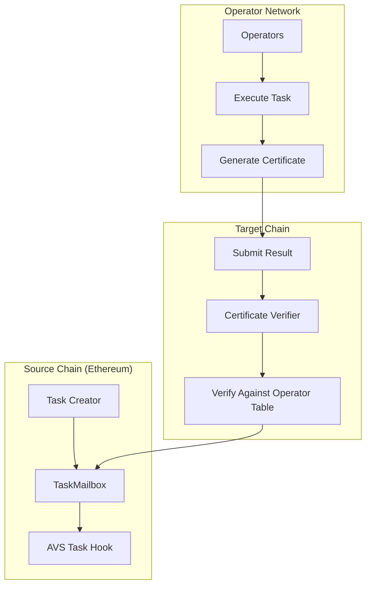

| Author(s) | Created | Status | References | Discussions |
| :---- | :---- | :---- | :---- | :---- |
| [Matt Nelson](mailto:matt.nelson@eigenlabs.org), [Rajath Alex](mailto:rajath@eigenlabs.org) | 2025-07-25 | `Draft` | [PR #1543](https://github.com/Layr-Labs/eigenlayer-contracts/pull/1543), [PR #515](https://github.com/Layr-Labs/eigenlayer-middleware/pull/515) | TBD |

# ELIP-010: Hourglass, a Task-Based AVS Framework

---

# Executive Summary

**Hourglass** is a comprehensive framework and set of enabling contracts for the creation of task-based AVSs on EigenLayer. A task based AVS is one where Operator work is initiated, distributed, and completed in discrete tasks. This proposal introduces the `TaskMailbox` contract and supporting infrastructure that standardize how AVSs can create tasks, have operators execute them, and submit verified results on-chain.

The framework leverages the `CertificateVerifier` contracts and standards introduced in [ELIP-008](./ELIP-008.md#certificates--verification) to enable stake-weighted verification of operator outputs across multiple chains. By providing a unified interface for task lifecycle management, this framework dramatically simplifies the development of task-based AVSs while maintaining the security guarantees of EigenLayer.

Key benefits include:

- **Standardized task execution model** with built-in fee management and result verification
- **Multi-chain support** through integration with ELIP-008's Certificate Verifiers
- **Flexible consensus mechanisms** supporting both BN254 and ECDSA signature schemes
- **Customizable AVS integration** through task hooks for validation and fee calculation
- **Integration with EigenLayer DevKit** to speed up the creation of task-based AVSs
- **Easier lifecycle management** for AVSs taking advantage of rewards and slashing, by having tasks and results on-chain

# Motivation

Currently, AVS developers face significant complexity when building task-based services that require operators to perform off-chain computations and submit results on-chain. Each AVS must implement its own:

1. **Task creation and management system** - Handling task lifecycle, storage, and state transitions
2. **Result submission and verification logic** - Validating operator outputs and managing consensus
3. **Fee distribution mechanisms** - Collecting fees from task creators and distributing to operators
4. **Multi-signature aggregation** - Combining operator signatures to verify consensus

This leads to:

- **Duplicated effort** across AVS teams implementing similar functionality
- **Security risks** from custom implementations of critical components
- **Limited composability** between different AVS implementations
- **High barrier to entry** for developers wanting to build task-based AVSs

The Hourglass framework addresses these challenges by providing a standardized, battle-tested infrastructure for task-based AVS execution. By abstracting common patterns into reusable contracts, AVS developers can focus on their core business logic while leveraging proven infrastructure for task management, result verification, and fee distribution.

# Features & Specification

## Overview

The Hourglass framework consists of several key components:

1. **TaskMailbox Contract** - Core infrastructure for task lifecycle management
2. **AVS Task Hooks** - Customization points for AVS-specific logic
3. **Certificate Verification** - Integration with ELIP-008's multi-chain verification system
4. **Fee Management** - Built-in support for task fees with configurable splits

## Core Components

### TaskMailbox

The TaskMailbox serves as the central coordinator for task-based AVS operations:

```solidity
contract TaskMailbox {
    // Task creation with automatic fee handling
    function createTask(TaskParams memory taskParams) external returns (bytes32 taskHash);
    
    // Result submission with certificate verification
    function submitResult(
        bytes32 taskHash,
        bytes memory executorCert,
        bytes memory result
    ) external;
    
    // Fee refund for expired tasks
    function refundFee(bytes32 taskHash) external;
}
```

### Task Lifecycle

Tasks follow a well-defined state machine:

```solidity
NONE → CREATED → VERIFIED
         ↓
      EXPIRED
```

1. **CREATED**: Task is posted with fee and awaiting execution
2. **VERIFIED**: Result submitted and verified through consensus
3. **EXPIRED**: Task SLA exceeded without valid result submission

### AVS Integration

AVSs integrate through the IAVSTaskHook interface:

```solidity
interface IAVSTaskHook {
    // Pre-creation validation
    function validatePreTaskCreation(
        address caller,
        TaskParams memory taskParams
    ) external view;
    
    // Dynamic fee calculation
    function calculateTaskFee(
        TaskParams memory taskParams
    ) external view returns (uint96);
    
    // Post-creation side effects
    function handlePostTaskCreation(bytes32 taskHash) external;
    
    // Pre-submission validation
    function validatePreTaskResultSubmission(
        address caller,
        bytes32 taskHash,
        bytes memory cert,
        bytes memory result
    ) external view;
    
    // Post-submission processing
    function handlePostTaskResultSubmission(bytes32 taskHash) external;
}
```

## Certificate Verification Integration

Hourglass leverages the Certificate Verifiers from ELIP-008 to enable stake-weighted verification:

### BN254 Support

For AVSs using BLS signatures:

- Aggregated signatures reduce on-chain verification costs
- Suitable for high-throughput applications
- Native support for threshold-based consensus

### ECDSA Support  

For AVSs preferring standard ECDSA:

- Compatible with existing wallet infrastructure
- Individual signature verification
- Flexible for diverse operator sets

### Consensus Configuration

AVSs configure consensus requirements per operator set:

```solidity
struct Consensus {
    ConsensusType consensusType;  // STAKE_PROPORTION_THRESHOLD
    bytes value;                  // Encoded threshold (e.g., 6667 = 66.67%)
}
```

The TaskMailbox currently supports the following consensus types: `STAKE_PROPORTION_THRESHOLD`. It is set up to support other consensus types in the future.

## Fee Management

The TaskMailbox implements a sophisticated fee system that handles collection, distribution, and refunds:

### Fee Collection (Task Creation)

When a task is created:

1. The AVS-specific `taskHook.calculateTaskFee()` determines the fee amount based on task parameters
2. If a fee token is configured and fee > 0, the fee is transferred from the task creator to the TaskMailbox
3. The current global `feeSplit` percentage is captured and stored with the task

```solidity
// During task creation
uint96 avsFee = taskConfig.taskHook.calculateTaskFee(taskParams);
if (taskConfig.feeToken != IERC20(address(0)) && avsFee > 0) {
    taskConfig.feeToken.safeTransferFrom(msg.sender, address(this), avsFee);
}
```

### Fee Distribution (Task Verification)

When a task result is successfully verified:

1. The fee is split based on the task's captured `feeSplit` percentage
2. The split amount is sent to the global `feeSplitCollector` (protocol revenue)
3. The remaining amount is sent to the AVS's configured `feeCollector`

```solidity
// During result submission
uint96 feeSplitAmount = ((uint256(task.avsFee) * task.feeSplit) / 10000);
if (feeSplitAmount > 0) {
    feeToken.safeTransfer(feeSplitCollector, feeSplitAmount);
}
uint96 avsAmount = task.avsFee - feeSplitAmount;
if (avsAmount > 0) {
    feeToken.safeTransfer(task.executorOperatorSetTaskConfig.feeCollector, avsAmount);
}
```

### Fee Refunds (Task Expiration)

If a task expires without being completed:

1. Only the designated `refundCollector` can request a refund
2. The full fee amount is refunded (no fee split applied)
3. The task is marked to prevent double refunds

```solidity
function refundFee(bytes32 taskHash) external {
    require(task.refundCollector == msg.sender, "Only refund collector");
    require(!task.isFeeRefunded, "Fee already refunded");
    require(status == TaskStatus.EXPIRED, "Task not expired");
    
    task.isFeeRefunded = true;
    feeToken.safeTransfer(task.refundCollector, task.avsFee);
}
```

### Global Fee Configuration

The contract owner can configure global fee parameters:

```solidity
// Set protocol fee split percentage (0-10000 basis points)
function setFeeSplit(uint16 _feeSplit) external onlyOwner;

// Set protocol fee collector address
function setFeeSplitCollector(address _feeSplitCollector) external onlyOwner;
```

## Multi-Chain Architecture

The framework seamlessly integrates with ELIP-008's multi-chain infrastructure:



## Security Considerations

### Reentrancy Protection

All state-changing functions use OpenZeppelin's ReentrancyGuardUpgradeable to prevent reentrancy attacks.

### Certificate Validation

- Reference timestamp verification ensures certificates match task creation time
- Message hash validation prevents result tampering
- Empty signature detection prevents invalid submissions

### Access Control

- Operator set owners control their configurations
- Contract owner manages global parameters
- Refund collectors have exclusive access to expired task fees

### Timestamp Security

Tasks cannot be verified at creation timestamp to prevent same-block manipulation attacks.

# Rationale

## Design Decisions

### Unified Task Interface

By standardizing the task interface, AVSs can leverage common tooling and infrastructure while maintaining flexibility through hooks.

### Certificate Verifier Integration

Reusing ELIP-008's verification infrastructure provides:

- Proven security model
- Multi-chain compatibility
- Reduced implementation complexity

### Flexible Fee Model

The configurable fee split enables:

- Protocol sustainability through fee collection
- AVS monetization flexibility
- Fair refund mechanisms for failed tasks

### Backwards Compatibility

The framework is designed as an opt-in addition that doesn't modify existing EigenLayer contracts, ensuring seamless adoption.

# Impact Summary

## AVS Developers

- **Reduced Development Time**: Focus on core logic instead of infrastructure
- **Proven Security**: Battle-tested components reduce vulnerability risks
- **Multi-Chain Ready**: Automatic support for cross-chain deployments

## Operators

- **Standardized Interface**: Consistent task execution across different AVSs
- **Fair Compensation**: Built-in fee distribution mechanisms
- **Flexible Participation**: Support for both BLS and ECDSA signing

## Task Creators

- **Predictable Costs**: Transparent fee calculation
- **Guaranteed Execution**: SLA enforcement with automatic refunds
- **Cross-Chain Access**: Submit tasks on any supported chain

## EigenLayer Ecosystem

- **Accelerated Innovation**: Lower barriers for new AVS development
- **Increased Adoption**: Standardized patterns improve interoperability
- **Enhanced Security**: Shared infrastructure benefits from collective review

# Action Plan

TBD

# References & Relevant Discussions

- [TaskMailbox Documentation](https://github.com/Layr-Labs/eigenlayer-contracts/blob/release-dev/hourglass/docs/avs/task/TaskMailbox.md)
- [ELIP-008: Multi-Chain Verification](./ELIP-008.md)
- [Hourglass Framework Repository](https://github.com/Layr-Labs/hourglass-monorepo)
- [PR #1543: Core Contracts](https://github.com/Layr-Labs/eigenlayer-contracts/pull/1543)
- [PR #515: Middleware Integration](https://github.com/Layr-Labs/eigenlayer-middleware/pull/515) 