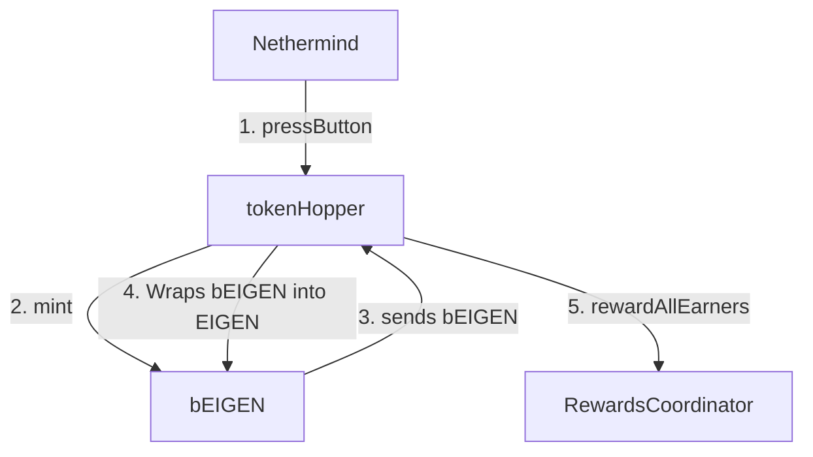

| Author(s) | Created | Status | References | Discussions |
|-------------|-----------|---------|------|----------|
| [Robert Drost](mailto:robert@eigenfoundation.org),  [Brandon Curtis](mailto:brandon@eigenlabs.org), Matt Curtis | 2025-09-18 | Draft | Listed at end of proposal |  |

# ELIP-011: Programmatic Incentives v2.0

---

# Executive Summary

This proposal builds upon the original programmatic incentives released in 2024, beginning in August of that year. Under the initial scheme, 3% EIGEN incentives were directed to ETH stakers, and 1% to EIGEN stakers, following the eligibility requirements outlined in [rewards v2 (ELIP-001)](https://github.com/eigenfoundation/ELIPs/blob/main/ELIPs/ELIP-001.md). Although the initial programmatic incentives were not explicitly versioned and preceded the ELIP process overall, for clarity we retroactively refer to them as **Programmatic Incentives v1 (PIv1)**.

This ELIP proposes a single, focused modification to PIv1: increasing the programmatic incentives allocated to EIGEN stakers from **1%** to **4%**, while leaving eligibility requirements unchanged. This would mark the release of **Programmatic Incentives v2.0 (PIv2.0)**. The versioning indicates our expectation that additional refinements in the v2.x family will follow with no or only minor changes to the overall reward rate.

# Motivation

Feedback around PIv1 indicated that the combined 4% reward rate effectively supported ETH staking through it 3% rewards, but was insufficient for EIGEN staking with only 1% rewards. 

While many protocols start with much higher inflationary rates, e.g. 8%, 9% or even higher, for EigenLayer PIv1's 4% was a conservative choice. The protocol was developing and releasing features such as slashing and redistribution. During this time a lower reward rate both helped with token supply/demand imbalances and was a good risk/reward position during a time when only shared staking was enable. 

Feedback around PIv1 indicated that the combined 4% reward rate effectively supported ETH staking through its 3% rewards. ETH staking levels to date provide an ample security pool for AVSs to draw upon for objective slashable security. On the other had, the 1% incentives to EIGEN were a very low incentive for a native protocol token. Much of the circulating and stakable market capitaliztion of EIGEN are staked, but an appreciable amount is not.

As EigenLayer progresses to verifiable cloud primitives based on EigenDA and EigenVerify, the need for ample intersubjective slashable security becomes critical. EIGEN is the intersubjective work token and it is the only token able to provide intersubjective slashable security.  With the additional risk of intersubjective slashing, the need for more rewards for EIGEN staking becomes only more needed. PIv1's 1% incentive may not adequately compensate for the withdrawal delay and the risk of slashing associated with intersubjective forks. Because staked EIGEN tokens are critical for securing EigenDA, EigenVerify, and other foundational primitives—whose security relies on intersubjective forking and slashing—greater participation of EIGEN token holders to staking is essential.

This proposal seeks to correct the imbalance by raising EIGEN staking incentives from **1%** to **4%**, bringing the total staked token programmatic reward rate for the sum of ETH and EIGEN to **7%**. This better aligns incentives for token EIGEN holders and strengthens the security of EigenLayer’s primitives. 

We note that at least one more follow-up proposal is anticipated in the v2 family, likely termed **PIv2.1**. While that proposal will not alter reward percentages, it will likely aim to adjust distribution criteria to further optimize staker and operator behavior through targeted incentives that improve EigenLayer and AVS capabilities.

# Features & Specification

## Contract Changes

A single change to the token hopper contracts is required to deploy this upgrade: the original constructor of the `ActionGenerator` read the value of `CALCULATION_INTERVAL_SECONDS` from the `RewardsCoordinator` to use as the 1 week distribution period. Since the deployment of PI V1, the `RewardsCoordinator` was upgraded to allow rewards distributions at a resolution of 1 day. To maintain the original functionality and weekly cadence of emissions, this value was hard-coded into the contract as 1 week.

## Configuration

The implementation of Programmatic Incentives v1 can be found in this commit a3be1de of the EigenHopper repository:

[Deploy_ProgrammaticIncentives_Mainnet.s.sol](https://github.com/Layr-Labs/EigenHopper/blob/a3be1de22fb450d1ceeacda6b0d8d1515acd7eeb/script/Deploy_ProgrammaticIncentives_Mainnet.s.sol)

### Timestamps:

The original hopper deployment included a single-time retrospective reward payment between August 15, 2024 and October 3, 2024\. Because this functionality is not needed for this timestamp, the `FIRST_SUBMISSION_TRIGGER_CUTOFF` has been set to 0\. While this logic could have been removed entirely, it was retained to minimize modifications of smart contracts.  

The `FIRST_SUBMISSION_START_TIMESTAMP` has been updated to October 9, 2025, and is used as the startTime of the hopper, signifying the date that this token hopper will become functional and a rewards submission can be created. 

```solidity
    /// @dev The unix start timestamp of the first submission.
    /// Rewards submissions are prevented before this date.
    /// Must be a multiple of `CALCULATION_INTERVAL_SECONDS` (1 week).
    uint32 internal constant FIRST_SUBMISSION_START_TIMESTAMP = 1759968000; // Thu Oct 09 2025 00:00:00 GMT+0000

    /// @dev The cutoff unix timestamp of the first submission.
    /// Before this cutoff, the `RewardAllStakersActionGenerator` uses special "catch-up" logic that allows
    /// multiple weeks of rewards to be distributed in a single submission. This handles the case where
    /// the rewards distribution might start late (e.g., if deployed after `FIRST_SUBMISSION_START_TIMESTAMP`).
    /// After this cutoff, normal weekly distribution logic applies (one week of rewards per submission).
    /// NOTE: PIV2 DOES NOT USE "CATCH-UP" LOGIC. Hence, this value is set to 0.
    uint256 internal constant FIRST_SUBMISSION_TRIGGER_CUTOFF = 0; // Thu Jan 01 1970 00:00:00 GMT+0000
```

As with the V1 implementation, V2 will be launched with no explicit expiration date, and will be rendered inoperable by the removal of minting rights by the Protocol Council.

### Reward Amounts:

The V1 token hopper used the total EIGEN supply at launch as the basis for the weekly minted EIGEN. The total inflation rate was 4% with EIGEN receiving 1/4 and ETH receiving 3/4 of that inflation on a weekly basis. 

V1 Emissions:

- Total Supply \= 1,673,646.66828466   
- Weekly Emissions to EIGEN stakers \= 321,855.128516280769230770  
- Weekly Emissions to ETH stakers \= 965,565.385548842307692308

With this deployment the total supply will be updated to the total supply on October 9, 2025, with the weekly amounts derived from that value. The total inflation rate has been updated to 7% with EIGEN receiving 4/7 and ETH receiving 3/7 of that value.

V2 Emissions

- Total Supply \= 1,750,891,899.128567384615384679  
- Weekly Emissions to EIGEN stakers \= 1,346,839.922406590295857988  
- Weekly Emissions to ETH stakers \= 1,010,129.941804942721893491

### Multipliers:

Over the past year, the relative value of LSTs qualifying for PI have changed. Since Strategy multipliers are set in the ActionGenerator on deployment, they will be updated to reflect their relative values as of ethereum block 23426354\. At this time, there will be no change to the Strategies that qualify for programmatic incentives.

The full changes to the deployment and testing methodology can be viewed [here](https://github.com/Layr-Labs/EigenHopper/pull/10).

# Architecture: 

The architecture of PIV2 remains the same as V1. We deploy an immutable tokenHopper contract which contains a rewards submission that will programmatically be sent every week to the RewardsCoordinator.



# Upgrade Script

The upgrade script proceeds in four phases

1. Friday, September 26th: Deploy TokenHopper: `1-eoa.s.sol`  
2. Friday, September 26th: Queue Granting Minting Rights: `2-queueGrantMintingRights.s.sol‎`  
   * Remove the old token hopper as a minter of `bEIGEN`  
   * Add the new token hopper as a minter of `bEIGEN`  
3. Friday, October 3rd: Set rewards permissions. *Note: This step will be completed after the final PIV1 submission has been executed.*  
   * Remove the old hopper from sending rewards for all earners  
   * Allow the new hopper to send rewards for all earners  
4. Monday, October 6th \- Wednesday October 9th. Execute granting minting rights from step 2

# Security Considerations
Both internal and external security teams will be consulted to confirm that this change introduces no new vulnerabilities or attack vectors. Since it is purely a numerical update, no risks are currently expected.

# Impact Summary

**EIGEN Token Holders:** Stronger incentives and higher rewards for staking.

**EigenDA:** Greater stake participation enhances its cryptoeconomic security.

**EigenVerify:** Increased stake bolsters its resilience.

**Other AVSs:** More EIGEN stake becomes available to secure additional services.

**Other Effects:** Total reward incentives rise from 4% to 7%, increasing the circulating supply more rapidly and potentially impacting market dynamics.

# Action Plan

1. Implementation Phase
- Modify contract parameters
- Add and adapt tests
- Conduct internal review

2. Review Phase
- Community feedback period
- (Optional) External audit, even for a simple parameter change. Publish and review audit report
- Apply final adjustments

3. Deployment Phase
- Internal testing
- Deploy to testnet
- Community testing period
- Mainnet deployment

# References & Relevant Discussions

[Programmatic Incentives v1](https://blog.eigencloud.xyz/introducing-programmatic-incentives-v1) and [v1 FAQs](https://docs.eigenfoundation.org/programmatic-incentives/programmatic-incentives-faq?utm_source=chatgpt.com)

[EigenLayer Improvement Proposal-001: Rewards v2](https://github.com/eigenfoundation/ELIPs/blob/main/ELIPs/ELIP-001.md)

[Forum discussion of ELIP-001](https://forum.eigenlayer.xyz/t/protocol-council-evaluation-elip-001/14348) and [[MERGED] ELIP-001: Rewards v2](https://forum.eigenlayer.xyz/t/merged-elip-001-rewards-v2/14196)

[Twitter post of proposal outline announcement](https://x.com/eigenfoundation/status/1952400791693897896)

[Forum post: Introducing Programmatic Incentives v2](https://forum.eigenlayer.xyz/t/introducing-programmatic-incentives-v2/14690)
