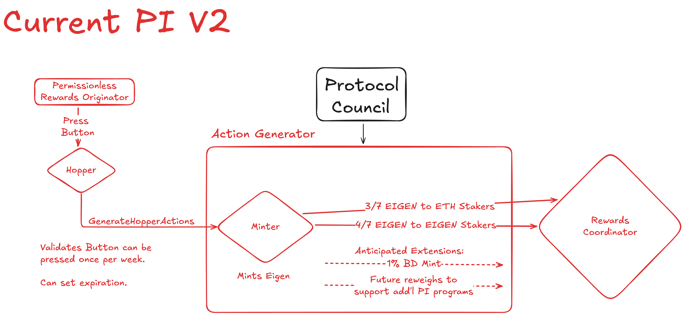
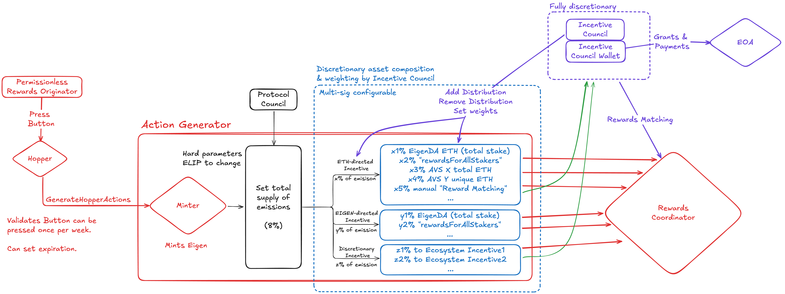

| Author(s) | Created | Status | References | Discussions |
|-------------|-----------|---------|------|----------|
| [Matt Nelson](mailto:matt.nelson@eigenlabs.org), [Matt Curtis](mailto:matt.curtis@eigenlabs.org), [Robert Drost](mailto:robert@eigenfoundation.org), [JT Rose](mailto:jt@eigenlabs.org) | 2025-12-1 | Draft | Listed at end of proposal |  |

# ELIP-012: The Incentives Committee

---

# Executive Summary

EigenLayer has reached a moment where it can expand its incentive architecture to match the rapidly growing range of services, applications, and economic models emerging across the EigenLayer and EigenCloud ecosystems. The Programmatic Incentive framework introduced in earlier phases successfully jump-started restaking, brought stakers and operators together, and enabled early AVSs to activate with strong participation. This foundation was a necessary, productive starting point.

As the protocol matures, the programmatic nature of the current approach limits optionality and speed for iterating on incentives and we must evolve how we deploy EIGEN emissions to encourage the productive use of stake and the generation of meaningful organic AVS yield.

This proposal establishes a new Incentives Committee, a focused body empowered to direct how emissions are allocated while remaining firmly within limits defined by the Protocol Council and the underlying ELIP-approved inflation schedule. The Committee will help maintain the liveness of rewards distribution and encourage the continued growth of the EigenCloud ecosystem with agility and careful stewardship from Eigen Labs and Foundation employees.

# Motivation

In earlier phases, Programmatic Incentives were intentionally uniform and unconditional. This simplicity was important as it ensured predictable emissions, minimized gate-keeping, and created a neutral environment for early adoption. The system as currently designed falls short in properly motivating risk-adjusted capital allocations to mature AVSs. It currently targets total stake on EigenLayer discouraging risk allocations to AVSs that need slashable or redistributable funds to bootstrap their protocol, provide value, and pay rewards to stakers and operators. While these incentives have successfully attracted stake to the platform, they were designed purely for that purpose.

As the protocol matures, participation in the ecosystem must expand from simply providing stake to providing usage-driven, fee-based stake that backs actual AVS operation. The distribution of EIGEN incentives needs to likewise expand. Incentives should guide stakers and operators toward actions that reinforce long-term health of the ecosystem.

There are a number of blockers to expanding Programmatic Incentives in this way:

1. Participation in each EigenCloud or AVS service may take different forms that will shift over time as new AVSs, apps, and EigenCloud services emerge.  
2. Programmatic distribution criteria cannot include subjective elements or elements otherwise impossible to encode on-chain.  
3. Programmatic measures of participation are prone to gaming or are outright impossible.  
4. The immutability of Programmatic Incentives prevents rapid iteration targeting new forms of participation.  
5. Modifications to Programmatic Incentives require extensive security and governance review (i.e. ELIP) by the Protocol Council, which was not designed or staffed with discretionary incentives in mind.

This proposal seeks to resolve these issues by creating a new Incentive Committee with the mission to direct the distribution of freshly minted EIGEN to incentivize behaviors aligned with ecosystem growth and protocol tokenonmics. The first of many challenges this Committee will address is how to ensure incentives motivate capital allocators to make productive stake allocations, unblocking mainnet AVS teams who need slashable stake to justify paying fees.

The Incentives Committee will have the discretion to evaluate participation, consider options and make updates without being forced to rely strictly on on-chain measurements. Utilizing the mechanisms described below, the Incentives Committee will have the freedom to experiment with incentive distributions to best drive the growth of the Eigen Ecosystem.

# Features & Specification

## Goals

The Incentives Committee serves as a governance-aligned mechanism that brings agility and thoughtful discretion to incentive design. It works within strict bounds: the Protocol Council governs total inflation and contract-level permissions, while the Incentives Committee focuses on allocation within those constraints.

The Incentives Committee will be a new multi-sig that will be managed by EgF and Labs stakeholders. The Committee will modify directed emission weights and incentivized assets as often as necessary. The Incentives Committee will *not* control the total amount of minted tokens. This lies with the Protocol Council, with the Incentives Committee controlling where they are directed. The Incentives Committee will make recommendations to the Protocol Council if it sees that emissions can be further reduced without impact to ecosystem growth.

The Incentives Committee is needed to move quickly and with discretion to change on-chain distribution of EIGEN. Currently, all changes to token emissions require an ELIP proposal and modifications to EigenLayer contracts that take time to code, audit, test, and deploy. This leads to a slow process for making beneficial changes to incentives. Timing and timeliness are critical for builders in our ecosystem to achieve success. The Committee requires agility and flexibility to experiment and observe success metrics and anti-metrics with tweaks to incentives without large governance overhead or the need for exclusively programmatic (i.e. encoded onchain) incentives.

This Committee would be stood up with an ecosystem mandate to support…

* AVSs to attract slashable and redistributable stake and incentive AVSs to pay rewards against that stake (unique staking incentives and discretionary rewards matching);  
* New incentives programs that can experiment with distribution criteria that may include subjective elements or elements otherwise impossible to encode on-chain;  
* New incentive programs to encourage and bootstrap Apps building, deploying, and scaling on EigenCloud and its ecosystem of AVSs and their operators and stakers.

The Committee's ongoing responsibilities will include…

* Ensuring liveness for incentive distribution;  
* Maintaining healthy weights and the allowlist for assets, AVSs, and apps that qualify for incentives;  
* Publishing and updating public, discretionary criteria for qualifying for incentives to be built with community buy-in;  
* Engaging ecosystem participants (e.g. AVSs, stakers, or operators) to gather feedback and build alignment on incentive changes;  
* Reporting of public activities.

The Committee’s mandates and responsibilities will evolve over time as it conducts its mission with feedback and oversight of the community and Protocol Council.

## Specifications

The Incentives Committee will operate within the existing EigenLayer contract architecture and build upon the programmatic incentives framework already deployed. Today’s Programmatic Incentives contract structure and architecture consist of the `Hopper` → `ActionGenerator` → `RewardsCoordinator` pipeline, which mints and distributes EIGEN according to predefined lists of qualifying assets and fixed distribution parameters.

Under the current programmatic incentives framework, the `Hopper` triggers the `ActionGenerator` weekly. When invoked, the `ActionGenerator` mints new EIGEN based on a fixed inflation schedule and calls `createRewardsForAllEarners` on the `RewardsCoordinator`. Rewards are then distributed to any Operator registered to at least one AVS. The set of incentivized assets and amounts is hardcoded into the `ActionGenerator`. There were anticipated enhancements which would have required follow-on ELIPs to create and later modify any new incentive programs.



This architecture ensures predictability but limits the ability to provide differentiated incentives for slashable stake, operator-set performance, or unique positioning within an AVS. This proposal introduces new controls that allow the Incentives Committee to direct how weekly EIGEN emissions are allocated while retaining the core infrastructure of the programmatic incentives system. These modifications preserve the reliability and predictability of weekly minting while expanding the expressiveness of incentive distribution to support the growing range of AVSs and sustainable economic models emerging across EigenLayer and EigenCloud.  



### Incentives Committee (& Protocol Council)

The Incentives Committee is represented as an M/N Gnosis Safe with rights to manage its membership internally. On some regular basis, it updates weights for distribution of EIGEN to  recipients and how they qualify for incentives, distributed weekly. The Protocol Council defines the address of the Incentives Committee multi-sig to help ensure liveness and continuous operation. The primary function of the Protocol Council with regard to incentives is to keep the Incentives Committee live, clear roadblocks, to act as a second layer of social consensus, and to manage and adjudicate ELIPs that may impact the structure of the Incentives Committee and distributions.

The Eigen Foundation will author a founding Charter for the new Incentives Committee and determine its initial members, to be reviewed alongside this proposal by the Protocol Council, following any public comment period associated with the establishment of the Incentives Committee.

This ELIP aligns protocol-level expectations with this charter, ensuring the Committee's authority remains transparent, bounded, and accountable. The Incentives Committee can operate programs that test new mechanisms within well-defined boundaries. This complements the permissionless nature of AVSs without introducing systemic risk.

#### Contract Function Calls

The Incentives Committee multi-sig has a few contract calls for which it is permissioned. These functions are exposed on the `ActionGenerator` contract and are explained more thoroughly in the next section.

Incentives Committee Functions:

```solidity
* addDistribution(weight{/*proportion of emissions, weekly*/}, distributionType{/*see below*/}, strategiesAndMultipliers(/*assets incentivized*/))  
  * Manual distributions need to go to the multisig.  
* updateDistribution(index)  
* //External to EigenLayer Core: Add or remove members of the Incentives Committee multi-sig
```

The Protocol Council retains or gains certain functions with regard to EigenLayer contracts and the Incentives Committee.

Protocol Council Functions:

```solidity
* Upgrade(actionGenerator) // upgrade the Action Generator under time-lock  
* SetCommittee(addr) // Sets the Incentives Committee multisig address that can interface with the `ActionGenerator` using the above functions   
* Update EIGEN Supply Emitted // Modification of the top level token emission as a proportion of supply annually (set to the full announced annual emission for PIv2 of 8% by this ELIP) on a time-lock
```

### Action Generator

The `ActionGenerator` today is a contract with EIGEN minting privileges that is triggered by the `Hopper`. When triggered, it mints new EIGEN tokens and calls `createRewardsForAllEarners` on the `RewardsCoordinator` to distribute supply side incentives that require only that an Operator is registered to at least one AVS. This process is currently run weekly. The amounts minted and list of assets that qualify for Programmatic Incentives are hard coded into the contract.

This ELIP proposes extending the `ActionGenerator` to include additional functionality and gauge weighting to more precisely direct incentives.

The amount of EIGEN minted weekly (inflation rate) is set by governance and cannot be altered without the approval of the Protocol Council. Currently, as of [PIv2](https://github.com/eigenfoundation/ELIPs/blob/main/ELIPs/ELIP-011.md), the inflation rate is 7%, a subset of the full 8% announced for ongoing PI to include a flexible additional 1% for ecosystems initiative programs.

This ELIP makes the Incentives Committee responsible for generating a set of weighted Rewards Submissions (gauge weights).

A Distribution consists of N fields:

* Weight: numerical weight used to calculate the proportion of the category that will be sent to this distribution.  
* Distribution-type: selector indicating the function calls that will be used on the `RewardsCoordinator`.  
* Strategies and Multipliers: Assets and relative values that are receiving incentives. These are needed for constructing the calldata of [a rewards distribution](https://github.com/Layr-Labs/eigenlayer-contracts/blob/main/docs/core/RewardsCoordinator.md#createavsrewardssubmission).

Distribution Submission types may include:

1. `createRewardsForAllEarners` - supply side incentives requiring only delegation to an operator registered to at least one AVS via the AVSRegistry or AllocationManager.  
2. `createOperatorSetTotalStakeRewardsSubmission` - Rewards distributed against Total Stake across Operators and their Stakers registered to a specific AVS in the `AllocationManager`.  
3. `createOperatorSetUniqueStakeRewardsSubmission` - Rewards distributed against Unique Stake Allocations across Operators and their Stakers allocated to a specific AVS in the AllocationManager.  
4. EigenDA Distribution - special case for EigenDA before OperatorSets are implemented.  
5. `Manual Distribution` - Rewards that are sent directly to the Incentives Committee multisig for manual distribution.

Gauges are weighted by percentage such that 100% of the minted EIGEN is distributed as configured. When minting is triggered, the `ActionGenerator` iterates through and submits each of these submissions on-chain.

AVSs receiving gauge weighted incentives must give the `ActionGenerator` permission to create the rewardsSubmission on their behalf via the `PermissionController`.

AVSs receiving manually distributed rewards must give the Incentives Committee permission to create the rewardsSubmission on their behalf via the `PermissionController`.

# Rationale

The early implementation of the programmatic incentives model was intentionally designed to provide strong, predictable guarantees regarding the future distribution of newly minted EIGEN. This design created strong supply-side incentives for the accumulation of specific restaked assets and other specific assets on EigenLayer, and it supported the activation and growth of early AVSs. As EigenLayer matured, features such as slashing, redistribution, operator-set mechanics, and AVS-specific service pathways were added, enabling richer forms of stake utility and more specialized forms of operator participation. With these expanded capabilities now active, and the protocol fully functional with slashing and redistribution, the incentive system is ready to evolve to better support AVSs that rely on more specialized forms of productive stake and operator behavior.

A purely programmatic, unconditional incentive model, while effective for bootstrapping, cannot, by itself, fully promote the use of advanced protocol features or the AVSs built atop EigenLayer and EigenCloud. Programmatic incentives alone cannot fully encourage slashable allocations, AVS-funded rewards, performance-based operator actions, or structured use of on-platform rewards submissions.

A strictly programmatic system struggles to distinguish between stake that contributes to AVS value creation and stake that does not. Static, uniformly applied incentives are easy to game in a permissionless environment, and while it would be straightforward to build programmatic incentives that uniformly reward the creation of slashable allocations and on-platform rewards submissions, the permissionless nature of the protocol would make such a system straightforward to exploit. Crafting on-chain rules that recognize productive stake without introducing new gaming vectors is challenging and would likely require frequent contract upgrades as AVS designs and ecosystem conditions change.

For these reasons, this proposal seeks to establish a more flexible mechanism for the allocation of inflationary incentives, controlled by an Incentives Committee, while preserving strong governance guarantees. A highly expressive incentive system must be adaptable, safe to iterate on, and capable of directing emissions toward behaviors that benefit users, developers, operators, stakers, and the long-term health of EigenLayer and EigenCloud.

The Incentives Committee provides this flexibility within clearly defined boundaries:

* Flexibility with boundaries: The Incentives Committee sets distribution weights, allowlists, and other criteria quickly, while the Protocol Council continues to maintain control over inflation and contract-level changes.  
* Alignment with ecosystem growth: As AVSs adopt slashable stake models, usage-driven fees, and operator-set dynamics, the Committee can evolve incentives to strengthen these patterns. EigenCloud will enable rapid development of Verifiable Apps that the Committee can evolve incentives to support, including AVSs that integrate these patterns.  
* Prototyping of incentive mechanisms: Some effective mechanisms will require experimentation to determine which configurations best support service quality, AVS growth, and broader ecosystem goals. The Committee can run such experiments in bounded, reversible ways.  
* Support for more expressive incentive logic: The Committee can support mechanisms such as matching incentives, AVS-funded reward augmentation, multi-operator performance schemes, unique-stake models, and other structures that route rewards to AVSs receiving allocations of slashable stake and making payments to their Stakers and Operators.  
* Deployment at ecosystem speed: The cadence of AVS development, EigenCloud services, and operator coordination calls for an incentive system that can respond more quickly than contract upgrades and full ELIP cycles alone allow.

The Incentives Committee will prioritize meaningful goals and success metrics for EigenLayer, such as productive stake and growing usage-driven fees and revenue in line with clear utility and positive value for users.  

To maintain strong commitments to the inflationary schedule and governance integrity, the top-level commitment is an inflationary rate hard coded as a number of tokens minted each week. The Protocol Council has the ability to modify this value, but doing so requires an ELIP and standard governance deliberations. While the Incentives Committee may use its discretion to allocate less than the total amount of EIGEN minted weekly, by burning tokens or reserving portions of emissions for other purposes, it is unable to increase the minting rate. This preserves long-term monetary commitments while enabling an adaptable incentive structure.

By combining a stable emissions baseline with flexible allocation pathways, the system can support AVSs that rely on slashable commitments or unique operator sets, reinforce incentives that reward real service quality rather than passive accumulation, and direct emissions toward productive stake and usage-driven value. The Incentives Committee therefore represents a constructive evolution of EigenLayer’s incentive architecture that builds on its initial foundation while unlocking the ability to support a broader, more varied, and service-aligned ecosystem across EigenLayer and EigenCloud.

## Upgradability

To streamline the future implementation of rewards, these contracts will be deployed behind upgradable proxies owned by the Protocol Council subject to the same time-locks enforced on the rest of the protocol.

## Gauge Weighting

To ensure a seamless transition to this incentive distribution mechanism, the minting and distribution of rewards will be controlled by the same `Hopper` and `ActionGenerator` mechanism that was used for Programmatic Incentives. The default instantiation of incentive weights will match the current PI V2 exactly when the Committee and any contract changes go live. Any subsequent changes will require Incentives Committee weight updates.

The gauge weighting system creates an on-chain observable commitment to future rewards flows that are not dependent upon ongoing liveness of the Incentives Committee. The weekly minting cadence also strikes a balance between the amount of work the Incentives Committee must do to update distributions and the amount of freshly minted EIGEN it controls at any given time.

In acknowledgement of the fact that more complex behaviors may require substantially more effort to appropriately reward, the Incentives Committee will have the ability to set aside portions of the weekly mint to perform offchain calculations for manual distributions. As an example, we expect the implementation of rewards-matching to require complex dependencies including oracle prices, reading off-chain rewards distribution data submitted by AVSs, and verifying that the rewards distributions conform to eligibility requirements.

## Rewards Attribution

When evaluating the performance of a position, users (Stakers and Operators) need to be able to attribute the rewards they earn to the AVSs that they support. The present implementation of programmatic rewards attributes all EIGEN earned to a single reward event. This proposal includes using existing reward infrastructure to attribute EIGEN rewards to the specific AVS positions that earn them. This also enables fine-tuning of incentivized behaviors, such as directing a stream of rewards specifically to ETH stakers supporting EigenDA, rather than relying on blanket incentives for all ETH on the platform.

## Economic & Game-Theoretic Risks

Incentives may unintentionally concentrate stake, promote sybil-like operator behavior, or distort slashable allocation patterns.

Mitigations:

* Iterative weight updates with transparent reporting allow rapid correction.  
* Protocol Council retains authority to escalate issues requiring structural or contractual modifications via new ELIPs.  
* Public criteria and consistent monitoring of allocation patterns help surface unintended behaviors.

# Security Considerations

## Compromise of the Incentives Committee Multisig

The Incentives Committee multisig directly controls weights and, in some cases, receives minted EIGEN for manual distribution. A compromised signer could redirect emissions or craft malicious submissions to siphon protocol emissions.

Mitigations:

* Require a robust M-of-N threshold using hardware-secured signers  
* Diverse signer selection (institutional, geographic, operational diversity)  
* Clear procedures for rapid signer rotation and recovery in case of compromise  
* Protocol Council has highest authority to replace the multisig.  
* On-chain observability and real-time monitoring of all submissions and distributions

## Malicious or Erroneous Rewards Submissions

Rewards submissions for an AVS with zero Operators are refunded to the AVS address. A malicious AVS could theoretically remove all Operators to claim refunded incentives for itself.

Mitigations:

* Such behavior would be immediately visible on-chain and carries severe reputational consequences, including removal from allowlists, loss of future incentives, and community or Protocol Council action  
* The Incentives Committee will maintain public eligibility criteria to discourage gaming  
* AVSs must explicitly grant permission for `ActionGenerator` or the multisig to submit on their behalf, limiting accidental or unsolicited submissions

## Misconfiguration or Malicious Use of Gauge Weights

Incorrect weights (e.g., 100% of a category allocated to a single AVS or a nonexistent address) could distort incentives or block intended distribution flows.

Mitigations:

* All top-level commitments (weekly minted tokens) remain hard-coded and cannot be changed without a new ELIP and Protocol Council approval.  
* The `ActionGenerator` enforces weight normalization and fallback behavior (e.g., revert-to-default submissions if all weights are zero).  
* Committee transparency reports and community monitoring help detect and challenge misaligned configurations.

## Abuse of Manual Distributions

Manual distributions exist to support complex reward schemes but introduce discretionary risk. Overuse or opaque use could reduce trust in the incentive system.

Mitigations:

* Manual distributions require explicit permissioning (opt-in to receiving rewards) from each AVS.  
* The Incentives Committee must publicly disclose the rationale and methodology for manual allocations in transparency reports.  
* Community and Protocol Council oversight provide a check on misuse.

# Impact Summary

## AVSs

No immediate changes will impact AVSs. Existing incentive distributions remain in place to keep stakers and operators incentivized to run existing AVS software. Future changes by the Incentives Committee will seek input from AVSs. The Incentives Committee may require AVSs to set some in-protocol permissions to allow for distribution of rewards on their behalf.

## Stakers & Operators

No immediate changes will impact stakers and Operators. Incentives will continue to emit weekly until later proposals by the Incentives Committee. Any future changes by the Incentives Committee may impact how stakers or operators qualify for additional incentives. The total inflation rate is *not* impacted by this proposal.

# Action Plan

**0. Public Feedback & Protocol Council Approval**  
Publish the ELIP for community review, gather comments, hold an open call if needed, revise, and submit to the Protocol Council. Upon approval, the proposal and Incentives Committee structure become authorized for implementation.

**1. Draft Incentives Committee Charter**  
Eigen Foundation authors the Charter defining mandate, powers, membership rules, transparency requirements, and interfaces with the Protocol Council. Circulate briefly for community comment and finalize.

**2. Establish Member Onboarding Process**  
Define nomination, vetting, and selection procedures; operational requirements for Safe signers; and an onboarding checklist (wallet setup, disclosures, permissions). Publish a short onboarding run-book.

**3. Staff Incentives Committee & Deploy Multisig**  
Select the initial M-of-N membership per Charter. Deploy the Gnosis Safe, verify signer addresses, configure required permissions (via Protocol Council if needed), and publicly announce the Committee composition and address.

**4. Go-Live Announcements**  
Coordinate comms across Labs, Foundation, and the Incentives Committee. Explain the rationale, new incentive flow, timelines, and migration from current programmatic incentives. Update docs for AVSs, operators, and stakers.

**5. Contract Changes: Testnet → Audit → Mainnet**  
Implement `ActionGenerator` / `Hopper` upgrades and required permissioning changes. Deploy to testnet and run full end-to-end flows. Complete external audits, address findings, and schedule a time-locked mainnet upgrade. Publish final addresses and integration docs for AVSs.

**6. Continuous Reporting & Oversight**  
Committee publishes regular transparency updates on weights, decisions, and observed outcomes. Community and Protocol Council monitor performance against success criteria and introduce follow-up ELIPs as needed.

# References & Relevant Discussions

\[List any relevant external references, resources, and prior discussions\]
