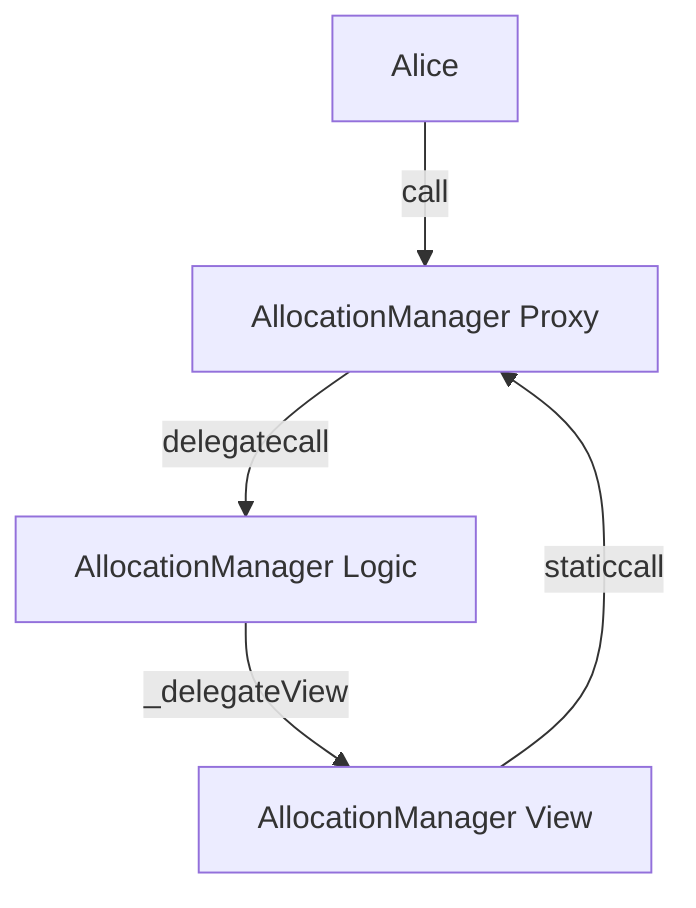

| Author(s) | Created | Status | References | Discussions |
|-------------|-----------|---------|------|----------|
| [0xClandestine](https://github.com/0xClandestine), [Yash Patil](ypatil12@gmail.com), [Mike Muehl](mailto:michael.muehl@eigenlabs.org), [Matt Nelson](mailto:matt.nelson@eigenlabs.org) | 2025-12-3 | `Draft` | [PR #1670](https://github.com/Layr-Labs/eigenlayer-contracts/pull/1670), [Release Notes](https://github.com/Layr-Labs/eigenlayer-contracts/blob/main/CHANGELOG/CHANGELOG-1.9.0.md)  | N/A |

# ELIP-013: Slashing UX Improvements

---

# Executive Summary

**Slashing UX Improvements** is a tech debt-focused release that improves key parts of the EigenLayer Core user experience.

These changes are fully backwards compatible and require no action from existing integrations unless they wish to take advantage of new functionality.

# Motivation

Since the launch of slashing ([ELIP-002](./ELIP-002.md)), several UX pain points have been identified:

1. **Contract Size Limitations**: The `AllocationManager` has grown in complexity, approaching EVM bytecode size limits. This prevents adding new functionality and complicates maintenance.

2. **Lack of Slashing Commitments**: AVSs cannot make credible commitments about who can slash their operator sets. The address that can slash can be instantaneously updated via the `PermissionController`, creating uncertainty for Operators and Stakers about slashing risk.

3. **Delayed Allocation for New Operators**: Newly registered operators must wait for the `ALLOCATION_CONFIGURATION_DELAY` (17.5 days) before they can allocate slashable stake. This creates unnecessary friction for new operators entering the ecosystem.

# Features & Specification

## Overview

This release spans changes across EigenLayer Core contracts. As part of this release, we are upgrading *all* core contracts to take advantage of size savings from deprecating the `SemverMixin.sol` across the Core Protocol. The EIGEN and bEIGEN token will *not* be upgraded. 

As part of this upgrade, we are also updating the `MerkleLib` used by several contracts in the core that check signatures. Refer to the [audit report](https://github.com/Layr-Labs/eigenlayer-contracts/blob/main/audits/EigenLayer%20Merkle%20-%20Certora%20-%20Security%20Assessment%20Final%20Report%20-%20July%202025.pdf) and [PR](https://github.com/Layr-Labs/eigenlayer-contracts/pull/1606) for more information. 

Contracts are now compiled with solc `0.8.30`, taking advantage of namespaced storage layouts for the `SplitContractMixin` pattern (below). 

## AllocationManager Split Contract Pattern

The `AllocationManager` uses a **split contract pattern** implemented via the `SplitContractMixin` to address EVM contract size limitations while maintaining full backwards compatibility. 

### Architecture


The main contract, `AllocationManager`, contains all state-mutating functions and delegates all view function calls to a separate view contract, `AllocationManagerView`. This system ensures backwards compatability with existing onchain interactions since view functions calls to `AllocationManager` are delegated using `_delegateView`. 

## Slashing Commitments

A key pain point for AVSs is that they are unable to make credible commitments on the address that can slash an operator set. Previously, the address that could slash could be instantaneously updated in the `PermissionController`.

Slasher permissions are now set and stored in the `AllocationManager` instead of the `PermissionController`. An operator set can have **at most one slasher**. Changing this slasher is subject to the `ALLOCATION_CONFIGURATION_DELAY` (17.5 days on mainnet).

### New Interfaces

```solidity
/// @notice Parameters used by an AVS to create new operator sets
/// @param operatorSetId the id of the operator set to create
/// @param strategies the strategies to add as slashable to the operator set
/// @param slasher the address that will be the slasher for the operator set
struct CreateSetParamsV2 {
    uint32 operatorSetId;
    IStrategy[] strategies;
    address slasher;
}

/// @notice Allows an AVS to create new operator sets, defining strategies that the operator set uses
function createOperatorSets(address avs, CreateSetParamsV2[] calldata params) external;

/// @notice Allows an AVS to create new Redistribution operator sets.
function createRedistributingOperatorSets(
    address avs,
    CreateSetParamsV2[] calldata params,
    address[] calldata redistributionRecipients
) external;

/// @notice Allows an AVS to update the slasher for an operator set
/// @param operatorSet the operator set to update the slasher for
/// @param slasher the new slasher
/// @dev The new slasher will take effect in DEALLOCATION_DELAY blocks
function updateSlasher(OperatorSet memory operatorSet, address slasher) external;

/// @notice Returns the slasher for a given operator set
/// @param operatorSet The operator set to query
/// @return The address of the slasher
function getSlasher(OperatorSet memory operatorSet) external view returns (address);
```

### Migration for Existing Operator Sets

Operator sets created prior to this release will have their slasher migrated based on the following rules:

1. If there is no slasher set or the slasher in the `PermissionController` is the zero address, the AVS address will be set as the slasher.
2. If there are multiple slashers set in the `PermissionController`, the first address will be set as the slasher.

A permissionless `migrateSlashers` function is provided to migrate slashers for existing operator sets:

```solidity
/// @notice Allows any address to migrate the slasher from the permission controller to the ALM
/// @param operatorSets the list of operator sets to migrate the slasher for
function migrateSlashers(OperatorSet[] memory operatorSets) external;
```

This function will be called at upgrade time for all operatorSets. 

### Deprecation Notice

The old `createOperatorSets` functions using `CreateSetParams` (without a slasher) will be deprecated in Q2 2026. If the old function is used, the slasher defaults to the AVS address.

| Function | Migrate To | Notes |
|----------|-----------|-------|
| `createOperatorSets(avs, CreateSetParams[])` | `createOperatorSets(avs, CreateSetParamsV2[])` | New function takes in a slasher address |
| `createRedistributingOperatorSets(avs, CreateSetParams[], redistributionRecipients[])` | `createRedistributingOperatorSets(avs, CreateSetParamsV2[], redistributionRecipients[])` | New function takes in a slasher address |

## Protocol Registry

A new core contract that serves as the canonical catalog of EigenLayer protocol deployments.

### Responsibilities

- Keeps track of all core proxy contract addresses
- Maintains a global semantic version for the protocol
- Can pause the entire core protocol in one function call

### Interface

```solidity
interface IProtocolRegistry {
    /// @notice Ships a list of deployments.
    /// @param addresses The addresses of the deployments to ship.
    /// @param configs The configurations of the deployments to ship.
    /// @param contractNames The names of the contracts to ship.
    /// @param semanticVersion The semantic version to ship.
    function ship(
        address[] calldata addresses,
        DeploymentConfig[] calldata configs,
        string[] calldata contractNames,
        string calldata semanticVersion
    ) external;

    /// @notice Pauses all deployments that support pausing.
    function pauseAll() external;

    /// @notice Returns the full semantic version string of the protocol.
    function version() external view returns (string memory);

    /// @notice Returns a deployment by name.
    function getAddress(string calldata name) external view returns (address);
}
```

### Roles

- `DEFAULT_ADMIN_ROLE`: Full control, required for `initialize`, `ship`, and `configure`.
- `PAUSER_ROLE`: Addresses with this role can invoke `pauseAll()`.

Upon deployment, the `executorMultisig` will be the default admin and the `pauserMultisig` will hold the `PAUSER_ROLE`. The `ProtocolRegistry` will also be added as a pauser in the `PauserRegistry`.

## Instant Allocation for New Operators

Previously, newly registered operators had to wait for the `ALLOCATION_CONFIGURATION_DELAY` (17.5 days) to pass before they could allocate slashable stake. The `ALLOCATION_CONFIGURATION_DELAY` protects users by giving them time to deallocate funds when an operator changes their allocation delay. However, for a new operator with no stakers, this delay is unnecessary.

Now, when an operator registers via `DelegationManager.registerAsOperator`, their allocation delay now takes effect immediately. This allows operators to allocate slashable stake immediately after registration.

For operators that existed prior to this release or for subsequent allocation delay changes, the `ALLOCATION_CONFIGURATION_DELAY` still applies.

## Slashing Logic Consolidation

The internal `SlashingLib.scaleForBurning` function has been deprecated in favor of `SlashingLib.calcSlashedAmount`. This standardizes the calculation of slashed shares across the withdrawal queue and storage, fixing a formal verification property that prevents over-slashing of any shares.

## Semver Removal

Semantic versioning (`SemVerMixin.sol`) has been removed from all contracts except those that inherit `SignatureUtilsMixin` (which use version in signature domain separators). The version of the core protocol can now be introspected via the `ProtocolRegistry`.

# Security Considerations

Both internal and external security teams will be consulted to confirm that this change introduces no new vulnerabilities or attack vectors. 

## Backwards Compatability

The split contract pattern for the `AllocationManager` is backwards compatible with all existing integrations. 

Although the `SemverMixin.sol` is being deprecated from all core contracts, introspection into this value is minimal on-chain. Customers, particularly LRTs, have been debriefed well in advance of this change. 

## Merkle Library Updates

**Risk**: A critical library is being updated across all EigenLayer contracts.

**Mitigation**:

- No breaking changes have been made to the library.
- On-chain verification and extensive integration/upgrade testing across  to the the RewardsCoordinator and Eigenpod system have been done.
- The signature checking functionality of the `ECDSACertificateVerifier` and `BN254CertificateVerifier` has already been upgraded on-chain to the latest library. 

## Slashing Commitments

**Risk**: Slashing permissions change and a delay on migration.

**Mitigation**:

- AVSs are aware of this change and it is highly requested given audit reports have reported high severity vulnerability due to the lack of credible commitments around the slasher address.
- Migrations insures at least one of the addresses that can slash will be able to slash after the upgrade. Furthermore, multiple slashers currently do not exist for any operatorSets on mainnet.
- Migration is permissionless: an operatorSet may migrate itself immediately upon upgrade.

## Instant Allocation for new operators

**Risk**: Newly registered operators can instantly allocate funds. 

**Mitigation**:

- The `ALLOCATION_CONFIGURATION_DELAY` protects users who have already delegated to an operator OR want to monitor changes in delays.
- For a new operator with no stakers, the delay provides no protocol guarantees.
- Stakers already have their funds instantly slashable if they delegate to an already-allocated operator.

# Impact Summary

## AVSs & Service Builders

- Slashing Commitments: AVSs can now make credible commitments about who can slash their operator sets, improving trust with Operators and Stakers.
- New Operator Set Creation: AVSs should migrate to `CreateSetParamsV2` to explicitly set their slasher. The old function will eventually be deprecated. 
- Protocol Registry: AVSs can query the registry for canonical contract addresses.

## Operators

- Instant Allocation: New operators can begin allocating slashable stake immediately after registration.

## Protocol Governance

- Emergency Response: The `ProtocolRegistry.pauseAll()` function enables rapid protocol-wide pausing.
- Version Tracking: Semantic versioning is now centralized in the `ProtocolRegistry`.

# Action Plan

## Timeline

1. Implementation: Complete (see referenced PRs)
2. Audit: December 2025
3. Testnet Deployment: December 2025
4. Mainnet Deployment: January 2026

## Migration Steps

1. Upgrade Contracts: Deploy new implementations and upgrade proxies
2. Deploy Protocol Registry: Deploy and initialize with current deployments
3. Migrate Slashers: Execute migration script for all existing operator sets
4. Update Pauser Registry: Add `ProtocolRegistry` as a pauser

## Deprecation Timeline

- **Q2 2026**: `createOperatorSets(avs, CreateSetParams[])` and `createRedistributingOperatorSets(avs, CreateSetParams[], redistributionRecipients[])` will be removed

# References & Relevant Discussions

- ELIP-002: [Slashing via Unique Stake and Operator Sets](./ELIP-002.md)
- Contract Documentation: [AllocationManager](https://github.com/Layr-Labs/eigenlayer-contracts/blob/main/docs/core/AllocationManager.md), [ProtocolRegistry](https://github.com/Layr-Labs/eigenlayer-contracts/blob/main/docs/core/ProtocolRegistry.md)
- Release Notes: [v1.9.0 Changelog](https://github.com/Layr-Labs/eigenlayer-contracts/blob/main/CHANGELOG/CHANGELOG-1.9.0.md)