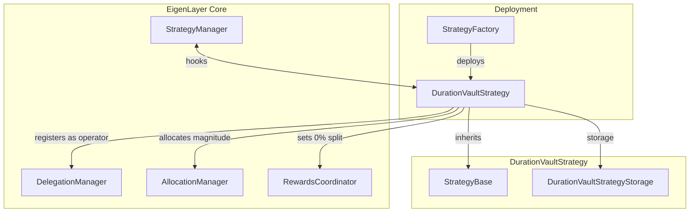
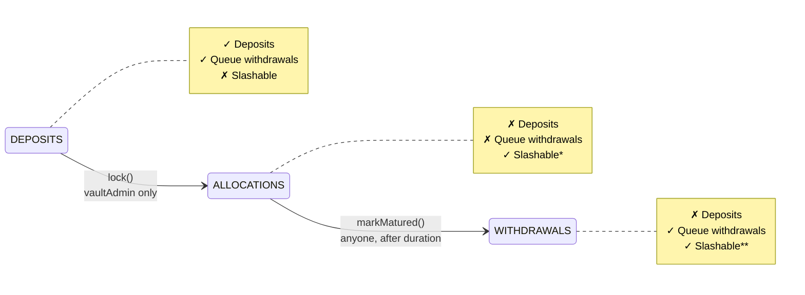

| Author(s) | Created | Status | References | Discussions |
| :---- | :---- | :---- | :---- | :---- |
| [Matt Nelson](mailto:matt.nelson@eigenlabs.org), [Mike Muehl](mailto:michael.muehl@eigenlabs.org) | 2026-01-09 | Draft | [Duration Vault Strategy Implementation](https://github.com/Layr-Labs/eigenlayer-contracts/blob/main/docs/core/DurationVaultStrategy.md) | [Forum discussion link] |

# ELIP-015: Duration Vault Strategies

---

# Executive Summary

The Duration Vault Strategy introduces a time-bound, single-use EigenLayer strategy designed for use-cases requiring guaranteed stake commitments for fixed periods (e.g. insurance). Unlike standard [strategies](https://github.com/Layr-Labs/eigenlayer-contracts/blob/7fdc1826845e814dc8999acab621017c44d08176/docs/core/StrategyManager.md) where stakers delegate to Operators, duration vaults act as their own operators, enabling stakers to commit capital for specific durations while AVSs gain access to guaranteed slashable stake for that period. This feature enables new use cases such as insurance pools, time-locked commitments, and other applications requiring predictable stake availability over defined, fixed periods.

# Motivation

The current EigenLayer ecosystem lacks a mechanism for AVSs to secure guaranteed stake commitments for specific time periods. This creates challenges for:

1. **AVSs requiring predictable security**: Services like insurance protocols, prediction markets, and time-bound commitments need certainty about stake availability for their entire operational period.

2. **Stakers seeking structured products**: Institutional stakers and protocols desire fixed-term staking products with clear risk profiles and defined lock periods.

3. **Risk-isolated staking**: The need for stake commitments that are isolated from other Operator activities and cannot be withdrawn or reallocated during critical periods.

4. **Simplified delegation model**: Some use-cases benefit from a direct staker-to-AVS relationship without the complexity of operator selection and monitoring.

Without duration vaults, AVSs must rely on continuous Operator participation and face uncertainty about stake availability, while stakers lack structured products for time-bound commitments.

# Features & Specification

The full specification can be found in the [contract documentation](https://github.com/Layr-Labs/eigenlayer-contracts/blob/main/docs/core/DurationVaultStrategy.md).

## Core Architecture

Duration Vault Strategy extends `StrategyBase` and introduces lifecycle-aware strategies through two new hooks:

- `beforeAddShares`: Controls deposit acceptance based on vault state
- `beforeRemoveShares`: Controls withdrawal queuing based on vault state



## Vault Lifecycle

Duration vaults progress through three forward-only states:

1. **DEPOSITS**: Vault accepts deposits up to configured caps. Stakers must delegate to the vault before depositing.
2. **ALLOCATIONS**: Vault is locked, deposits/withdrawal queuing blocked. Full magnitude allocated to configured operator set.
3. **WITHDRAWALS**: Duration elapsed, stake deallocated. Stakers can withdraw principal minus any slashing.



## Key Features

### Self-Operating Vaults

- Vault registers itself as an EigenLayer operator on initialization
- Stakers must delegate to the vault before depositing
- Vault allocates 100% magnitude to its configured AVS operator set
- Operator reward split set to 0% (100% to stakers)

### Permissionless Deployment

```solidity
function deployDurationVaultStrategy(
    VaultConfig calldata config
) external returns (IDurationVaultStrategy newVault)
```

Configuration includes:

- `underlyingToken`: ERC20 token for deposits
- `vaultAdmin`: Address that can lock the vault
- `duration`: Lock period in seconds (max 2 years)
- `maxPerDeposit`: Per-transaction deposit limit
- `stakeCap`: Total deposit cap
- `operatorSet`: Target AVS operator set
- `delegationApprover`: Optional delegation approval address

### TVL Management

Vault admins can update deposit limits during DEPOSITS state:

```solidity
function updateTVLLimits(
    uint256 newMaxPerDeposit,
    uint256 newStakeCap
) external onlyVaultAdmin
```

### Lifecycle Transitions

**Lock Transition (DEPOSITS → ALLOCATIONS)**:

```solidity
function lock() external onlyVaultAdmin
```

- Prevents new deposits and withdrawal queuing
- Allocates full magnitude to operator set
- Begins duration countdown

**Maturity Transition (ALLOCATIONS → WITHDRAWALS)**:

```solidity
function markMatured() external
```

- Callable by anyone after `unlockTimestamp`
- Deallocates from operator set (best-effort)
- Deregisters from operator set (best-effort)
- Enables withdrawal queuing

## Integration Points

The Duration Vault Strategy integrates with core EigenLayer contracts:

- **StrategyManager**: Receives hooks for share movement control
- **DelegationManager**: Vault registers as operator
- **AllocationManager**: Manages magnitude allocations
- **RewardsCoordinator**: Configures operator splits

# Rationale

## Design Decisions

**Why vaults as operators?**

- Simplifies the staker experience by removing operator selection complexity
- Ensures all vault stake is allocated to the intended AVS
- Prevents stake migration to other AVSs during the commitment period
- Provides clear accountability for the specific use case

**Why single-use vaults?**

- Simplifies state management and accounting
- Provides clear lifecycle boundaries for auditing
- Enables clean slate for each duration commitment
- Reduces complexity of handling partial withdrawals and re-locking

**Why permissionless deployment?**

- Allows any AVS to create duration-specific products
- Enables market-driven discovery of optimal durations and caps
- Reduces coordination overhead for launching new vaults
- Maintains EigenLayer's permissionless ethos

**Why best-effort cleanup on maturity?**

- Ensures stakers can always withdraw after duration expires
- Prevents external dependencies from blocking withdrawals
- Handles edge cases like paused AllocationManager gracefully

## Parameter Choices

| Parameter | Value | Rationale |
| :---- | :---- | :---- |
| `MAX_DURATION` | 2 years | Balances long-term commitments with practical limits |
| `FULL_ALLOCATION` | `1e18` (100%) | Maximizes security provided to AVS |
| `operatorSplit` | 0% | Ensures all rewards flow to stakers |
| `allocationDelay` | `minWithdrawalDelayBlocks + 1` | Protects against pre-lock withdrawal attacks |

# Security Considerations

## Known Issues and Mitigations

1. **Cap Bypass via Donations**

   - **Issue**: Direct token transfers bypass cap checks
   - **Impact**: Limited - attacker gains nothing, primarily affects metrics
   - **Mitigation**: Cap's primary purpose (risk limiting) remains intact

2. **Best-Effort State Cleanup**

   - **Issue**: Deallocation/deregistration may silently fail
   - **Impact**: Vault may remain registered but withdrawals still enabled
   - **Mitigation**: Try/catch ensures user withdrawals never blocked

3. **Short Duration Edge Cases**

   - **Issue**: Very short durations may expire before allocation active
   - **Impact**: AVS doesn't receive expected security
   - **Mitigation**: AVSs should set meaningful minimum durations

4. **Front-Running Lock**

   - **Issue**: Depositors can queue withdrawals before lock
   - **Impact**: Less capital locked than expected
   - **Mitigation**: Admin responsibility to monitor and time lock appropriately

5. **Admin Cap Reduction**

   - **Issue**: Admin can set caps below current deposits
   - **Impact**: Blocks new deposits until balance drops
   - **Mitigation**: Intentional flexibility for emergency response

## Critical Invariants

1. State transitions are forward-only: DEPOSITS → ALLOCATIONS → WITHDRAWALS
2. Stakers delegated to vault cannot be delegated elsewhere (similar to existing single-Operator delegation)
3. Vault shares cannot be delegated to any Operator except the vault itself
4. Users can always queue withdrawals before lock or after maturity
5. Withdrawals queued before lock are not subject to slashing

# Impact Summary

## AVSs

- **New capability**: Create time-bound stake commitments for specific use cases
- **Simplified operations**: No need to manage operator relationships for duration products
- **Predictable security**: Guaranteed stake availability for entire duration
- **Flexible deployment**: Permissionless creation of vaults with custom parameters

## Operators

- **No direct impact**: Duration vaults operate independently of traditional operators
- **Opportunity**: Can participate as stakers in duration vaults
- **Complementary**: Duration vaults don't compete with traditional operator model

## Stakers

- **New products**: Access to fixed-term staking with defined risk/reward
- **Simplified experience**: Direct delegation to vault removes operator selection complexity
- **Clear commitments**: Transparent lock periods and withdrawal windows
- **Risk isolation**: Stake only slashable by single AVS for specific purpose

## Protocol

- **Extended functionality**: Adds time-bound commitments to strategy toolkit
- **Maintained security**: Leverages existing slashing and allocation mechanisms
- **Ecosystem growth**: Enables new AVS use cases and staker products

# Action Plan

## Phase 1: Implementation (Completed)

- [x] Implement `DurationVaultStrategy` contract
- [x] Add strategy hooks to `StrategyBase`
- [x] Integrate with `StrategyManager` hooks
- [x] Deploy beacon proxy pattern via `StrategyFactory`

## Phase 2: Testing & Auditing

- [x] Comprehensive unit and integration tests
- [x] Security audit of vault lifecycle and state transitions
- [x] Testnet deployment and validation
- [x] Community review period

## Phase 3: Deployment

- [x] Deploy StrategyFactory with duration vault beacon
- [x] Documentation and integration guides for AVSs
- [ ] Reference implementations for common use cases
- [ ] Monitoring and tooling support

# References & Relevant Discussions

- [Duration Vault Strategy Technical Documentation](https://github.com/Layr-Labs/eigenlayer-contracts/blob/main/docs/core/DurationVaultStrategy.md)
- [StrategyFactory Implementation](https://github.com/Layr-Labs/eigenlayer-contracts/blob/main/src/contracts/strategies/StrategyFactory.sol)
- [StrategyBase with Hooks](https://github.com/Layr-Labs/eigenlayer-contracts/blob/main/src/contracts/strategies/StrategyBase.sol)
- [Audit Report](https://github.com/Layr-Labs/eigenlayer-contracts/blob/main/audits/Certora%20-%20Eigenlayer%20Duration%20Vaults.pdf)
